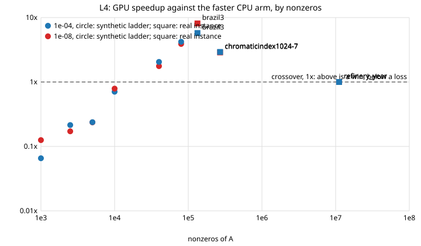
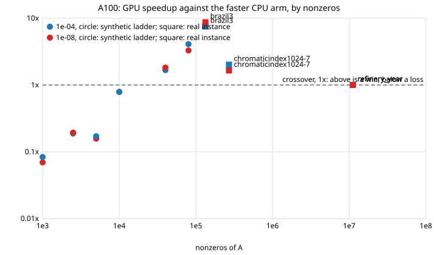
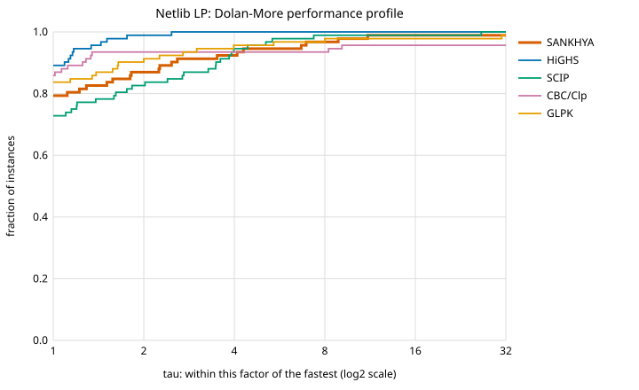

# SANKHYA — benchmarks

<!-- GENERATED FILE. Do not edit by hand. -->
<!-- Regenerate with: python bench/runners/make_benchmarks_doc.py -->

This file is generated from the CSVs in `bench/results/`, so it cannot drift from the
evidence. Every number below came out of a run that recorded the instance sha256, the git
commit and the machine tag alongside it. CI checks that every CSV's commit is on `main`
(`bench/runners/check_result_stamps.py`, #433); a run made on a branch and carried to `main`
by a squash merge keeps the commit it was produced on and is listed with that squash merge
in `bench/results/squash-stamps.txt`, so the number still ties back to a build.

Times in sections 1a-1c, 1f and 2 are wall-clock, measured around the whole process, so they
include reading the model and writing the outputs. That makes them slightly pessimistic and
honest; it is not the figure to quote for algorithmic speed, and no attempt is made to
dress it up. Section 1d prints solver-internal seconds (its instances take minutes, and the
read is not what is being measured) and section 4 is solver-internal on both sides, as it
says.

Reporting follows Mittelmann's conventions: shifted geometric means with a
1-second shift, an explicit time limit, and failures counted and named
rather than dropped.

---

## 1. Netlib LP — accuracy against published optima

The reference optimum for each instance is parsed by `bench/runners/fetch_data.py` from
Netlib's own `readme`. None of these values was typed from memory.

### 1a. The small set — what the demo runs

Nine instances, committed to the repository so a fresh clone can reproduce this with no
network. **This is the set `demo/run_demo.sh` lets a judge pick from, and it is the easy end
of Netlib.** Its pass rate is not the headline; section 1c is.

Source CSV: `bench/results/netlib-small-2b4eb6b.csv`  
Commit `2b4eb6b` · machine `Windows-AMD64` · generated 2026-09-09T03:41:33+00:00

**9 of 9 instances in this working set** matched their published optimum to a relative 1e-6 **and** passed independent verification by `tools/verify_solution.py`.

The same run graded against the **exact** optimum, Koch's rational values (*The final NETLIB-LP results*, Oper. Res. Lett. 32, 2004; `data/netlib/koch_exact.json`): **9 of 9** within a relative 1e-6 **and** verified. Not within it: none.

Coverage: this run used **9 of the 97 instances** Netlib publishes an optimal value for (set `small`, selected by `fetch_data.py --set small`). Phase 6's "full Netlib >= 95%" exit criterion is measured against the full set, not against this one.

Every instance in this set passed.

| instance | rows | cols | status | our objective | published optimum | rel. error | iters | time (s) | verified |
|---|---:|---:|---|---:|---:|---:|---:|---:|:--:|
| `adlittle` | 56 | 97 | optimal | 2.2549496316e+05 | 2.2549496316e+05 | 1.1e-11 | 73 | 0.054 | yes |
| `afiro` | 27 | 32 | optimal | -4.6475314286e+02 | -4.6475314286e+02 | 6.1e-12 | 13 | 0.024 | yes |
| `blend` | 74 | 83 | optimal | -3.0812149846e+01 | -3.0812149846e+01 | 5.6e-12 | 97 | 0.030 | yes |
| `israel` | 174 | 142 | optimal | -8.9664482186e+05 | -8.9664482186e+05 | 3.4e-12 | 176 | 0.044 | yes |
| `sc105` | 105 | 103 | optimal | -5.2202061212e+01 | -5.2202061212e+01 | 5.6e-12 | 88 | 0.023 | yes |
| `sc50a` | 50 | 48 | optimal | -6.4575077059e+01 | -6.4575077059e+01 | 6.7e-12 | 42 | 0.019 | yes |
| `sc50b` | 50 | 48 | optimal | -7.0000000000e+01 | -7.0000000000e+01 | 2.0e-16 | 42 | 0.029 | yes |
| `share2b` | 96 | 79 | optimal | -4.1573224074e+02 | -4.1573224074e+02 | 3.4e-12 | 133 | 0.034 | yes |
| `stocfor1` | 117 | 111 | optimal | -4.1131976219e+04 | -4.1131976219e+04 | 1.1e-11 | 101 | 0.027 | yes |

**Summary**

- shifted geometric mean solve time (shift 1s): **0.031s**
- slowest solved instance: 0.054s
- worst relative error against a published optimum: **1.06e-11**
- no failures on this set

### 1b. The medium tier — instances up to 500 rows

Source CSV: `bench/results/netlib-medium-2b4eb6b.csv`  
Commit `2b4eb6b` · machine `Windows-AMD64` · generated 2026-09-09T03:36:04+00:00

**48 of 50 instances in this working set** matched their published optimum to a relative 1e-6 **and** passed independent verification by `tools/verify_solution.py`.

The same run graded against the **exact** optimum, Koch's rational values (*The final NETLIB-LP results*, Oper. Res. Lett. 32, 2004; `data/netlib/koch_exact.json`): **50 of 50** within a relative 1e-6 **and** verified. Not within it: none.

Coverage: this run used **50 of the 97 instances** Netlib publishes an optimal value for (set `medium`, selected by `fetch_data.py --set medium`). Phase 6's "full Netlib >= 95%" exit criterion is measured against the full set, not against this one.

**2 failed**, grouped by the reason the solver itself gave. They are named here because a pass rate without its failures is a claim, not evidence:

| why it failed | count | instances |
|---|---:|---|
| disagrees with the published optimum (#75) | 2 | e226, scrs8 |

| instance | rows | cols | status | our objective | published optimum | rel. error | iters | time (s) | verified |
|---|---:|---:|---|---:|---:|---:|---:|---:|:--:|
| `adlittle` | 56 | 97 | optimal | 2.2549496316e+05 | 2.2549496316e+05 | 1.1e-11 | 73 | 0.397 | yes |
| `afiro` | 27 | 32 | optimal | -4.6475314286e+02 | -4.6475314286e+02 | 6.1e-12 | 13 | 0.040 | yes |
| `agg` | 488 | 163 | optimal | -3.5991767287e+07 | -3.5991767287e+07 | 1.2e-11 | 147 | 0.132 | yes |
| `bandm` | 305 | 472 | optimal | -1.5862801845e+02 | -1.5862801845e+02 | 7.6e-13 | 452 | 0.406 | yes |
| `beaconfd` | 173 | 262 | optimal | 3.3592485807e+04 | 3.3592485807e+04 | 6.0e-12 | 115 | 0.165 | yes |
| `blend` | 74 | 83 | optimal | -3.0812149846e+01 | -3.0812149846e+01 | 5.6e-12 | 97 | 0.281 | yes |
| `boeing1` | 351 | 384 | optimal | -3.3521356751e+02 | -3.3521356751e+02 | 8.6e-12 | 357 | 0.223 | yes |
| `boeing2` | 166 | 143 | optimal | -3.1501872802e+02 | -3.1501872802e+02 | 1.5e-11 | 133 | 0.205 | yes |
| `bore3d` | 233 | 315 | optimal | 1.3730803942e+03 | 1.3730803942e+03 | 6.2e-12 | 161 | 0.145 | yes |
| `brandy` | 220 | 249 | optimal | 1.5185098965e+03 | 1.5185098965e+03 | 7.8e-12 | 282 | 0.244 | yes |
| `capri` | 271 | 353 | optimal | 2.6900129138e+03 | 2.6900129138e+03 | 1.2e-11 | 236 | 0.112 | yes |
| `d6cube` | 415 | 6184 | optimal | 3.1549166667e+02 | 3.1549166667e+02 | 1.1e-11 | 1013 | 2.035 | yes |
| `degen2` | 444 | 534 | optimal | -1.4351780000e+03 | -1.4351780000e+03 | 0.0e+00 | 639 | 0.653 | yes |
| `e226` | 223 | 282 | optimal | -1.1638929066e+01 | -1.8751929066e+01 | 3.8e-01 | 507 | 0.911 | yes |
| `etamacro` | 400 | 688 | optimal | -7.5571523312e+02 | -7.5571521774e+02 | 2.0e-08 | 705 | 0.420 | yes |
| `finnis` | 497 | 614 | optimal | 1.7279106560e+05 | 1.7279096547e+05 | 5.8e-07 | 403 | 0.307 | yes |
| `fit1d` | 24 | 1026 | optimal | -9.1463780924e+03 | -9.1463780924e+03 | 2.3e-12 | 56 | 0.292 | yes |
| `fit2d` | 25 | 10500 | optimal | -6.8464293294e+04 | -6.8464293294e+04 | 2.5e-12 | 224 | 2.146 | yes |
| `forplan` | 161 | 421 | optimal | -6.6421896127e+02 | -6.6421873953e+02 | 3.3e-07 | 309 | 0.669 | yes |
| `grow15` | 300 | 645 | optimal | -1.0687094129e+08 | -1.0687094129e+08 | 3.3e-11 | 3630 | 2.191 | yes |
| `grow22` | 440 | 946 | optimal | -1.6083433648e+08 | -1.6083433648e+08 | 1.6e-11 | 3853 | 4.883 | yes |
| `grow7` | 140 | 301 | optimal | -4.7787811815e+07 | -4.7787811815e+07 | 6.0e-12 | 1932 | 0.785 | yes |
| `israel` | 174 | 142 | optimal | -8.9664482186e+05 | -8.9664482186e+05 | 3.4e-12 | 176 | 0.152 | yes |
| `kb2` | 43 | 41 | optimal | -1.7499001299e+03 | -1.7499001299e+03 | 3.5e-12 | 51 | 0.109 | yes |
| `lotfi` | 153 | 308 | optimal | -2.5264706062e+01 | -2.5264706062e+01 | 4.7e-12 | 243 | 0.107 | yes |
| `pilot4` | 410 | 1000 | optimal | -2.5811392589e+03 | -2.5811392641e+03 | 2.0e-09 | 1060 | 1.036 | yes |
| `recipe` | 91 | 180 | optimal | -2.6661600000e+02 | -2.6661600000e+02 | 1.1e-15 | 41 | 0.068 | yes |
| `sc105` | 105 | 103 | optimal | -5.2202061212e+01 | -5.2202061212e+01 | 5.6e-12 | 88 | 0.112 | yes |
| `sc205` | 205 | 203 | optimal | -5.2202061212e+01 | -5.2202061212e+01 | 5.6e-12 | 209 | 0.061 | yes |
| `sc50a` | 50 | 48 | optimal | -6.4575077059e+01 | -6.4575077059e+01 | 6.7e-12 | 42 | 0.098 | yes |
| `sc50b` | 50 | 48 | optimal | -7.0000000000e+01 | -7.0000000000e+01 | 2.0e-16 | 42 | 0.107 | yes |
| `scagr25` | 471 | 500 | optimal | -1.4753433061e+07 | -1.4753433061e+07 | 1.6e-11 | 465 | 0.146 | yes |
| `scagr7` | 129 | 140 | optimal | -2.3313898243e+06 | -2.3313892548e+06 | 2.4e-07 | 111 | 0.095 | yes |
| `scfxm1` | 330 | 457 | optimal | 1.8416759028e+04 | 1.8416759028e+04 | 1.9e-11 | 460 | 0.174 | yes |
| `scorpion` | 388 | 358 | optimal | 1.8781248227e+03 | 1.8781248227e+03 | 2.0e-11 | 242 | 0.207 | yes |
| `scrs8` | 490 | 1169 | optimal | 9.0429695380e+02 | 9.0429998619e+02 | 3.4e-06 | 610 | 0.241 | yes |
| `scsd1` | 77 | 760 | optimal | 8.6666666743e+00 | 8.6666666743e+00 | 3.8e-12 | 155 | 0.179 | yes |
| `scsd6` | 147 | 1350 | optimal | 5.0500000077e+01 | 5.0500000078e+01 | 1.7e-11 | 367 | 0.165 | yes |
| `scsd8` | 397 | 2750 | optimal | 9.0499999993e+02 | 9.0499999993e+02 | 5.0e-12 | 1785 | 1.129 | yes |
| `sctap1` | 300 | 480 | optimal | 1.4122500000e+03 | 1.4122500000e+03 | 0.0e+00 | 269 | 0.109 | yes |
| `share1b` | 117 | 225 | optimal | -7.6589318579e+04 | -7.6589318579e+04 | 2.4e-12 | 136 | 0.206 | yes |
| `share2b` | 96 | 79 | optimal | -4.1573224074e+02 | -4.1573224074e+02 | 3.4e-12 | 133 | 0.160 | yes |
| `ship04l` | 402 | 2118 | optimal | 1.7933245380e+06 | 1.7933245380e+06 | 1.7e-11 | 449 | 0.441 | yes |
| `ship04s` | 402 | 1458 | optimal | 1.7987147004e+06 | 1.7987147004e+06 | 2.5e-11 | 300 | 0.336 | yes |
| `stair` | 356 | 467 | optimal | -2.5126695119e+02 | -2.5126695119e+02 | 1.2e-11 | 448 | 0.551 | yes |
| `standata` | 359 | 1075 | optimal | 1.2576995000e+03 | 1.2576995000e+03 | 1.8e-16 | 58 | 0.083 | yes |
| `standmps` | 467 | 1075 | optimal | 1.4060175000e+03 | 1.4060175000e+03 | 1.6e-16 | 200 | 0.100 | yes |
| `stocfor1` | 117 | 111 | optimal | -4.1131976219e+04 | -4.1131976219e+04 | 1.1e-11 | 101 | 0.095 | yes |
| `tuff` | 333 | 587 | optimal | 2.9214776509e-01 | 2.9214776509e-01 | 3.6e-12 | 239 | 0.133 | yes |
| `wood1p` | 244 | 2594 | optimal | 1.4429024116e+00 | 1.4429024116e+00 | 1.8e-11 | 406 | 1.046 | yes |

**Summary**

- shifted geometric mean solve time (shift 1s): **0.382s**
- slowest solved instance: 4.883s
- worst relative error against a published optimum: **5.79e-07**
- **failed: `e226`, `scrs8`** — kept in the table on purpose

### 1c. The full set — the honest headline

Every instance in Netlib's summary table. Both tiers above are defined by a row cap, which
makes them the easier half of the library by construction; this is the number Phase 6's
">= 95% of Netlib" exit criterion is measured against, and the one the README quotes.

Source CSV: `bench/results/netlib-full-9094e1c.csv`  
Commit `9094e1c` · machine `Windows-AMD64` · generated 2026-09-29T12:26:26+00:00

**82 of 92 instances in this working set** matched their published optimum to a relative 1e-6 **and** passed independent verification by `tools/verify_solution.py`.

The same run graded against the **exact** optimum, Koch's rational values (*The final NETLIB-LP results*, Oper. Res. Lett. 32, 2004; `data/netlib/koch_exact.json`): **90 of 92** within a relative 1e-6 **and** verified. Not within it: `pilot.ja`, `pilot87`.

Coverage: this run used **92 of the 97 instances** Netlib publishes an optimal value for (set `full`, selected by `fetch_data.py --set full`). Phase 6's "full Netlib >= 95%" exit criterion is measured against this set.

**10 failed**, grouped by the reason the solver itself gave. They are named here because a pass rate without its failures is a claim, not evidence:

| why it failed | count | instances |
|---|---:|---|
| disagrees with the published optimum (#75) | 9 | 80bau3b, e226, ganges, greenbea, greenbeb, nesm, pilot, pilot.we, scrs8 |
| duals miss feasibility (#52) | 1 | pilot.ja |

| instance | rows | cols | status | our objective | published optimum | rel. error | iters | time (s) | verified |
|---|---:|---:|---|---:|---:|---:|---:|---:|:--:|
| `25fv47` | 821 | 1571 | optimal | 5.5018458883e+03 | 5.5018458883e+03 | 2.4e-12 | 4586 | 0.310 | yes |
| `80bau3b` | 2262 | 9799 | optimal | 9.8722419241e+05 | 9.8723216072e+05 | 8.1e-06 | 3887 | 0.339 | yes |
| `adlittle` | 56 | 97 | optimal | 2.2549496316e+05 | 2.2549496316e+05 | 1.1e-11 | 86 | 0.016 | yes |
| `afiro` | 27 | 32 | optimal | -4.6475314286e+02 | -4.6475314286e+02 | 6.1e-12 | 13 | 0.015 | yes |
| `agg` | 488 | 163 | optimal | -3.5991767287e+07 | -3.5991767287e+07 | 1.2e-11 | 140 | 0.023 | yes |
| `agg2` | 516 | 302 | optimal | -2.0239252356e+07 | -2.0239252356e+07 | 1.1e-12 | 165 | 0.026 | yes |
| `agg3` | 516 | 302 | optimal | 1.0312115935e+07 | 1.0312115935e+07 | 8.7e-12 | 168 | 0.025 | yes |
| `bandm` | 305 | 472 | optimal | -1.5862801845e+02 | -1.5862801845e+02 | 7.6e-13 | 520 | 0.027 | yes |
| `beaconfd` | 173 | 262 | optimal | 3.3592485807e+04 | 3.3592485807e+04 | 6.0e-12 | 115 | 0.022 | yes |
| `blend` | 74 | 83 | optimal | -3.0812149846e+01 | -3.0812149846e+01 | 5.6e-12 | 99 | 0.019 | yes |
| `bnl1` | 643 | 1175 | optimal | 1.9776295615e+03 | 1.9776292856e+03 | 1.4e-07 | 1674 | 0.078 | yes |
| `bnl2` | 2324 | 3489 | optimal | 1.8112365404e+03 | 1.8112365404e+03 | 2.3e-11 | 2377 | 0.171 | yes |
| `boeing1` | 351 | 384 | optimal | -3.3521356751e+02 | -3.3521356751e+02 | 8.6e-12 | 465 | 0.030 | yes |
| `boeing2` | 166 | 143 | optimal | -3.1501872802e+02 | -3.1501872802e+02 | 1.5e-11 | 223 | 0.021 | yes |
| `bore3d` | 233 | 315 | optimal | 1.3730803942e+03 | 1.3730803942e+03 | 6.2e-12 | 162 | 0.019 | yes |
| `brandy` | 220 | 249 | optimal | 1.5185098965e+03 | 1.5185098965e+03 | 7.8e-12 | 299 | 0.022 | yes |
| `capri` | 271 | 353 | optimal | 2.6900129138e+03 | 2.6900129138e+03 | 1.2e-11 | 259 | 0.020 | yes |
| `cycle` | 1903 | 2857 | optimal | -5.2263930249e+00 | -5.2263930249e+00 | 1.1e-12 | 335 | 0.058 | yes |
| `czprob` | 929 | 3523 | optimal | 2.1851966989e+06 | 2.1851966989e+06 | 2.0e-11 | 981 | 0.059 | yes |
| `d2q06c` | 2171 | 5167 | optimal | 1.2278421081e+05 | 1.2278423615e+05 | 2.1e-07 | 14998 | 2.815 | yes |
| `d6cube` | 415 | 6184 | optimal | 3.1549166667e+02 | 3.1549166667e+02 | 1.1e-11 | 868 | 0.170 | yes |
| `degen2` | 444 | 534 | optimal | -1.4351780000e+03 | -1.4351780000e+03 | 0.0e+00 | 611 | 0.040 | yes |
| `degen3` | 1503 | 1818 | optimal | -9.8729400000e+02 | -9.8729400000e+02 | 1.2e-16 | 3164 | 0.351 | yes |
| `dfl001` | 6071 | 12230 | optimal | 1.1266396047e+07 | 1.1266400000e+07 | 3.5e-07 | 57076 | 100.551 | yes |
| `e226` | 223 | 282 | optimal | -1.1638929066e+01 | -1.8751929066e+01 | 3.8e-01 | 435 | 0.032 | yes |
| `etamacro` | 400 | 688 | optimal | -7.5571523335e+02 | -7.5571521774e+02 | 2.1e-08 | 779 | 0.039 | yes |
| `fffff800` | 524 | 854 | optimal | 5.5567956482e+05 | 5.5567961165e+05 | 8.4e-08 | 706 | 0.036 | yes |
| `finnis` | 497 | 614 | optimal | 1.7279106560e+05 | 1.7279096547e+05 | 5.8e-07 | 398 | 0.029 | yes |
| `fit1d` | 24 | 1026 | optimal | -9.1463780924e+03 | -9.1463780924e+03 | 2.3e-12 | 56 | 0.030 | yes |
| `fit1p` | 627 | 1677 | optimal | 9.1463780924e+03 | 9.1463780924e+03 | 2.3e-12 | 1088 | 0.079 | yes |
| `fit2d` | 25 | 10500 | optimal | -6.8464293294e+04 | -6.8464293294e+04 | 2.5e-12 | 226 | 0.161 | yes |
| `fit2p` | 3000 | 13525 | optimal | 6.8464293294e+04 | 6.8464293232e+04 | 9.0e-10 | 10207 | 2.611 | yes |
| `forplan` | 161 | 421 | optimal | -6.6421896127e+02 | -6.6421873953e+02 | 3.3e-07 | 298 | 0.033 | yes |
| `ganges` | 1309 | 1681 | optimal | -1.0958573613e+05 | -1.0958636356e+05 | 5.7e-06 | 1183 | 0.054 | yes |
| `gfrd-pnc` | 616 | 1092 | optimal | 6.9022359995e+06 | 6.9022359995e+06 | 7.1e-12 | 448 | 0.033 | yes |
| `greenbea` | 2392 | 5405 | optimal | -7.2555248130e+07 | -7.2462405908e+07 | 1.3e-03 | 8526 | 1.107 | yes |
| `greenbeb` | 2392 | 5405 | optimal | -4.3022602612e+06 | -4.3021476065e+06 | 2.6e-05 | 10966 | 1.363 | yes |
| `grow15` | 300 | 645 | optimal | -1.0687094129e+08 | -1.0687094129e+08 | 3.3e-11 | 1238 | 0.063 | yes |
| `grow22` | 440 | 946 | optimal | -1.6083433648e+08 | -1.6083433648e+08 | 1.6e-11 | 2264 | 0.148 | yes |
| `grow7` | 140 | 301 | optimal | -4.7787811815e+07 | -4.7787811815e+07 | 6.0e-12 | 337 | 0.032 | yes |
| `israel` | 174 | 142 | optimal | -8.9664482186e+05 | -8.9664482186e+05 | 3.4e-12 | 170 | 0.027 | yes |
| `kb2` | 43 | 41 | optimal | -1.7499001299e+03 | -1.7499001299e+03 | 3.5e-12 | 51 | 0.019 | yes |
| `lotfi` | 153 | 308 | optimal | -2.5264706062e+01 | -2.5264706062e+01 | 4.7e-12 | 200 | 0.023 | yes |
| `maros` | 846 | 1443 | optimal | -5.8063743701e+04 | -5.8063743701e+04 | 2.2e-12 | 1802 | 0.110 | yes |
| `maros-r7` | 3136 | 9408 | optimal | 1.4971851665e+06 | 1.4971851665e+06 | 1.2e-11 | 28 | 10.134 | yes |
| `modszk1` | 687 | 1620 | optimal | 3.2061972906e+02 | 3.2061972906e+02 | 1.3e-11 | 662 | 0.043 | yes |
| `nesm` | 662 | 2923 | optimal | 1.4076036488e+07 | 1.4076073035e+07 | 2.6e-06 | 3321 | 0.145 | yes |
| `perold` | 625 | 1376 | optimal | -9.3807552782e+03 | -9.3807580773e+03 | 3.0e-07 | 2492 | 0.174 | yes |
| `pilot` | 1441 | 3652 | optimal | -5.5748972927e+02 | -5.5740430007e+02 | 1.5e-04 | 9900 | 4.066 | yes |
| `pilot.ja` | 940 | 1988 | feasible | -6.1131364656e+03 | -6.1131344111e+03 | 3.4e-07 | 3220 | 0.245 | yes |
| `pilot.we` | 722 | 2789 | optimal | -2.7201075328e+06 | -2.7201027439e+06 | 1.8e-06 | 5254 | 0.330 | yes |
| `pilot4` | 410 | 1000 | optimal | -2.5811392589e+03 | -2.5811392641e+03 | 2.0e-09 | 4 | 0.062 | yes |
| `pilot87` | 2030 | 4883 | optimal | 3.0171069277e+02 | 3.0171072827e+02 | 1.2e-07 | 21106 | 31.753 | yes |
| `pilotnov` | 975 | 2172 | optimal | -4.4972761882e+03 | -4.4972761882e+03 | 4.2e-12 | 2311 | 0.181 | yes |
| `recipe` | 91 | 180 | optimal | -2.6661600000e+02 | -2.6661600000e+02 | 1.1e-15 | 40 | 0.020 | yes |
| `sc105` | 105 | 103 | optimal | -5.2202061212e+01 | -5.2202061212e+01 | 5.6e-12 | 98 | 0.016 | yes |
| `sc205` | 205 | 203 | optimal | -5.2202061212e+01 | -5.2202061212e+01 | 5.6e-12 | 232 | 0.021 | yes |
| `sc50a` | 50 | 48 | optimal | -6.4575077059e+01 | -6.4575077059e+01 | 6.7e-12 | 42 | 0.017 | yes |
| `sc50b` | 50 | 48 | optimal | -7.0000000000e+01 | -7.0000000000e+01 | 2.0e-16 | 42 | 0.017 | yes |
| `scagr25` | 471 | 500 | optimal | -1.4753433061e+07 | -1.4753433061e+07 | 1.6e-11 | 457 | 0.025 | yes |
| `scagr7` | 129 | 140 | optimal | -2.3313898243e+06 | -2.3313892548e+06 | 2.4e-07 | 111 | 0.021 | yes |
| `scfxm1` | 330 | 457 | optimal | 1.8416759028e+04 | 1.8416759028e+04 | 1.9e-11 | 433 | 0.027 | yes |
| `scfxm2` | 660 | 914 | optimal | 3.6660261565e+04 | 3.6660261565e+04 | 3.3e-14 | 937 | 0.049 | yes |
| `scfxm3` | 990 | 1371 | optimal | 5.4901254550e+04 | 5.4901254550e+04 | 4.5e-12 | 1641 | 0.074 | yes |
| `scorpion` | 388 | 358 | optimal | 1.8781248227e+03 | 1.8781248227e+03 | 2.0e-11 | 242 | 0.026 | yes |
| `scrs8` | 490 | 1169 | optimal | 9.0429695380e+02 | 9.0429998619e+02 | 3.4e-06 | 610 | 0.035 | yes |
| `scsd1` | 77 | 760 | optimal | 8.6666666743e+00 | 8.6666666743e+00 | 3.8e-12 | 98 | 0.023 | yes |
| `scsd6` | 147 | 1350 | optimal | 5.0500000078e+01 | 5.0500000078e+01 | 7.1e-12 | 399 | 0.033 | yes |
| `scsd8` | 397 | 2750 | optimal | 9.0499999993e+02 | 9.0499999993e+02 | 5.0e-12 | 1563 | 0.092 | yes |
| `sctap1` | 300 | 480 | optimal | 1.4122500000e+03 | 1.4122500000e+03 | 1.6e-16 | 278 | 0.022 | yes |
| `sctap2` | 1090 | 1880 | optimal | 1.7248071429e+03 | 1.7248071429e+03 | 2.5e-11 | 775 | 0.049 | yes |
| `sctap3` | 1480 | 2480 | optimal | 1.4240000000e+03 | 1.4240000000e+03 | 0.0e+00 | 1111 | 0.057 | yes |
| `seba` | 515 | 1028 | optimal | 1.5711600000e+04 | 1.5711600000e+04 | 1.2e-16 | 439 | 0.029 | yes |
| `share1b` | 117 | 225 | optimal | -7.6589318579e+04 | -7.6589318579e+04 | 2.4e-12 | 136 | 0.048 | yes |
| `share2b` | 96 | 79 | optimal | -4.1573224074e+02 | -4.1573224074e+02 | 3.4e-12 | 124 | 0.019 | yes |
| `shell` | 536 | 1775 | optimal | 1.2088253460e+09 | 1.2088253460e+09 | 0.0e+00 | 461 | 0.033 | yes |
| `ship04l` | 402 | 2118 | optimal | 1.7933245380e+06 | 1.7933245380e+06 | 1.7e-11 | 447 | 0.030 | yes |
| `ship04s` | 402 | 1458 | optimal | 1.7987147004e+06 | 1.7987147004e+06 | 2.5e-11 | 296 | 0.026 | yes |
| `ship08l` | 778 | 4283 | optimal | 1.9090552114e+06 | 1.9090552114e+06 | 5.7e-12 | 743 | 0.047 | yes |
| `ship08s` | 778 | 2387 | optimal | 1.9200982105e+06 | 1.9200982105e+06 | 1.8e-11 | 422 | 0.036 | yes |
| `ship12l` | 1151 | 5427 | optimal | 1.4701879193e+06 | 1.4701879193e+06 | 2.0e-11 | 1063 | 0.061 | yes |
| `ship12s` | 1151 | 2763 | optimal | 1.4892361344e+06 | 1.4892361344e+06 | 4.1e-12 | 590 | 0.037 | yes |
| `sierra` | 1227 | 2036 | optimal | 1.5394362184e+07 | 1.5394362184e+07 | 2.4e-11 | 550 | 0.044 | yes |
| `stair` | 356 | 467 | optimal | -2.5126695119e+02 | -2.5126695119e+02 | 1.2e-11 | 445 | 0.039 | yes |
| `standata` | 359 | 1075 | optimal | 1.2576995000e+03 | 1.2576995000e+03 | 1.8e-16 | 51 | 0.022 | yes |
| `standmps` | 467 | 1075 | optimal | 1.4060175000e+03 | 1.4060175000e+03 | 1.6e-16 | 197 | 0.033 | yes |
| `stocfor1` | 117 | 111 | optimal | -4.1131976219e+04 | -4.1131976219e+04 | 1.1e-11 | 104 | 0.019 | yes |
| `stocfor2` | 2157 | 2031 | optimal | -3.9024408538e+04 | -3.9024408538e+04 | 3.0e-12 | 1877 | 0.132 | yes |
| `tuff` | 333 | 587 | optimal | 2.9214776509e-01 | 2.9214776509e-01 | 3.6e-12 | 242 | 0.030 | yes |
| `vtp.base` | 198 | 203 | optimal | 1.2983146246e+05 | 1.2983146246e+05 | 1.0e-11 | 162 | 0.021 | yes |
| `wood1p` | 244 | 2594 | optimal | 1.4429024116e+00 | 1.4429024116e+00 | 1.8e-11 | 219 | 0.099 | yes |
| `woodw` | 1098 | 8405 | optimal | 1.3044763331e+00 | 1.3044763331e+00 | 1.2e-11 | 2495 | 0.273 | yes |

**Summary**

- shifted geometric mean solve time (shift 1s): **0.236s**
- slowest solved instance: 100.551s
- worst relative error against a published optimum: **5.79e-07**
- **failed: `80bau3b`, `e226`, `ganges`, `greenbea`, `greenbeb`, `nesm`, `pilot`, `pilot.ja`, `pilot.we`, `scrs8`** — kept in the table on purpose

**`pilot87` passes this table and is 1.1e-6 from the exact optimum (#548).** The table
grades against Netlib's own readme value, 301.71072827; Koch's exact rational
recomputation (ZIB-Report 03-05, 2003) gives 301.710347333, and ours, 301.71069146, is
1.2e-7 from the readme and 1.1e-6 from the exact value. Reproduced on `main` at
`d709281` (`sankhya solve data/netlib/pilot87.mps`, default options, `simplex-dual+primal`)
and re-checked by `tools/verify_solution.py`, which shares no code with the solver: primal
infeasibility 3.8e-12, complementarity 6.8e-15, and one column, `CPCSU04`, with a
reduced-cost violation of 6.786e-08 - under the 1e-7 dual feasibility tolerance, so the
status is `optimal` by policy - which the verifier's gap accounting names as the source of
essentially the whole 3.2e-4 absolute duality gap. So the attribution is a dual that is
not quite feasible on a badly scaled model, not an infeasible primal basis and not a
relaxed unscaled retry (none ran). Not fixed here: tightening the dual tolerance to chase
one instance is the move the evidence rules forbid without a numerical justification,
and #548 stays open for a scale-aware reduced-cost test.

### 1c.1 The Kennington set - the next rung

The sixteen Kennington LPs (the `cre`, `ken`, `osa` and `pds` families, Carolan et al.,
Operations Research 38(2), 1990), larger and sparser than the core Netlib set. Fetched and
hashed by `bench/runners/fetch_kennington.py`, which parses the published optima from the
directory's own readme; run by `bench/runners/kennington.py` under the full-set rules.

Source CSV: `bench/results/kennington-full-65eecbc.csv`  
Commit `65eecbc` · machine `Windows-AMD64` · generated 2026-09-23T22:38:22+00:00

**15 of 16** matched the readme's published optimum to a relative 1e-6 **and** passed independent verification. The published values are Vanderbei's ALPO results printed to eight significant figures, so rounding moves them by at most 5e-8 relative, well inside the tolerance.

**1 failed**, grouped by the reason the solver itself gave. They are named here because a pass rate without its failures is a claim, not evidence:

| why it failed | count | instances |
|---|---:|---|
| optimality claim withdrawn by our own check (#157) | 1 | pds-20 |

| instance | rows | cols | status | our objective | published optimum | rel. error | iters | time (s) | verified |
|---|---:|---:|---|---:|---:|---:|---:|---:|:--:|
| `cre-a` | 3516 | 4067 | optimal | 2.3595407061e+07 | 2.3595407e+07 | 2.6e-09 | 2945 | 0.262 | yes |
| `cre-b` | 9648 | 72447 | optimal | 2.3129639887e+07 | 2.3129640e+07 | 4.9e-09 | 8560 | 19.293 | yes |
| `cre-c` | 3068 | 3678 | optimal | 2.5275116141e+07 | 2.5275116e+07 | 5.6e-09 | 2937 | 0.314 | yes |
| `cre-d` | 8926 | 69980 | optimal | 2.4454969765e+07 | 2.4454970e+07 | 9.6e-09 | 7356 | 14.159 | yes |
| `ken-07` | 2426 | 3602 | optimal | -6.7952044338e+08 | -6.7952044e+08 | 5.0e-09 | 1330 | 0.088 | yes |
| `ken-11` | 14694 | 21349 | optimal | -6.9723822625e+09 | -6.9723823e+09 | 5.4e-09 | 9051 | 2.514 | yes |
| `ken-13` | 28632 | 42659 | optimal | -1.0257394789e+10 | -1.0257395e+10 | 2.1e-08 | 6117 | 5.041 | yes |
| `ken-18` | 105127 | 154699 | optimal | -5.2217025287e+10 | -5.2217025e+10 | 5.5e-09 | 187081 | 423.351 | yes |
| `osa-07` | 1118 | 23949 | optimal | 5.3572251730e+05 | 5.3572252e+05 | 5.0e-09 | 48 | 0.392 | yes |
| `osa-14` | 2337 | 52460 | optimal | 1.1064628447e+06 | 1.1064628e+06 | 4.0e-08 | 50 | 0.800 | yes |
| `osa-30` | 4350 | 100024 | optimal | 2.1421398732e+06 | 2.1421399e+06 | 1.3e-08 | 76 | 1.636 | yes |
| `osa-60` | 10280 | 232966 | optimal | 4.0440725032e+06 | 4.0440725e+06 | 7.8e-10 | 200 | 4.953 | yes |
| `pds-02` | 2953 | 7535 | optimal | 2.8857862010e+10 | 2.8857862e+10 | 3.5e-10 | 964 | 0.112 | yes |
| `pds-06` | 9881 | 28655 | optimal | 2.7761037600e+10 | 2.7761038e+10 | 1.4e-08 | 9478 | 2.608 | yes |
| `pds-10` | 16558 | 48763 | optimal | 2.6727094976e+10 | 2.6727095e+10 | 9.0e-10 | 6183 | 26.015 | yes |
| `pds-20` | 33874 | 105728 | feasible | 2.3821658640e+10 | 2.3821659e+10 | 1.5e-08 | 77 | 373.403 | yes |

**Summary**

- shifted geometric mean solve time over the passed instances (shift 1s): **3.881s**
- worst relative error against a published optimum: **4.04e-08**
- **failed: `pds-20`**, kept in the table on purpose

No per-engine option run is committed yet (`--solver-option algorithm=dual-simplex`, `simplex`, `pdhg`, `ipm`).

### 1d. Beyond Netlib — Mittelmann's LP set

Netlib's largest instance has about 6,000 rows. PS26119 asks about "thousands to millions
of variables", and the only honest way to say where this solver stands on that is to run
instances of that size and name what happens. These are the eight smallest archives in
Mittelmann's LP test set (`bench/runners/fetch_mittelmann.py`, provenance in
`data/mittelmann/reference.json`).

Source CSV: `bench/results/mittelmann-72123ff.csv`  
Commit `72123ff` · machine `Windows-AMD64` · time limit 300 s per instance, both solvers

**5 of 12** instances reached `optimal` inside the limit; **5 of 12** also passed the independent verifier and agree with HiGHS. HiGHS, run as a separate process under the same limit, finished **4 of 12**.

These are the smallest archives in Mittelmann's LP directory; against Netlib's largest instance (dfl001, 6,071 rows, 35,632 nonzeros) they range from the same row count with 2.7x the nonzeros (qap15) to 62x the rows and 42x the nonzeros (bdry2). No published optimum exists for them, so there is no pass-against-a-number column: the outcome is the status, the verifier's verdict where a solution was written, and HiGHS's objective where HiGHS finished. `our objective` on a `time_limit` row is the last iterate's value, not a bound, and is printed only so that a later run can be compared with it.

| instance | rows | cols | nonzeros | status | our objective | HiGHS objective | rel. diff | iters | solver time (s) | verified |
|---|---:|---:|---:|---|---:|---:|---:|---:|---:|:--:|
| `Linf_520c` | 93326 | 69004 | 566193 | time_limit | 0.7756970849 | Time limit reached | - | 24039 | 300.1 | - |
| `bdry2` | 376500 | 250998 | 1500003 | time_limit | 0.001999991456 | Time limit reached | - | 7019 | 253.4 | - |
| `brazil3` | 14646 | 23968 | 133184 | optimal | 2 | 2 | 3.7e-11 | 15 | 5.9 | yes |
| `chromaticindex1024-7` | 67583 | 73728 | 270324 | optimal | 3 | 3 | 2.6e-12 | 560 | 57.9 | yes |
| `datt256_lp` | 11077 | 262144 | 1503732 | optimal | 256 | Time limit reached | - | 10 | 153.0 | yes |
| `ex10` | 69608 | 17680 | 1162000 | optimal | 100 | 100 | 3.0e-12 | 1480 | 77.6 | yes |
| `irish-electricity` | 104259 | 61728 | 523257 | time_limit | 2454378.022 | Time limit reached | - | 36902 | 240.2 | - |
| `physiciansched3-3` | 266227 | 79555 | 1062479 | time_limit | 1431579.932 | Time limit reached | - | 21399 | 216.8 | - |
| `qap15` | 6330 | 22275 | 94950 | time_limit | 172.7930772 | Time limit reached | - | 23875 | 300.1 | - |
| `rmine15` | 358395 | 42438 | 879732 | time_limit | -5042.486721 | Time limit reached | - | 20597 | 216.7 | - |
| `s250r10` | 10962 | 273142 | 1318607 | optimal | -0.1726767184 | -0.1726770419 | 3.2e-07 | 116 | 185.0 | yes |
| `supportcase10` | 165684 | 14770 | 555082 | time_limit | 3.383924801 | Time limit reached | - | 22080 | 220.7 | - |

**Not solved inside the limit**, named rather than dropped: `Linf_520c`, `bdry2`, `irish-electricity`, `physiciansched3-3`, `qap15`, `rmine15`, `supportcase10`.

#### The same eight under each engine

Source CSVs: `bench/results/mittelmann-72123ff.csv` (dual simplex), `bench/results/mittelmann-pdhg-5c7efbc.csv` (PDHG), `bench/results/mittelmann-brazil3-ipm-xover-65eecbc.csv` (interior point)  
Same 300 s limit per instance and engine; HiGHS is not re-run here.

| instance | dual simplex: status · verified · time (s) | PDHG: status · verified · time (s) | interior point: status · verified · time (s) |
|---|---|---|---|
| `Linf_520c` | time_limit · - · 300.1 | time_limit · - · 231.4 | not run |
| `bdry2` | time_limit · - · 253.4 | time_limit · - · 241.1 | not run |
| `brazil3` | optimal · yes · 5.9 | optimal · yes · 58.0 | optimal · yes · 2.7 |
| `chromaticindex1024-7` | optimal · yes · 57.9 | optimal · yes · 0.7 | not run |
| `datt256_lp` | optimal · yes · 153.0 | not run | not run |
| `ex10` | optimal · yes · 77.6 | not run | not run |
| `irish-electricity` | time_limit · - · 240.2 | time_limit · - · 240.0 | not run |
| `physiciansched3-3` | time_limit · - · 216.8 | not run | not run |
| `qap15` | time_limit · - · 300.1 | optimal · yes · 93.4 | not run |
| `rmine15` | time_limit · - · 216.7 | time_limit · - · 216.2 | not run |
| `s250r10` | optimal · yes · 185.0 | not run | not run |
| `supportcase10` | time_limit · - · 220.7 | time_limit · - · 220.9 | not run |

Finished and verified inside the limit: dual simplex **5 of 12**, PDHG **3 of 12**, interior point **1 of 12**.

### 1e. The first-order engine — PDHG

The simplex is not the only continuous engine. Restarted PDHG (`--option algorithm=pdhg`) is
a first-order method: no basis, no factorization, and a cost that depends enormously on the
accuracy asked of it - which is why this section reports two tolerances separately rather
than one blended number. It is also the engine the GPU work targets, so its CPU behaviour is
the baseline every GPU claim will be measured against.

Source CSV: `bench/results/pdhg-4177ae6.csv`  
Commit `4177ae6` · machine `Windows-AMD64` · 9 instances, the ones committed to the repository

- **9 of 9** reach `optimal` at a requested 0.0001 with restarts on.
- **9 of 9** reach `optimal` at a requested 1e-08 with restarts on, **9 of 9** with restarts off.

`optimal` here means what it means everywhere else in this document: the point also survives the project's absolute tolerances, not merely the relative ones the first-order loop converges on. That distinction is the whole of #179 - the loop used to stop on the relative measure and the report then downgraded the point it stopped on, so the engine gave up early and handed back the weaker answer.

**Read the two tolerance columns together, because they are the same run.** Since #179 the loop stops only where the absolute standard is met, so a request looser than that standard no longer stops the solve any earlier - ask for 1e-4 and you get the 1e-8 point, at the 1e-8 cost. That is the honest reading of the identical columns below, and it is a real trade: the old behaviour honoured a loose request and returned a point it then had to label `feasible`. #180 made that the opt-in: `--option pdhg_stop_at_request=true` waives the dual, gap and complementarity halves of the standard - absolute primal feasibility is kept, so `feasible` still means a feasible point - and reports the point as `feasible` unless it meets the full standard anyway. Measured on these instances at 1e-4 it costs 0.85x the iterations (`bench/results/pdhg-stop-at-request-02cd92c.csv`) and turns `share2b` from an iteration limit into a usable point at 807,760. The two tolerance columns stay identical on `adlittle`, `israel` and `sc50b` even with the switch on, because on those the kept primal clause is what binds.

| instance | simplex | PDHG 0.0001: objective / iterations | PDHG 1e-08: objective / iterations |
|---|---:|---:|---:|
| `adlittle` | 225494.9632 | 225494.9632 / 192080 | 225494.9632 / 192080 |
| `afiro` | -464.7531429 | -464.7531428 / 1040 | -464.7531428 / 1040 |
| `blend` | -30.81214985 | -30.81214988 / 44520 | -30.81214988 / 44520 |
| `israel` | -896644.8219 | -896644.8219 / 368720 | -896644.8219 / 368720 |
| `sc105` | -52.20206121 | -52.20206122 / 61440 | -52.20206122 / 61440 |
| `sc50a` | -64.57507706 | -64.57507705 / 7680 | -64.57507705 / 7680 |
| `sc50b` | -70 | -69.99999999 / 8360 | -69.99999999 / 8360 |
| `share2b` | -415.7322407 | -415.7322407 / 1000009 | -415.7322407 / 1000009 |
| `stocfor1` | -41131.97622 | -41131.97619 / 321000 | -41131.97619 / 321000 |

**Restarts, measured at 1e-08.** The claim that restarting the averaging helps is checked rather than repeated:

| instance | restarts on | restarts off | ratio |
|---|---:|---:|---:|
| `adlittle` | 192080 | 207040 | 1.08x |
| `afiro` | 1040 | 2800 | 2.69x |
| `blend` | 44520 | 76400 | 1.72x |
| `israel` | 368720 | 1000005 | 2.71x |
| `sc105` | 61440 | 291200 | 4.74x |
| `sc50a` | 7680 | 28280 | 3.68x |
| `sc50b` | 8360 | 33200 | 3.97x |
| `share2b` | 1000009 | 1000009 | 1.00x |
| `stocfor1` | 321000 | 496320 | 1.55x |

A ratio above 1 means restarts saved iterations on that instance.


**The relative KKT error, and the three crossing times (#486).** Every PDHG run records
`kkt_1e4_seconds`, `kkt_1e6_seconds` and `kkt_1e8_seconds` in the stats JSON and, where a
runner carries them, in its CSV: the solver clock at which the relative KKT error first
came at or under that level, measured at the engine's evaluation interval. The error is
the PDLP definition, `max(||Ax - proj(Ax)|| / (1 + ||b||), ||c - A'y - z|| / (1 + ||c||),
|c'x - b'y| / (1 + |c'x| + |b'y|))` in the 2-norm on the unscaled model
(`src/pdhg/pdhg_evaluate.hpp`), which is the measurement published PDLP and cuPDLP figures
use and the one Mittelmann's LP feasibility page is quoted at (1e-6, no basis). A crossing
is what a first-order method reaches at a relative tolerance; it is NOT an optimal basis and
NOT the project's absolute standard, which is what `optimal` in the status column means and
what the verifier checks. `nan` in a crossing column means the level was never reached in
that run.
---

### 1g. GPU PDHG crossover — when the GPU wins

The GPU backend (`algorithm=pdhg gpu=true`) offloads the matrix-vector products to CUDA.
Small problems spend more time on data transfer than on computation; the crossover point
below is where the GPU overtakes the CPU.

Source CSV: `bench/results/gpu-fb72ab4.csv`  
Commit `fb72ab4` · machine `Windows-AMD64`

Both columns time PDHG alone (`pdhg_polish=false`) on the solver's own clock, to the tolerance named, the CPU side on one thread (#487); a warm-up GPU solve absorbed CUDA's context creation before the timed ones. The GPU pays a per-iteration launch and transfer cost that a small model cannot amortise; the crossover is where the parallel products start to pay for it.

> **GPU iteration counts differ from the CPU's (#448).** The device sums its reductions in a fixed order since #478, so a GPU run repeats itself, but a one-ulp difference from the CPU's summation order can flip a restart decision and shift the whole trajectory. Speedup figures here are the median of repeated solves, and a ratio below 1x is a loss, printed in the same type as a win. Do not compare a GPU iteration count against a CPU count for the same instance: the two engines take different trajectories and any comparison is meaningless. `tests/unit/test_pdhg_cuda_regression.cpp` (#451) holds both engines to the same stopping tolerance rather than to identical iterates. See also `docs/ARCHITECTURE.md` § 7.

| rows×cols | CPU 1e-4 (s) | GPU 1e-4 (s) | speedup | CPU 1e-8 (s) | GPU 1e-8 (s) | speedup |
|----------:|-------------:|-------------:|--------:|-------------:|-------------:|--------:|
| 200×200 | 0.027 | 2.495 | 0.01× | 0.068 | 3.365 | 0.02× |
| 500×500 | 0.105 | 0.597 | 0.18× | 0.137 | 7.505 | 0.02× |
| 1000×1000 | 0.040 | 0.738 | 0.05× | 0.041 | 0.602 | 0.07× |
| 2000×2000 | 0.698 | 5.081 | 0.14× | 0.715 | 7.467 | 0.10× |
| 5000×5000 | 0.784 | 1.436 | 0.55× | 0.770 | 1.635 | 0.47× |
| 10000×10000 | 2.855 | 2.082 | 1.37× | 2.929 | 1.903 | 1.54× |

GPU: NVIDIA GeForce RTX 5050 Laptop GPU (compute 12.0, 8151 MiB VRAM); driver and CUDA runtime not recorded (the CSV predates #488's columns).  
Instances are synthetic KKT LPs with ~5 nonzeros per column (seed 42).

#### 1e-8 ceiling — sizes PDHG does not drive to project standard

Project standard: absolute primal ≤ 1e-7, dual ≤ 1e-7, gap ≤ 1e-8.  
`feasible` means the solver met the *requested* 1e-8 tolerance but not all three project-standard thresholds. These are not dropped from the table.

| rows×cols | engine | achieved primal | achieved dual |
|----------:|--------|----------------:|--------------:|
| 200×200 | CPU | 9.583e-08 | 0.000e+00 |
| 200×200 | GPU | 5.652e-08 | 5.194e-17 |
| 500×500 | CPU | 7.220e-08 | 0.000e+00 |
| 500×500 | GPU | 3.208e-08 | 8.831e-17 |
| 1000×1000 | CPU | 8.748e-08 | 0.000e+00 |
| 1000×1000 | GPU | 8.565e-08 | 8.532e-16 |
| 2000×2000 | CPU | 9.897e-08 | 0.000e+00 |

#### 1g.1 GPU on non-synthetic instances

Not yet run on this tier (the datacenter card's run is in 1g.3). Reproduce with:

```
python bench/runners/fetch_mittelmann.py
python bench/runners/gpu_real_instances.py --binary build_gpu/sankhya
```

> **Needs a CUDA-capable card and a CUDA build** (`-DSANKHYA_ENABLE_CUDA=ON`, the CUDA runtime installed). On a build without CUDA, or a machine whose card fails the device checks, `gpu=true` warns and runs on the CPU, so both arms of the runner would be CPU solves and the GPU column would mean nothing: do not run it there.

#### 1g.2 GPU PDHG vs OR-Tools PDLP

Not yet run. Reproduce with (needs GPU card and `pip install ortools`):

```
python bench/runners/fetch_mittelmann.py
python bench/runners/gpu_pdlp_compare.py --binary build_gpu/sankhya
```

See `docs/PROVENANCE.md` row 21 for the OR-Tools provenance judgement call.

#### 1g.3 The same measurements on a datacenter card

Everything above 1g.3 is one laptop card. A rented card (E2E Networks TIR) runs the same
runners from a fresh clone at a `main` commit; the CPU column in each table is that
machine's own CPU, so a ratio here is card against host, not card against the laptop.

**L4**



The figure is regenerated from the two CSVs by `bench/runners/gpu_plot.py` each time this document is; each point is one instance and tolerance, the speedup against the faster CPU arm on the solver's clock; the dashed line is 1x, the crossover, and everything below it is a loss.

The crossover, the same protocol as 1g (`bench/runners/gpu_report.py`, medians of repeats with their min-max):

Source CSV: `bench/results/gpu-l4-fdc89c5.csv`  
Commit `fdc89c5` · machine `Linux-x86_64`

Both columns time PDHG alone (`pdhg_polish=false`) on the solver's own clock, to the tolerance named, the CPU side on one thread (#487); a warm-up GPU solve absorbed CUDA's context creation before the timed ones. The GPU pays a per-iteration launch and transfer cost that a small model cannot amortise; the crossover is where the parallel products start to pay for it.

> **GPU iteration counts differ from the CPU's (#448).** The device sums its reductions in a fixed order since #478, so a GPU run repeats itself, but a one-ulp difference from the CPU's summation order can flip a restart decision and shift the whole trajectory. Speedup figures here are the median of repeated solves (5 per cell), and a ratio below 1x is a loss, printed in the same type as a win. Do not compare a GPU iteration count against a CPU count for the same instance: the two engines take different trajectories and any comparison is meaningless. `tests/unit/test_pdhg_cuda_regression.cpp` (#451) holds both engines to the same stopping tolerance rather than to identical iterates. See also `docs/ARCHITECTURE.md` § 7.

Each cell is the median of 5 solves; `[min–max]` shows the spread from run-to-run variance (thermal state, clock boost on the laptop GPU).

| rows×cols | CPU 1e-4 (s) | GPU 1e-4 (s) | speedup | CPU 1e-8 (s) | GPU 1e-8 (s) | speedup |
|----------:|-------------:|-------------:|--------:|-------------:|-------------:|--------:|
| 200×200 | 0.043 [0.043–0.044] | 0.663 [0.407–1.738] | 0.07× | 0.091 [0.090–0.092] | 0.723 [0.622–0.796] | 0.13× |
| 500×500 | 0.178 [0.171–0.182] | 0.832 [0.542–3.330] | 0.21× | 0.228 [0.226–0.229] | 1.327 [1.287–2.707] | 0.17× |
| 1000×1000 | 0.064 [0.063–0.064] | 0.267 [0.240–0.373] | 0.24× | 0.064 [0.063–0.066] | 0.270 [0.244–0.364] | 0.24× |
| 2000×2000 | 1.025 [1.014–1.034] | 1.449 [1.264–1.795] | 0.71× | 1.028 [1.019–1.063] | 1.302 [1.260–2.244] | 0.79× |
| 5000×5000 | 0.890 [0.879–0.905] | 0.434 [0.429–0.562] | 2.05× | 0.884 [0.870–0.904] | 0.501 [0.457–0.540] | 1.77× |
| 10000×10000 | 2.854 [2.829–3.001] | 0.678 [0.610–0.799] | 4.21× | 2.906 [2.856–2.928] | 0.745 [0.644–0.779] | 3.90× |

GPU: NVIDIA L4 (compute 8.9, 22478 MiB VRAM); driver and CUDA runtime not recorded (the CSV predates #488's columns).  
Instances are synthetic KKT LPs with ~5 nonzeros per column (seed 42).

#### 1e-8 ceiling — sizes PDHG does not drive to project standard

Project standard: absolute primal ≤ 1e-7, dual ≤ 1e-7, gap ≤ 1e-8.  
`feasible` means the solver met the *requested* 1e-8 tolerance but not all three project-standard thresholds. These are not dropped from the table.

| rows×cols | engine | achieved primal | achieved dual |
|----------:|--------|----------------:|--------------:|
| 200×200 | GPU | 3.378e-08 | 2.481e-16 |
| 500×500 | CPU | 7.220e-08 | 0.000e+00 |
| 500×500 | GPU | 9.665e-08 | 7.241e-15 |
| 1000×1000 | CPU | 8.748e-08 | 0.000e+00 |
| 2000×2000 | CPU | 9.897e-08 | 0.000e+00 |
| 2000×2000 | GPU | 6.291e-08 | 2.167e-17 |

On non-synthetic instances (`bench/runners/gpu_real_instances.py`):

Source CSV: `bench/results/gpu-real-l4-58a8374.csv`  
Commit `58a8374` · machine `Linux-x86_64`  
GPU: NVIDIA L4 (compute 8.9, 22478 MiB VRAM); driver and CUDA runtime not recorded (the CSV predates #488's columns)

Same protocol as §1g: PDHG alone, solver clock, warm-up GPU solve per instance, one solve per cell. Report the result whichever way it goes: a speedup below 1x is a loss and is printed in the same type as a win. The card is compared with two CPU arms: one thread with the serial A x (the default configuration), and 16 threads with `pdhg_parallel_spmv=true`, so A x is row-parallel as well as A^T y (#487, #488). The gap is |obj - ref| / max(1, |ref|) against the reference in the last column, which also carries HiGHS's own run time on the same file in its own process when HiGHS is the reference; `feasible` means the requested relative tolerance was met but not the project's absolute standard.

| instance | rows | tol | CPU 1 thread (s) | CPU 16 threads (s) | GPU (s) | GPU vs 1 thread | GPU vs 16 threads | GPU status | rel gap CPU 1t / CPU 16t / GPU | reference |
|----------|-----:|----:|-------------:|-------------:|--------:|--------:|--------:|--------|--------|--------|
| `refinery_year` | 779640 | 1e-04 | 300.434 | 300.519 | 300.426 | 1.00x | 1.00x | time_limit | 2.620e-08 / 1.686e-08 / 8.482e-12 | -38289180.41914 (construction) |
| `refinery_year` | 779640 | 1e-08 | 300.415 | 300.406 | 300.443 | 1.00x | 1.00x | time_limit | 2.620e-08 / 3.578e-10 / 3.656e-11 | -38289180.41914 (construction) |
| `chromaticindex1024-7` | 67583 | 1e-04 | 1.095 | 1.366 | 0.374 | 2.92x | 3.65x | feasible | 7.666e-10 / 7.666e-10 / 3.514e-10 | 3.0 (highs) |
| `chromaticindex1024-7` | 67583 | 1e-08 | 1.093 | 1.371 | 0.380 | 2.88x | 3.61x | feasible | 7.666e-10 / 7.666e-10 / 2.722e-10 | 3.0 (highs) |
| `brazil3` | 14646 | 1e-04 | 37.615 | 73.734 | 6.537 | 5.75x | 11.28x | feasible | 5.942e-07 / 5.942e-07 / 4.583e-07 | 2.0000000000012172 (highs) |
| `brazil3` | 14646 | 1e-08 | 90.802 | 205.149 | 11.206 | 8.10x | 18.31x | feasible | 1.228e-09 / 1.228e-09 / 2.371e-07 | 2.0000000000012172 (highs) |

The datacenter runner (`bench/runners/gpu_datacenter.py`, #488):

`gpu-datacenter-l4-58a8374.csv` - NVIDIA L4 (compute 8.9, 22478 MiB VRAM), driver and CUDA runtime not recorded (the CSV predates #488's columns), solver at `58a8374`, Linux-x86_64, 3 repeats per cell. HiGHS's own time on the same file, once per instance in its own process: `chromaticindex1024-7` -; `brazil3` -.

| instance | mode | threads | parallel A x | tol | forced iterations | status | objective | rel gap | primal res | dual res | iterations | solver (s) | solver median (s) | median wall (s) | spread (s) |
|---|---|---:|---|---:|---:|---|---:|---:|---:|---:|---:|---:|---:|---:|---:|
| `chromaticindex1024-7` | cpu-1t | 1 | false | 0.0001 | - | feasible | 3.0000000022999487 | 7.666e-10 | 7.735e-08 | 0.000e+00 | 480 | 1.090639 | 1.090639 | 1.474255 | 0.045129 |
| `chromaticindex1024-7` | cpu-16t | 16 | true | 0.0001 | - | feasible | 3.0000000022999487 | 7.666e-10 | 7.735e-08 | 0.000e+00 | 480 | 1.620675 | 1.521952 | 1.945741 | 0.310240 |
| `chromaticindex1024-7` | gpu | - | - | 0.0001 | - | feasible | 3.0000000002465512 | 8.218e-11 | 6.860e-09 | 5.735e-20 | 480 | 0.382011 | 0.382011 | 0.830584 | 0.101041 |
| `chromaticindex1024-7` | cpu-1t | 1 | false | 1e-06 | - | feasible | 3.0000000022999487 | 7.666e-10 | 7.735e-08 | 0.000e+00 | 480 | 1.088841 | 1.088841 | 1.520321 | 0.105772 |
| `chromaticindex1024-7` | cpu-16t | 16 | true | 1e-06 | - | feasible | 3.0000000022999487 | 7.666e-10 | 7.735e-08 | 0.000e+00 | 480 | 1.372105 | 1.609226 | 2.034045 | 0.461847 |
| `chromaticindex1024-7` | gpu | - | - | 1e-06 | - | feasible | 2.9999999999389435 | 2.035e-11 | 6.496e-09 | 1.612e-20 | 440 | 0.494805 | 0.409369 | 0.891146 | 0.076106 |
| `chromaticindex1024-7` | cpu-1t | 1 | false | 1e-08 | - | feasible | 3.0000000022999487 | 7.666e-10 | 7.735e-08 | 0.000e+00 | 480 | 1.077835 | 1.089177 | 1.504897 | 0.057781 |
| `chromaticindex1024-7` | cpu-16t | 16 | true | 1e-08 | - | feasible | 3.0000000022999487 | 7.666e-10 | 7.735e-08 | 0.000e+00 | 480 | 1.399473 | 1.376116 | 1.831740 | 0.084701 |
| `chromaticindex1024-7` | gpu | - | - | 1e-08 | - | optimal | 3.000000000464075 | 1.547e-10 | 1.400e-08 | 1.037e-19 | 480 | 0.422733 | 0.394340 | 0.872333 | 0.043593 |
| `chromaticindex1024-7` | cpu-1t | 1 | false | 1e-08 | 2000 | feasible | 3.0000000022999487 | 7.666e-10 | 7.735e-08 | 0.000e+00 | 480 | 1.084394 | 1.087431 | 1.577028 | 0.164928 |
| `chromaticindex1024-7` | cpu-16t | 16 | true | 1e-08 | 2000 | feasible | 3.0000000022999487 | 7.666e-10 | 7.735e-08 | 0.000e+00 | 480 | 1.426865 | 1.426865 | 2.084692 | 0.562197 |
| `chromaticindex1024-7` | gpu | - | - | 1e-08 | 2000 | optimal | 3.0000000005869634 | 1.957e-10 | 1.771e-08 | 2.689e-20 | 480 | 0.399453 | 0.399453 | 0.875116 | 0.096236 |
| `brazil3` | cpu-1t | 1 | false | 0.0001 | - | feasible | 1.999998811677631 | 5.942e-07 | 9.810e-08 | 4.616e-06 | 80800 | 37.960764 | 37.960764 | 38.344607 | 0.237166 |
| `brazil3` | cpu-16t | 16 | true | 0.0001 | - | feasible | 1.999998811677631 | 5.942e-07 | 9.810e-08 | 4.616e-06 | 80800 | 74.711291 | 85.362817 | 85.830594 | 16.782420 |
| `brazil3` | gpu | - | - | 0.0001 | - | feasible | 2.000001032349996 | 5.162e-07 | 9.870e-08 | 2.212e-15 | 62480 | 5.466302 | 7.404682 | 7.756653 | 4.042350 |
| `brazil3` | cpu-1t | 1 | false | 1e-06 | - | feasible | 2.0000000851361506 | 4.257e-08 | 8.140e-09 | 8.089e-08 | 101600 | 47.516754 | 47.566027 | 47.895255 | 0.126173 |
| `brazil3` | cpu-16t | 16 | true | 1e-06 | - | feasible | 2.0000000851361506 | 4.257e-08 | 8.140e-09 | 8.089e-08 | 101600 | 101.554162 | 101.554162 | 101.893775 | 17.412368 |
| `brazil3` | gpu | - | - | 1e-06 | - | feasible | 2.00000001864988 | 9.324e-09 | 1.820e-09 | 9.282e-08 | 121600 | 10.515429 | 11.849320 | 12.250285 | 2.249318 |
| `brazil3` | cpu-1t | 1 | false | 1e-08 | - | feasible | 1.9999999975461507 | 1.228e-09 | 2.028e-10 | 3.687e-10 | 194240 | 90.565692 | 90.756010 | 91.120279 | 1.197783 |
| `brazil3` | cpu-16t | 16 | true | 1e-08 | - | feasible | 1.9999999975461507 | 1.228e-09 | 2.028e-10 | 3.687e-10 | 194240 | 184.212826 | 193.741678 | 194.096287 | 40.233682 |
| `brazil3` | gpu | - | - | 1e-08 | - | feasible | 1.9999999998182212 | 9.150e-11 | 1.502e-11 | 2.038e-11 | 215920 | 18.045897 | 15.171753 | 15.812082 | 5.445201 |
| `brazil3` | cpu-1t | 1 | false | 1e-08 | 2000 | iteration_limit | 0.0 | 1.000e+00 | 2.212e-02 | 0.000e+00 | 2000 | 1.003801 | 1.003801 | 1.341848 | 0.102726 |
| `brazil3` | cpu-16t | 16 | true | 1e-08 | 2000 | iteration_limit | 0.0 | 1.000e+00 | 2.212e-02 | 0.000e+00 | 2000 | 1.621168 | 1.621168 | 1.966050 | 0.208349 |
| `brazil3` | gpu | - | - | 1e-08 | 2000 | iteration_limit | 0.0 | 1.000e+00 | 2.211e-02 | 1.155e-17 | 2000 | 0.371867 | 0.463225 | 0.791387 | 0.197338 |

GPU speedup on the solver's own clock (median of the repeats):

| instance | tol | forced iterations | GPU vs 1 thread | GPU vs 16 threads, parallel A x | GPU rel gap |
|---|---:|---:|---:|---:|---:|
| `chromaticindex1024-7` | 0.0001 | - | 2.85x | 3.98x | 8.218e-11 |
| `chromaticindex1024-7` | 1e-06 | - | 2.66x | 3.93x | 2.035e-11 |
| `chromaticindex1024-7` | 1e-08 | - | 2.76x | 3.49x | 1.547e-10 |
| `chromaticindex1024-7` | 1e-08 | 2000 | 2.72x | 3.57x | 1.957e-10 |
| `brazil3` | 0.0001 | - | 5.13x | 11.53x | 5.162e-07 |
| `brazil3` | 1e-06 | - | 4.01x | 8.57x | 9.324e-09 |
| `brazil3` | 1e-08 | - | 5.98x | 12.77x | 9.150e-11 |
| `brazil3` | 1e-08 | 2000 | 2.17x | 3.50x | 1.000e+00 |

**A100**



The figure is regenerated from the two CSVs by `bench/runners/gpu_plot.py` each time this document is; each point is one instance and tolerance, the speedup against the faster CPU arm on the solver's clock; the dashed line is 1x, the crossover, and everything below it is a loss.

The crossover, the same protocol as 1g (`bench/runners/gpu_report.py`, medians of repeats with their min-max):

Source CSV: `bench/results/gpu-a100-fdd1f35.csv`  
Commit `fdd1f35` · machine `Linux-x86_64`

Both columns time PDHG alone (`pdhg_polish=false`) on the solver's own clock, to the tolerance named, the CPU side on one thread (#487); a warm-up GPU solve absorbed CUDA's context creation before the timed ones. The GPU pays a per-iteration launch and transfer cost that a small model cannot amortise; the crossover is where the parallel products start to pay for it.

> **GPU iteration counts differ from the CPU's (#448).** The device sums its reductions in a fixed order since #478, so a GPU run repeats itself, but a one-ulp difference from the CPU's summation order can flip a restart decision and shift the whole trajectory. Speedup figures here are the median of repeated solves (5 per cell), and a ratio below 1x is a loss, printed in the same type as a win. Do not compare a GPU iteration count against a CPU count for the same instance: the two engines take different trajectories and any comparison is meaningless. `tests/unit/test_pdhg_cuda_regression.cpp` (#451) holds both engines to the same stopping tolerance rather than to identical iterates. See also `docs/ARCHITECTURE.md` § 7.

Each cell is the median of 5 solves; `[min–max]` shows the spread from run-to-run variance (thermal state, clock boost on the laptop GPU).

| rows×cols | CPU 1e-4 (s) | GPU 1e-4 (s) | speedup | CPU 1e-8 (s) | GPU 1e-8 (s) | speedup |
|----------:|-------------:|-------------:|--------:|-------------:|-------------:|--------:|
| 200×200 | 0.089 [0.088–0.108] | 1.061 [0.915–1.594] | 0.08× | 0.090 [0.089–0.091] | 1.296 [0.875–1.799] | 0.07× |
| 500×500 | 0.271 [0.271–0.281] | 1.444 [0.377–1.806] | 0.19× | 0.368 [0.367–0.382] | 1.903 [1.779–2.735] | 0.19× |
| 1000×1000 | 0.075 [0.075–0.076] | 0.439 [0.328–0.512] | 0.17× | 0.075 [0.075–0.081] | 0.479 [0.400–0.612] | 0.16× |
| 2000×2000 | 1.575 [1.555–1.579] | 1.997 [1.393–2.154] | 0.79× | 1.565 [1.562–1.579] | 1.986 [1.540–2.346] | 0.79× |
| 5000×5000 | 1.082 [1.077–1.102] | 0.648 [0.444–0.706] | 1.67× | 1.086 [1.078–1.091] | 0.596 [0.463–0.684] | 1.82× |
| 10000×10000 | 3.156 [3.148–3.183] | 0.773 [0.693–0.895] | 4.08× | 3.151 [3.147–3.152] | 0.960 [0.710–1.615] | 3.28× |

GPU: NVIDIA A100-SXM4-40GB (compute 8.0, 40326 MiB VRAM, CUDA runtime 12.4, driver API 12.4); driver 550.127.08, CUDA runtime 12.4.  
Instances are synthetic KKT LPs with ~5 nonzeros per column (seed 42).

#### 1e-8 ceiling — sizes PDHG does not drive to project standard

Project standard: absolute primal ≤ 1e-7, dual ≤ 1e-7, gap ≤ 1e-8.  
`feasible` means the solver met the *requested* 1e-8 tolerance but not all three project-standard thresholds. These are not dropped from the table.

| rows×cols | engine | achieved primal | achieved dual |
|----------:|--------|----------------:|--------------:|
| 200×200 | CPU | 7.112e-08 | 0.000e+00 |
| 200×200 | GPU | 5.606e-08 | 9.947e-16 |
| 500×500 | CPU | 8.676e-08 | 0.000e+00 |
| 500×500 | GPU | 7.995e-08 | 1.616e-15 |

On non-synthetic instances (`bench/runners/gpu_real_instances.py`):

Source CSV: `bench/results/gpu-real-a100-fdd1f35.csv`  
Commit `fdd1f35` · machine `Linux-x86_64`  
GPU: NVIDIA A100-SXM4-40GB (compute 8.0, 40326 MiB VRAM, CUDA runtime 12.4, driver API 12.4); driver 550.127.08, CUDA runtime 12.4

Same protocol as §1g: PDHG alone, solver clock, warm-up GPU solve per instance, each cell the median of 3 solves. Report the result whichever way it goes: a speedup below 1x is a loss and is printed in the same type as a win. The card is compared with two CPU arms: one thread with the serial A x (the default configuration), and 16 threads with `pdhg_parallel_spmv=true`, so A x is row-parallel as well as A^T y (#487, #488). The gap is |obj - ref| / max(1, |ref|) against the reference in the last column, which also carries HiGHS's own run time on the same file in its own process when HiGHS is the reference; `feasible` means the requested relative tolerance was met but not the project's absolute standard.

| instance | rows | tol | CPU 1 thread (s) | CPU 16 threads (s) | GPU (s) | GPU vs 1 thread | GPU vs 16 threads | GPU status | rel gap CPU 1t / CPU 16t / GPU | reference |
|----------|-----:|----:|-------------:|-------------:|--------:|--------:|--------:|--------|--------|--------|
| `refinery_year` | 779640 | 1e-04 | 300.486 | 300.580 | 300.537 | 1.00x | 1.00x | time_limit | 1.410e-08 / 2.347e-09 / 1.786e-12 | -38289180.41914 (construction) |
| `refinery_year` | 779640 | 1e-08 | 300.515 | 300.516 | 300.550 | 1.00x | 1.00x | time_limit | 1.410e-08 / 2.653e-08 / 2.148e-11 | -38289180.41914 (construction) |
| `chromaticindex1024-7` | 67583 | 1e-04 | 1.058 | 0.886 | 0.439 | 2.41x | 2.02x | feasible | 3.655e-10 / 3.655e-10 / 1.881e-10 | 3.0 (highs, 134.339 s) |
| `chromaticindex1024-7` | 67583 | 1e-08 | 1.150 | 0.868 | 0.526 | 2.19x | 1.65x | feasible | 1.468e-10 / 1.468e-10 / 1.083e-10 | 3.0 (highs, 134.339 s) |
| `brazil3` | 14646 | 1e-04 | 40.005 | 38.658 | 5.154 | 7.76x | 7.50x | feasible | 2.973e-07 / 2.973e-07 / 9.721e-08 | 2.0000000000012172 (highs, 9.285 s) |
| `brazil3` | 14646 | 1e-08 | 92.221 | 91.841 | 10.535 | 8.75x | 8.72x | feasible | 4.341e-10 / 4.341e-10 / 3.947e-09 | 2.0000000000012172 (highs, 9.285 s) |

The datacenter runner (`bench/runners/gpu_datacenter.py`, #488):

`gpu-datacenter-a100-fdd1f35.csv` - NVIDIA A100-SXM4-40GB (compute 8.0, 40326 MiB VRAM, CUDA runtime 12.4, driver API 12.4), driver 550.127.08, CUDA runtime 12.4, solver at `fdd1f35`, Linux-x86_64, 3 repeats per cell. HiGHS's own time on the same file, once per instance in its own process: `chromaticindex1024-7` 132.257 s; `brazil3` 9.158 s; `refinery_year` -.

| instance | mode | threads | parallel A x | tol | forced iterations | status | objective | rel gap | primal res | dual res | iterations | solver (s) | solver median (s) | median wall (s) | spread (s) |
|---|---|---:|---|---:|---:|---|---:|---:|---:|---:|---:|---:|---:|---:|---:|
| `chromaticindex1024-7` | cpu-1t | 1 | false | 0.0001 | - | feasible | 3.0000000010966152 | 3.655e-10 | 4.298e-08 | 0.000e+00 | 440 | 1.044568 | 1.045359 | 1.699264 | 0.094034 |
| `chromaticindex1024-7` | cpu-16t | 16 | true | 0.0001 | - | feasible | 3.0000000010966152 | 3.655e-10 | 4.298e-08 | 0.000e+00 | 440 | 0.934624 | 0.934624 | 1.630916 | 0.073677 |
| `chromaticindex1024-7` | gpu | - | - | 0.0001 | - | feasible | 3.000000001790135 | 5.967e-10 | 5.078e-08 | 1.440e-20 | 440 | 0.444030 | 0.527923 | 1.363874 | 0.305273 |
| `chromaticindex1024-7` | cpu-1t | 1 | false | 1e-06 | - | feasible | 3.0000000010966152 | 3.655e-10 | 4.298e-08 | 0.000e+00 | 440 | 1.048594 | 1.046543 | 1.779338 | 0.180825 |
| `chromaticindex1024-7` | cpu-16t | 16 | true | 1e-06 | - | feasible | 3.0000000010966152 | 3.655e-10 | 4.298e-08 | 0.000e+00 | 440 | 0.944112 | 0.944112 | 1.695665 | 0.165481 |
| `chromaticindex1024-7` | gpu | - | - | 1e-06 | - | optimal | 2.999999999933687 | 2.210e-11 | 2.647e-09 | 6.386e-21 | 480 | 0.441226 | 0.474954 | 1.348346 | 0.069336 |
| `chromaticindex1024-7` | cpu-1t | 1 | false | 1e-08 | - | feasible | 3.0000000004404526 | 1.468e-10 | 1.413e-08 | 0.000e+00 | 480 | 1.140325 | 1.134743 | 1.748526 | 0.156432 |
| `chromaticindex1024-7` | cpu-16t | 16 | true | 1e-08 | - | feasible | 3.0000000004404526 | 1.468e-10 | 1.413e-08 | 0.000e+00 | 480 | 1.134410 | 1.023737 | 1.770078 | 0.071265 |
| `chromaticindex1024-7` | gpu | - | - | 1e-08 | - | optimal | 2.9999999999201497 | 2.662e-11 | 4.337e-09 | 8.637e-21 | 480 | 0.514749 | 0.587042 | 1.410876 | 0.130916 |
| `chromaticindex1024-7` | cpu-1t | 1 | false | 1e-08 | 2000 | feasible | 3.0000000004404526 | 1.468e-10 | 1.413e-08 | 0.000e+00 | 480 | 1.140050 | 1.141037 | 1.806845 | 0.110548 |
| `chromaticindex1024-7` | cpu-16t | 16 | true | 1e-08 | 2000 | feasible | 3.0000000004404526 | 1.468e-10 | 1.413e-08 | 0.000e+00 | 480 | 1.118039 | 1.089569 | 1.863584 | 0.250995 |
| `chromaticindex1024-7` | gpu | - | - | 1e-08 | 2000 | feasible | 3.0000000003387575 | 1.129e-10 | 1.126e-08 | 3.651e-20 | 480 | 0.492554 | 0.512776 | 1.477552 | 0.549593 |
| `brazil3` | cpu-1t | 1 | false | 0.0001 | - | feasible | 2.0000005945624593 | 2.973e-07 | 5.838e-08 | 0.000e+00 | 80400 | 39.673795 | 39.673795 | 40.187951 | 0.860591 |
| `brazil3` | cpu-16t | 16 | true | 0.0001 | - | feasible | 2.0000005945624593 | 2.973e-07 | 5.838e-08 | 0.000e+00 | 80400 | 45.219215 | 39.959953 | 40.563899 | 7.264595 |
| `brazil3` | gpu | - | - | 0.0001 | - | feasible | 2.000001059866077 | 5.299e-07 | 9.924e-08 | 8.602e-06 | 76000 | 5.173633 | 5.173633 | 5.774609 | 1.267470 |
| `brazil3` | cpu-1t | 1 | false | 1e-06 | - | feasible | 2.000000046366026 | 2.318e-08 | 4.445e-09 | 3.274e-09 | 100720 | 49.791687 | 49.757710 | 50.423300 | 0.229131 |
| `brazil3` | cpu-16t | 16 | true | 1e-06 | - | feasible | 2.000000046366026 | 2.318e-08 | 4.445e-09 | 3.274e-09 | 100720 | 53.048559 | 48.922255 | 49.480363 | 5.037091 |
| `brazil3` | gpu | - | - | 1e-06 | - | feasible | 2.0000003248963667 | 1.624e-07 | 3.107e-08 | 3.952e-08 | 109520 | 7.508020 | 7.508020 | 8.135186 | 3.005358 |
| `brazil3` | cpu-1t | 1 | false | 1e-08 | - | feasible | 2.0000000008694463 | 4.341e-10 | 8.318e-11 | 9.559e-10 | 186480 | 91.624233 | 91.624233 | 92.173520 | 0.075755 |
| `brazil3` | cpu-16t | 16 | true | 1e-08 | - | feasible | 2.0000000008694463 | 4.341e-10 | 8.318e-11 | 9.559e-10 | 186480 | 86.064040 | 86.064040 | 86.742761 | 6.218757 |
| `brazil3` | gpu | - | - | 1e-08 | - | feasible | 2.000000000359578 | 1.792e-10 | 3.445e-11 | 4.879e-10 | 188320 | 12.552638 | 12.246187 | 12.851702 | 1.638437 |
| `brazil3` | cpu-1t | 1 | false | 1e-08 | 2000 | iteration_limit | 0.015343213351677185 | 9.923e-01 | 2.029e-02 | 9.577e-04 | 2000 | 1.060653 | 1.063369 | 1.559908 | 0.203006 |
| `brazil3` | cpu-16t | 16 | true | 1e-08 | 2000 | iteration_limit | 0.015343213351677185 | 9.923e-01 | 2.029e-02 | 9.577e-04 | 2000 | 0.887245 | 0.868460 | 1.711694 | 0.586000 |
| `brazil3` | gpu | - | - | 1e-08 | 2000 | iteration_limit | 0.0 | 1.000e+00 | 2.153e-02 | 1.909e-17 | 2000 | 0.351621 | 0.466897 | 1.079123 | 0.171720 |
| `refinery_year` | cpu-1t | 1 | false | 0.0001 | - | time_limit | -38289179.8791777 | 1.410e-08 | 3.513e-02 | 3.548e-04 | 6484 | 300.502737 | 300.483279 | 312.530795 | 0.162886 |
| `refinery_year` | cpu-16t | 16 | true | 0.0001 | - | time_limit | -38289180.32925697 | 2.347e-09 | 8.827e-03 | 1.834e-04 | 12360 | 300.745930 | 300.690346 | 312.785082 | 0.070754 |
| `refinery_year` | gpu | - | - | 0.0001 | - | time_limit | -38289180.41991669 | 2.028e-11 | 3.065e-05 | 1.187e-11 | 526610 | 300.580993 | 300.580993 | 312.948826 | 0.112449 |
| `refinery_year` | cpu-1t | 1 | false | 1e-06 | - | time_limit | -38289179.8791777 | 1.410e-08 | 3.513e-02 | 3.548e-04 | 6404 | 300.500946 | 300.500946 | 312.829517 | 0.162958 |
| `refinery_year` | cpu-16t | 16 | true | 1e-06 | - | time_limit | -38289180.32925697 | 2.347e-09 | 8.827e-03 | 1.834e-04 | 12626 | 300.696524 | 300.602121 | 312.769317 | 0.179278 |
| `refinery_year` | gpu | - | - | 1e-06 | - | time_limit | -38289180.420124196 | 2.570e-11 | 8.175e-05 | 1.853e-09 | 527335 | 300.557498 | 300.561976 | 312.729397 | 0.249979 |
| `refinery_year` | cpu-1t | 1 | false | 1e-08 | - | time_limit | -38289179.8791777 | 1.410e-08 | 3.513e-02 | 3.548e-04 | 6462 | 300.495616 | 300.495616 | 312.697036 | 0.226163 |
| `refinery_year` | cpu-16t | 16 | true | 1e-08 | - | time_limit | -38289181.43510503 | 2.653e-08 | 1.662e-02 | 3.066e-04 | 12969 | 300.618292 | 300.678841 | 313.097623 | 0.715307 |
| `refinery_year` | gpu | - | - | 1e-08 | - | time_limit | -38289180.41914109 | 2.841e-14 | 1.274e-05 | 3.233e-08 | 527654 | 300.541985 | 300.554939 | 312.713069 | 0.705166 |
| `refinery_year` | cpu-1t | 1 | false | 1e-08 | 2000 | iteration_limit | -38289178.233224735 | 5.709e-08 | 1.351e-01 | 5.119e-03 | 2000 | 95.325896 | 95.249205 | 107.188652 | 0.602393 |
| `refinery_year` | cpu-16t | 16 | true | 1e-08 | 2000 | iteration_limit | -38289178.233224735 | 5.709e-08 | 1.351e-01 | 5.119e-03 | 2000 | 51.905765 | 51.905765 | 64.141963 | 3.874404 |
| `refinery_year` | gpu | - | - | 1e-08 | 2000 | iteration_limit | -38289179.325400755 | 2.857e-08 | 1.383e-01 | 2.162e-03 | 2000 | 4.522373 | 4.510435 | 16.555003 | 0.209577 |

GPU speedup on the solver's own clock (median of the repeats):

| instance | tol | forced iterations | GPU vs 1 thread | GPU vs 16 threads, parallel A x | GPU rel gap |
|---|---:|---:|---:|---:|---:|
| `chromaticindex1024-7` | 0.0001 | - | 1.98x | 1.77x | 5.967e-10 |
| `chromaticindex1024-7` | 1e-06 | - | 2.20x | 1.99x | 2.210e-11 |
| `chromaticindex1024-7` | 1e-08 | - | 1.93x | 1.74x | 2.662e-11 |
| `chromaticindex1024-7` | 1e-08 | 2000 | 2.23x | 2.12x | 1.129e-10 |
| `brazil3` | 0.0001 | - | 7.67x | 7.72x | 5.299e-07 |
| `brazil3` | 1e-06 | - | 6.63x | 6.52x | 1.624e-07 |
| `brazil3` | 1e-08 | - | 7.48x | 7.03x | 1.792e-10 |
| `brazil3` | 1e-08 | 2000 | 2.28x | 1.86x | 1.000e+00 |
| `refinery_year` | 0.0001 | - | 1.00x | 1.00x | 2.028e-11 |
| `refinery_year` | 1e-06 | - | 1.00x | 1.00x | 2.570e-11 |
| `refinery_year` | 1e-08 | - | 1.00x | 1.00x | 2.841e-14 |
| `refinery_year` | 1e-08 | 2000 | 21.12x | 11.51x | 2.857e-08 |

#### 1g.4 What the CPU side does with its cores

The CPU column of the 1g crossover is one thread. The 1g.1 and 1g.3 files written since #488
add an N-thread arm with the row-parallel A x; the older ones are one thread (the real
instances) or 16 threads with a serial A x (the datacenter runner), as their notes say.
`pdhg_parallel_spmv` (#487) computes A x row-parallel
over the `threads` workers, bitwise the same at any thread count (the test holds it to the
bit); this is what it buys, per instance, at a fixed iteration count:

Source CSV: `pdhg-threads-58a8374.csv`  
Commit `58a8374` · machine `Linux-x86_64` · 2000 iterations per solve, PDHG alone, `pdhg_parallel_spmv=true` except the `serial` rows; `+ updates` rows also run the vector updates and the step rule's sums over the threads (`pdhg_parallel_updates=true`).

| instance | rows | threads | A x | solver (s) | speed-up over 1 thread |
|---|---:|---:|---|---:|---:|
| `kkt_1000x1000` | 1000 | 1 | serial | 0.049 | - |
| `kkt_1000x1000` | 1000 | 1 | parallel + updates | 0.054 | 1.000x |
| `kkt_1000x1000` | 1000 | 2 | parallel + updates | 0.134 | 0.401x |
| `kkt_1000x1000` | 1000 | 4 | parallel + updates | 0.162 | 0.332x |
| `kkt_1000x1000` | 1000 | 8 | parallel + updates | 0.177 | 0.304x |
| `kkt_1000x1000` | 1000 | 16 | parallel + updates | 0.184 | 0.293x |
| `kkt_2000x2000` | 2000 | 1 | serial | 0.099 | - |
| `kkt_2000x2000` | 2000 | 1 | parallel + updates | 0.102 | 1.000x |
| `kkt_2000x2000` | 2000 | 2 | parallel + updates | 0.165 | 0.619x |
| `kkt_2000x2000` | 2000 | 4 | parallel + updates | 0.179 | 0.573x |
| `kkt_2000x2000` | 2000 | 8 | parallel + updates | 0.204 | 0.502x |
| `kkt_2000x2000` | 2000 | 16 | parallel + updates | 0.230 | 0.445x |
| `kkt_5000x5000` | 5000 | 1 | serial | 0.320 | - |
| `kkt_5000x5000` | 5000 | 1 | parallel + updates | 0.330 | 1.000x |
| `kkt_5000x5000` | 5000 | 2 | parallel + updates | 0.483 | 0.682x |
| `kkt_5000x5000` | 5000 | 4 | parallel + updates | 0.390 | 0.846x |
| `kkt_5000x5000` | 5000 | 8 | parallel + updates | 0.349 | 0.945x |
| `kkt_5000x5000` | 5000 | 16 | parallel + updates | 0.360 | 0.915x |
| `kkt_10000x10000` | 10000 | 1 | serial | 0.652 | - |
| `kkt_10000x10000` | 10000 | 1 | parallel + updates | 0.677 | 1.000x |
| `kkt_10000x10000` | 10000 | 2 | parallel + updates | 0.697 | 0.971x |
| `kkt_10000x10000` | 10000 | 4 | parallel + updates | 0.519 | 1.305x |
| `kkt_10000x10000` | 10000 | 8 | parallel + updates | 0.562 | 1.204x |
| `kkt_10000x10000` | 10000 | 16 | parallel + updates | 0.531 | 1.274x |
| `refinery_year` | 779640 | 1 | serial | 91.743 | - |
| `refinery_year` | 779640 | 1 | parallel + updates | 82.422 | 1.000x |
| `refinery_year` | 779640 | 2 | parallel + updates | 49.096 | 1.679x |
| `refinery_year` | 779640 | 4 | parallel + updates | 32.964 | 2.500x |
| `refinery_year` | 779640 | 8 | parallel + updates | 28.346 | 2.908x |
| `refinery_year` | 779640 | 16 | parallel + updates | 23.879 | 3.452x |

#### 1g.5 Root domain propagation, CPU against the device (#510)

Activity-based bound propagation at the MIP root (`gpu_domain_prop=true`), the CPU
reference against the CUDA propagator (one thread per row, one per column; Sofranac,
Gleixner and Pokutta, arXiv:2009.07785). The two return the same bounds bit for bit
(`tests/unit/test_domain_propagation.cpp`, on random models, Netlib and the fetched MIPLIB
sets); this is what each costs, on generated knapsack-row models from 1,000 to 1,000,000
rows (`bench/runners/gpu_domain_prop.py`).

Source CSV: `gpu-domain-prop-58a8374.csv`  
Commit `58a8374` · machine `Linux-x86_64` · GPU NVIDIA L4 (compute 8.9, 22478 MiB VRAM) · median of 5 run(s) per cell, the propagation time the solver logs (on the device: the row-major copy, the transfers and the rounds).

| rows | columns | nonzeros | rounds | bounds tightened | CPU (s) | GPU (s) | GPU / CPU | GPU context (s) | GPU without context (s) | same rounds and count |
|---:|---:|---:|---:|---:|---:|---:|---:|---:|---:|---|
| 1,000 | 1,000 | 5,000 | 2 | 797 | 0.000078 | 0.110972 | 1422.72x | 0.110305 | 0.000669 | yes |
| 10,000 | 10,000 | 50,000 | 2 | 7,708 | 0.000802 | 0.114150 | 142.33x | 0.112876 | 0.001274 | yes |
| 100,000 | 100,000 | 500,000 | 2 | 77,630 | 0.011564 | 0.118193 | 10.22x | 0.111768 | 0.006318 | yes |
| 300,000 | 300,000 | 1,500,000 | 2 | 233,257 | 0.042749 | 0.162775 | 3.81x | 0.140816 | 0.021959 | yes |
| 1,000,000 | 1,000,000 | 5,000,000 | 2 | 777,545 | 0.287839 | 0.325613 | 1.13x | 0.221346 | 0.108063 | yes |

**The device loses at every measured size (5 of 5).** The CPU reference is faster from the smallest model to the largest; the GPU backend stays off by default (`gpu_domain_prop=false`, `domain_prop_backend=auto`).
Without the context (a process that has already touched the card), the device is faster at 3 of 5.

#### 1g.6 Two cards against one: the row-partitioned engine (#295)

Rows of A split across the cards, balanced by nonzeros plus rows; the primal iterate
replicated, the dual partitioned, A^T y summed across the cards every iteration in slot
order over P2P (NVLink or PCIe) or, without it, staged through the host
(`src/gpu/pdhg_multi_gpu.cu`). Dispatch is explicit (`gpu_devices=0,1`); nothing chooses
several cards by itself, for the reason the table gives (`docs/ARCHITECTURE.md` section 7).

Source CSV: `bench/results/multi-gpu-e2e-2xA100-SXM4-40GB-NV12-58a8374.csv`  
Commit `58a8374` · machine `e2e-2xA100-SXM4-40GB-NV12` · GPU not recorded; driver and CUDA runtime not recorded (the CSV predates #488's columns)  
1 run(s) per cell; the row is the median per-step time with its min and max where recorded.

`partitioned-1` is the multi-card engine on one card, the like-for-like baseline; `single-engine` is the production single-card engine. The exchange share is the time the cards spend in the cross-card sum of A^T y (waiting for the slowest partial included) as a share of the device time per step; `peak MiB` is what each slot allocated. A ratio below 1x is a loss and is printed in the same type as a win.

| instance | rows | nnz | budget | config | status | rel gap | us/step [min-max] | exchange share | exchange us/step | MiB moved | peak MiB per slot | partition | solve (s) |
|---|---:|---:|---|---|---|---:|---:|---:|---:|---:|---|---|---:|
| `kkt_250000_8_295` | - | - | steps | single-engine | iteration_limit | 2.0365770667639497e-06 | 1532.4 | - | - | - | - | - | 3.064838692 |
| `kkt_250000_8_295` | - | - | steps | partitioned-1 | iteration_limit | 2.0417248172018695e-06 | 301.8 | - | - | - | - | - | 3.89680004 |
| `kkt_250000_8_295` | - | - | steps | partitioned-2 | iteration_limit | 2.05556322707943e-06 | 281.8 | - | - | - | - | - | 4.033234973 |
| `kkt_250000_8_295` | - | - | steps | partitioned-2-host | iteration_limit | 2.05556322707943e-06 | 561.7 | - | - | - | - | - | 5.919624766 |
| `kkt_1000000_8_295` | - | - | steps | single-engine | iteration_limit | 7.828675480288482e-07 | 7589.2 | - | - | - | - | - | 15.178445209 |
| `kkt_1000000_8_295` | - | - | steps | partitioned-1 | iteration_limit | 7.50299129631909e-07 | 780.2 | - | - | - | - | - | 14.744972242 |
| `kkt_1000000_8_295` | - | - | steps | partitioned-2 | iteration_limit | 8.851956530360737e-07 | 658.6 | - | - | - | - | - | 14.804839477 |
| `kkt_1000000_8_295` | - | - | steps | partitioned-2-host | iteration_limit | 8.851956530360737e-07 | 1844.8 | - | - | - | - | - | 18.013142631 |
| `kkt_4000000_8_295` | - | - | steps | single-engine | iteration_limit | 1.0458861020341966e-06 | 53819.2 | - | - | - | - | - | 107.638338313 |
| `kkt_4000000_8_295` | - | - | steps | partitioned-1 | iteration_limit | 1.0619466278583482e-06 | 4465.8 | - | - | - | - | - | 108.389042159 |
| `kkt_4000000_8_295` | - | - | steps | partitioned-2 | iteration_limit | 1.100689788744084e-06 | 2722.3 | - | - | - | - | - | 106.526108326 |
| `kkt_4000000_8_295` | - | - | steps | partitioned-2-host | iteration_limit | 1.100689788744084e-06 | 7919.3 | - | - | - | - | - | 115.886434061 |
| `Linf_520c` | - | - | steps | single-engine | iteration_limit | - | 764.5 | - | - | - | - | - | 1.528970668 |
| `Linf_520c` | - | - | steps | partitioned-1 | iteration_limit | - | 143.2 | - | - | - | - | - | 1.259586643 |
| `Linf_520c` | - | - | steps | partitioned-2 | iteration_limit | - | 167.7 | - | - | - | - | - | 1.910138542 |
| `Linf_520c` | - | - | steps | partitioned-2-host | iteration_limit | - | 238.7 | - | - | - | - | - | 1.547371667 |
| `bdry2` | - | - | steps | single-engine | iteration_limit | - | 1623.4 | - | - | - | - | - | 3.246786156 |
| `bdry2` | - | - | steps | partitioned-1 | iteration_limit | - | 260.3 | - | - | - | - | - | 2.468190109 |
| `bdry2` | - | - | steps | partitioned-2 | iteration_limit | - | 592.2 | - | - | - | - | - | 4.256273472 |
| `bdry2` | - | - | steps | partitioned-2-host | iteration_limit | - | 830.5 | - | - | - | - | - | 3.764644477 |

Two cards against one, per step (partitioned-2 / partitioned-1, the same arithmetic split; `single-engine`'s per-step figure includes its setup and evaluation, so it is not a like-for-like denominator and is not divided here):

| instance | budget | two cards vs partitioned-1 | host-staged vs partitioned-1 |
|---|---|---:|---:|
| `kkt_250000_8_295` | steps | 1.07x | 0.54x |
| `kkt_1000000_8_295` | steps | 1.18x | 0.42x |
| `kkt_4000000_8_295` | steps | 1.64x | 0.56x |
| `Linf_520c` | steps | 0.85x | 0.60x |
| `bdry2` | steps | 0.44x | 0.31x |

#### 1g.7 The interior point's normal equations on cuDSS (#489)

`ipm_linear_solver=cudss` factors the normal equations on the device (NVIDIA cuDSS, a
vendor library and not a solver, judgement call 28 in `docs/PROVENANCE.md`); the Newton
iteration and the refinement stay on the host. The instances are section 1g.3's: the
synthetic ladder, the refinery year and the Mittelmann pair.

Not yet run. Needs a build with `-DSANKHYA_ENABLE_CUDSS=ON` and a card:

```
python bench/runners/ipm_cudss.py --binary build/sankhya --card a100
```


#### 1g.8 Feasibility Jump on the device against the CPU (#508)

The MIP primal heuristic of Luteberget and Sartor (Feasibility Jump, Mathematical Programming
Computation 15, 2023) run once per instance on each engine from the box point closest to zero,
every third instance of the MIPLIB tier-2 list, `bench/runners/gpu_fj_ab.py`. The question is
only whether and when a feasible point appears; neither engine is in the default solve path.

Source CSV: `bench/results/gpu-fj-ab-ad57c03-e2e-V100.csv`  
Commit `ad57c03` · machine `e2e-V100` · GPU Tesla V100-PCIE-32GB · 60.0 s per run, one run per instance and engine, every point checked against the model (`verified`)

- `cpu`: a feasible point on **16 of 20** instances by the limit, 14 of 20 by 10 s.
- `gpu`: a feasible point on **15 of 20** instances by the limit, 14 of 20 by 10 s.

| instance | cpu first (s) | cpu rel. gap | gpu first (s) | gpu rel. gap |
|---|---:|---:|---:|---:|
| `csched007` | none | - | none | - |
| `glass4` | 1.902 | 0.733728 | 2.019 | 0.472213 |
| `mad` | 0.002 | 0.6322 | 0.172 | 0.31 |
| `markshare_4_0` | 0.000 | 162 | 0.153 | 46 |
| `mas76` | 0.000 | 0.0971636 | 0.158 | 0.0411497 |
| `mc11` | 0.030 | 0.621011 | 0.653 | 1.16109 |
| `mik-250-20-75-4` | 0.000 | 0.026902 | 0.156 | 0.021491 |
| `n5-3` | 0.296 | 0.559284 | 2.483 | 0.467366 |
| `neos-3024952-loue` | 52.911 | 7.86418 | 31.681 | 7.55042 |
| `neos-3627168-kasai` | 15.132 | 0.0160906 | none | - |
| `neos-3754480-nidda` | 0.000 | 0.840704 | 0.189 | 0.46102 |
| `neos-4338804-snowy` | 0.018 | 0.0509857 | 0.281 | 0.0135962 |
| `pk1` | 0.001 | 8.63636 | 0.156 | 2.81818 |
| `qap10` | 0.001 | 0.376471 | 0.141 | 0.111765 |
| `reblock115` | 0.000 | 1 | 0.130 | 0.921877 |
| `rococoC10-001000` | none | - | none | - |
| `roll3000` | none | - | none | - |
| `timtab1` | none | - | none | - |
| `tr12-30` | 0.008 | 0.145533 | 0.242 | 0.0990153 |
| `uct-subprob` | 0.010 | 0.207006 | 0.172 | 0.10828 |


#### 1g.9 Deterministic device reductions on the refinery year, per iteration (#478)

Since #478 the device sums its reductions in a fixed order (`deterministic=true`) so a GPU
solve repeats itself. This measures what that costs per PDHG iteration on the 779,640-row
refinery year (`generate_refinery_lp.py --periods 8760 --seed 42`), with three and with two
sparse products per iteration, and with the whole iteration loop kept on the device
(`gpu_on_device_loop=true`).

Instance `refinery_year.mps` (779640 rows, 1208880 columns, 9968834 nonzeros), engine `cuda`, 10000 iterations per solve, median of 3 repeats; the per-iteration figure is the marginal time between the full and the one-fifth run, as `pdhg_two_matvec_ab.py` defines it. Commit `ad57c03`, GPU Tesla V100-PCIE-32GB (compute 7.0, 32494 MiB VRAM).

| leg | solver options | three products (us/iter) | two products (us/iter) | two / three | source |
|---|---|---:|---:|---:|---|
| default | `defaults` | 985.7 | 808.7 | 0.820 | `pdhg-478-refinery-default-ad57c03.csv` |
| deterministic | `deterministic=true` | 1007.4 | 805.8 | 0.800 | `pdhg-478-refinery-deterministic-ad57c03.csv` |
| deterministic-loop | `deterministic=true gpu_on_device_loop=true` | 1009.4 | 824.4 | 0.817 | `pdhg-478-refinery-deterministic-loop-ad57c03.csv` |

---

### 1f. Scale — how far up this goes

Every tier above is Netlib-sized: the largest instance in the full set has 12,230 columns, and
most have a few hundred, so none of them speaks to the size PS26119 asks about.

Source CSV: `bench/results/scale-e134aeb.csv`  
Commit `e134aeb` · machine `Windows-AMD64` · 120.0s per solve

PS26119 asks for **thousands to millions of variables**, and this is the section that answers it with a file rather than an adjective. The instances are generated backwards from a primal-dual pair that already satisfies the KKT conditions, from integer data, so the optimum is known EXACTLY before the solver sees the model (`bench/runners/generate_large_lp.py`). A large random instance would prove nothing: nobody would know whether the answer was right.

**Read the error column before the clock.** Whether an objective is right is a property of the solver. How long it took, and therefore whether the run ended at the limit, is a property of this laptop on this day.

| size (rows x cols) | engine | status | objective | relative error | iterations | seconds |
|---:|---|---|---:|---:|---:|---:|
| 1,000 | `dual-simplex` | optimal | -362 | 9.4e-15 | 4271 | 0.4 |
| 1,000 | `ipm` | optimal | -361.9999994 | 1.6e-09 | 19 | 0.4 |
| 1,000 | `pdhg` | optimal | -362 | 6.0e-13 | 71200 | 1.2 |
| 5,000 | `dual-simplex` | time limit | 27163.63491 | 1.7e+00 | 33019 | 120.0 |
| 5,000 | `ipm` | feasible | 9945.000027 | 2.7e-09 | 24 | 70.9 |
| 5,000 | `pdhg` | optimal | 9945 | 1.1e-11 | 410840 | 53.7 |
| 20,000 | `dual-simplex` | time limit | -115703.4636 | 3.4e+00 | 34163 | 120.2 |
| 20,000 | `ipm` | time limit | 27091.64405 | 2.0e+00 | 0 | 120.2 |
| 20,000 | `pdhg` | time limit | -26592.00005 | 2.0e-09 | 122309 | 86.2 |
| 100,000 | `dual-simplex` | time limit | -2148996.41 | 2.5e+01 | 19497 | 121.0 |
| 100,000 | `ipm` | no output | - | - | - | 202.6 |
| 100,000 | `pdhg` | time limit | -83109.99102 | 1.1e-07 | 20400 | 114.9 |

**7 of 12** solves reached the analytic optimum to a relative 1e-06.

- `dual-simplex` reached it at **1,000** rows and columns (optimal, 0.4 s).
- `ipm` reached it at **5,000** rows and columns (feasible, 70.9 s).
- `pdhg` reached it at **100,000** rows and columns (time limit, 114.9 s).

**Reaching the answer and proving it are different things, and at this scale they come apart.** `ipm` at 5,000, `pdhg` at 20,000, `pdhg` at 100,000 landed on the analytic optimum and still stopped at the limit, because the convergence test had not been satisfied when the clock ran out. Reported as what it is - not `optimal` - and worth knowing: a first-order method is useful long before it can certify itself.

**What this does NOT say.** The largest instance here is 100,000 rows and columns. That is the thousands end of what the problem statement asks for and the low end of the millions; nothing above is evidence about a million-variable model. The instances in this table are also one shape - square, 5000 nonzeros at the smallest size, with nonzeros placed at random - which is an expander graph, the worst case for anything that factorizes, and nothing like a refinery. Section 1f.2 runs the same sizes on a shape a planning model has; section 5 is where the structural hazards are pushed.

#### 1f.1 The same question without the clock

Source CSV: `bench/results/scale-iterations-bf3df02.csv`  
Commit `bf3df02` · machine `Windows-AMD64` · **1000 iterations per solve**, not a clock

**This is the one measurement on this page another machine reproduces exactly.** Every other timing here is partly a property of this laptop: a machine at half speed does half the iterations inside a time limit and lands further from the optimum, so the same solver looks worse. Fixing the iteration count removes the machine, and what is left is a property of the algorithm.

| size (rows x cols) | engine | objective | analytic optimum | relative error | polish iterations | seconds |
|---:|---|---:|---:|---:|---:|---:|
| 1,000 | `pdhg-raw` | -361.7805711 | -362 | 6.1e-04 | - | 0.1 |
| 1,000 | `pdhg` | -361.9999999 | -362 | 1.9e-10 | 7 | 0.3 |
| 5,000 | `pdhg-raw` | 9944.617973 | 9945 | 3.8e-05 | - | 0.3 |
| 5,000 | `pdhg` | 9944.617973 | 9945 | 3.8e-05 | 7 | 30.3 |
| 20,000 | `pdhg-raw` | -26591.57153 | -26592 | 1.6e-05 | - | 1.3 |
| 20,000 | `pdhg` | -26591.57153 | -26592 | 1.6e-05 | - | 4.9 |
| 100,000 | `pdhg-raw` | -83110.56935 | -83110 | 6.9e-06 | - | 7.6 |
| 100,000 | `pdhg` | -83110.56935 | -83110 | 6.9e-06 | - | 37.7 |
| 500,000 | `pdhg-raw` | 87564.13601 | 87565 | 9.9e-06 | - | 50.4 |
| 500,000 | `pdhg` | 87564.13601 | 87565 | 9.9e-06 | - | 80.0 |
| 1,000,000 | `pdhg-raw` | 208841.722 | 208845 | 1.6e-05 | - | 122.2 |
| 1,000,000 | `pdhg` | 208841.722 | 208845 | 1.6e-05 | - | 151.7 |

| size | unpolished error | polished error | polish iterations | polished status |
|---:|---:|---:|---:|---|
| 1,000 | 6.1e-04 | 1.9e-10 | 7 | optimal |
| 5,000 | 3.8e-05 | 3.8e-05 | 7 | iteration limit |
| 20,000 | 1.6e-05 | 1.6e-05 | 0 | iteration limit |
| 100,000 | 6.9e-06 | 6.9e-06 | 0 | iteration limit |
| 500,000 | 9.9e-06 | 9.9e-06 | 0 | iteration limit |
| 1,000,000 | 1.6e-05 | 1.6e-05 | 0 | iteration limit |

**The polish is where the accuracy comes from, where it can run.** On the size where it ran (1,000 rows) the same 1000 first-order iterations, finished by the interior point from the point they reached, land 3,166,592x closer to the optimum, at the cost of the polish-iteration column - each of those is a factorization, and the answer's iteration count is the sum of both phases. A first-order method converges linearly with a rate that flattens near the optimum; a second-order method started there converges quadratically. At 5,000, 20,000, 100,000, 500,000, 1,000,000 rows the polish did not improve the answer - its factor, or the ordering that sizes it, did not fit `polish_max_factor_nonzeros` / `polish_max_seconds` (a nonzero polish-iteration count there is what it managed before the clock) - and the first-order answer stands unchanged, which is what the table shows. The seconds column carries the cost of finding that out. The polish is on by default (`pdhg_polish`) and is measured here so that the unpolished number stays on the page beside it.

**The accuracy does not degrade with the model.** Across sizes from 1,000 to 1,000,000 rows and columns, the same 1000 iterations land between 1.9e-10 and 6.1e-04 of an optimum known exactly by construction. The number of iterations a first-order method needs is a property of the problem's conditioning, not of its size, and on this family that shows: what grows with the model is the cost of one iteration, not how many are required.

Only the first-order method is measured here, and deliberately. The simplex and the interior point are not iterative in the same sense - a simplex iteration is a pivot and an interior-point iteration is a factorization, so the same count means something different for each, and section 1f already shows both running out of time well below these sizes.

#### 1f.2 The same sizes on a second shape

Source CSV: `bench/results/scale-staircase-e134aeb.csv`  
Commit `e134aeb` · machine `Windows-AMD64` · 120.0s per solve · staircase structure

**Same construction, same sizes, same nonzeros per column, different pattern.** The random family above draws each column's rows uniformly, which makes an expander graph: no small separators, so every elimination ordering fills catastrophically. That is the worst case for a method that factorizes and it looks nothing like an industrial model. This family is a staircase, each column in its own period with one coupling into the next - a multi-period planning model, which is the shape PS26119's own domain produces. The optimum is exact by construction either way.

| size (rows x cols) | engine | status | objective | relative error | iterations | seconds |
|---:|---|---|---:|---:|---:|---:|
| 1,000 | `dual-simplex` | optimal | -5821 | 0.0e+00 | 5338 | 0.5 |
| 1,000 | `ipm` | optimal | -5820.999999 | 1.3e-10 | 18 | 0.3 |
| 1,000 | `pdhg` | optimal | -5821 | 4.1e-11 | 76560 | 1.6 |
| 5,000 | `dual-simplex` | time limit | -2622.001205 | 8.1e-01 | 42448 | 120.1 |
| 5,000 | `ipm` | optimal | -14008 | 1.1e-10 | 24 | 2.6 |
| 5,000 | `pdhg` | optimal | -14008 | 7.8e-12 | 155280 | 21.7 |
| 20,000 | `dual-simplex` | time limit | -255228.4684 | 3.5e+01 | 40108 | 120.2 |
| 20,000 | `ipm` | feasible | 7459.000101 | 1.4e-08 | 26 | 19.1 |
| 20,000 | `pdhg` | feasible | 7459.000382 | 5.1e-08 | 98578 (of which 19 polish) | 99.6 |
| 100,000 | `dual-simplex` | time limit | -2005644.115 | 2.1e+01 | 20655 | 121.1 |
| 100,000 | `ipm` | time limit | 98414.11935 | 1.2e-06 | 36 | 120.8 |
| 100,000 | `pdhg` | time limit | 98413.9697 | 3.1e-07 | 21250 (of which 9 polish) | 114.9 |

**8 of 12** solves reached the analytic optimum to a relative 1e-06 on this shape.

| engine | largest size reached, random | largest size reached, staircase |
|---|---:|---:|
| `dual-simplex` | 1,000 | 1,000 |
| `ipm` | 5,000 | 20,000 |
| `pdhg` | 100,000 | 100,000 |

**Structure is what a direct method needs, and the table shows it:** `ipm` from 5,000 to 20,000. Nothing about the solver changed between the two families. What changed between the shapes is whether the matrix has small separators, and the measurements behind that - the ordering time and the fill in the factor at the same size on both shapes - are in #193. The lesson for the section above is that its random family is a fair test of the first-order engine and an unfair one of the other two.

The 20,000-row `ipm` row is the one to read against the first measurement of this family, `bench/results/scale-staircase-81596a3.csv`, where it was a numerical failure after 300 iterations. Running that row is what found the defect fixed in #205 - the method had converged to a relative gap of 1e-7 and then iterated on a NaN that overwrote the answer - and here it reports feasible at a relative error of 1.4e-08 in 26 iterations. Same instance, same hash; the stopping rule is what changed.

#### 1f.3 A refinery planning model, by the year

Source CSV: `bench/results/scale-refinery-e134aeb.csv`  
Commit `e134aeb` · machine `Windows-AMD64` · 120.0s per solve · refinery structure

**A refinery planning model, rolled out over T periods** (`bench/runners/generate_refinery_lp.py`, #211): crude purchases, distillation throughput and crude tanks per crude; production by yields, sales and product tanks per product; distillation and unit capacities, quality budgets and delivery commitments per period; inventory balances coupling each period to the next. The operating plan is chosen first and the prices derived from the KKT conditions, so the optimum is exact by construction, as for the other two families. Rows are what the generator built - T = 12 is a monthly year, 365 a daily one, 8,760 hourly.

| periods | rows x cols | engine | status | objective | relative error | iterations | seconds |
|---:|---:|---|---|---:|---:|---:|---:|
| 12 | 1,068 x 1,656 | `dual-simplex` | optimal | -61203.88791 | 8.3e-16 | 5853 | 0.5 |
| 12 | 1,068 x 1,656 | `ipm` | optimal | -61203.88791 | 1.4e-13 | 36 | 0.3 |
| 12 | 1,068 x 1,656 | `pdhg` | optimal | -61203.88791 | 5.5e-13 | 17720 | 0.9 |
| 365 | 32,485 x 50,370 | `dual-simplex` | time limit | -2167772.561 | 3.8e-01 | 41540 | 120.7 |
| 365 | 32,485 x 50,370 | `ipm` | optimal | -1571173.846 | 6.8e-12 | 45 | 67.7 |
| 365 | 32,485 x 50,370 | `pdhg` | optimal | -1571173.846 | 1.4e-14 | 43944 (of which 5 polish) | 92.3 |
| 8760 | 779,640 x 1,208,880 | `dual-simplex` | time limit | -1217992956 | 3.2e+01 | 2413 | 136.4 |
| 8760 | 779,640 x 1,208,880 | `ipm` | time limit | -475650568.5 | 1.2e+01 | 2 | 140.0 |
| 8760 | 779,640 x 1,208,880 | `pdhg` | time limit | -36893748.68 | 1.0e-08 | 1522 | 111.8 |

**6 of 9** solves reached the analytic optimum to a relative 1e-06 on this model; the largest solved is 779,640 rows.

#### 1f.4 The same families under `algorithm=auto`


**random** (`bench/results/auto-scale-random-078cb24.csv`):

| size | engine that ran | status | relative error | iterations | seconds |
|---:|---|---|---:|---:|---:|
| 1000 | `simplex-dual+primal` | optimal | 9.4e-15 | 4271 | 0.5 |
| 5000 | `simplex-dual` | time_limit | 1.5e-06 | 111239 | 120.0 |
| 20000 | `pdhg-cpu` | time_limit | 8.8e-10 | 136302 | 120.1 |
| 100000 | `pdhg-cpu` | time_limit | 1.1e-07 | 20033 | 90.9 |

**staircase** (`bench/results/auto-scale-staircase-078cb24.csv`):

| size | engine that ran | status | relative error | iterations | seconds |
|---:|---|---|---:|---:|---:|
| 1000 | `simplex-dual+primal` | optimal | 1.6e-16 | 5608 | 0.6 |
| 5000 | `simplex-dual+primal` | optimal | 1.4e-15 | 34071 | 22.5 |
| 20000 | `ipm+crossover` | optimal | 1.8e-15 | 3904 | 23.4 |
| 100000 | `pdhg-cpu` | time_limit | 5.4e-07 | 18717 | 114.6 |

**refinery** (`bench/results/auto-scale-refinery-078cb24.csv`):

| size | engine that ran | status | relative error | iterations | seconds |
|---:|---|---|---:|---:|---:|
| 1068 x 1656 | `simplex-dual+primal` | optimal | 8.3e-16 | 5853 | 0.5 |
| 32485 x 50370 | `ipm` | optimal | 8.6e-12 | 16 | 30.0 |
| 779640 x 1208880 | `pdhg-cpu` | time_limit | 1.0e-08 | 1510 | 106.6 |

**10 of 11** solves under `auto` reached the analytic optimum to a relative 1e-06 (commit 078cb24). The engine column is what ran, which after a decline is the fallback: `pdhg-cpu` on a row that the rule table sent to the interior point means the set-up passed `ipm_setup_share` of the limit and the first-order method took the rest (#357).

#### 1f.5 A million rows on the CPU

_No `million-cpu-*.csv` in `bench/results/`. Produce one with_ `python bench/runners/million.py --binary build/sankhya --keep DIR`.

---

## 2. MIPLIB — the mixed-integer side

The LP tiers above say nothing about the branch and bound. This is the MILP evidence, and it
is a harder library: MIPLIB instances are chosen to be difficult for mature solvers.

Source CSV: `bench/results/miplib-ad57c03.csv`  
Commit `ad57c03` · machine `Linux-x86_64`

**14 of 30** instances reached the published optimum. **11 of 30** also PROVED it - closed the bound to within the requested gap target rather than stopping at a node or time limit.

Every row above was counted under the #188 convention: a search that meets the requested gap target reports `optimal`, because the incumbent is within the tolerance that was asked for. Only a node or time limit leaves a row unproved.
Those are different claims and are kept apart deliberately. Branch and bound here finds good incumbents far more often than it finishes the proof: reliability branching (#69) and warm-started dual node LPs (#65) do the searching, and the root cutting planes that exist (#159: Gomory mixed-integer and lifted knapsack cover, selected by score since #415) have their default decided by the measurement below, not asserted here. Collapsing the two columns would hide exactly the thing cuts are meant to improve.

**Root cuts, on versus off** (`bench/results/miplib-cuts-off.csv` and `miplib-cuts-on.csv`, both at `0018254`, 30 instances, the same time limit): with cuts on, 13 of 30 reach the published optimum and 10 prove it, against 15 and 9 with them off. Over the 29 instances that end the same way either way, the cuts take the total node count to 1.015x (per instance from 0.308x to 1.207x). The outcome changed on 1: `neos-3611689-kaihu` feasible -> optimal. Both runs were recorded under #188, where a search meeting its gap target is optimal, so the counts are the CSVs' own. Instances whose matched or proved verdict differs between the two runs: `enlight8`: objective 27.0 without cuts and 22.5 with them (matched yes -> no, proved no -> no); `neos-3611689-kaihu`: objective 119.0 without cuts and 119.0 with them (matched yes -> yes, proved no -> yes); `noswot`: objective -41.0 without cuts and -40.0 with them (matched yes -> no, proved no -> no). Cuts make every node LP dearer, because each cut is a row; on this measurement they prove +1 and match -2 against a node count of 1.015x. A proof is a closed bound and a match at the limit is an incumbent that moves between identical runs, so this is the measurement that earns `enable_root_cuts` its default of on (#415): a proof gained at that node cost, with matches lost only where the clock decides. **With cut rounds below the root as well** (`miplib-cuts-tree.csv`, `tree_cut_depth=4`, same commit): 12 of 30 reach the published optimum and 9 prove it, +0 proved and -3 matched against cuts off, node count 0.850x over the 30 instances that end the same way; verdicts that moved: `enlight8`: matched yes -> no, proved no -> no; `neos-3611689-kaihu`: matched yes -> no, proved no -> no; `noswot`: matched yes -> no, proved no -> no.

| instance | root cuts | root gap closed | root + tree cuts |
|---|---:|---:|---:|
| `b-ball` | 7 | 26.7% | 7 |
| `ej` | 0 | 0.0% | 0 |
| `enlight8` | 14 | 2.3% | 418 |
| `enlight_hard` | 30 | 4.0% | 490 |
| `f2gap40400` | 30 | 90.4% | 44 |
| `flugpl` | 1 | 2.0% | 2 |
| `gen-ip016` | 0 | 0.0% | 0 |
| `gen-ip054` | 1 | 1.0% | 2 |
| `gr4x6` | 4 | 26.2% | 49 |
| `gt2` | 13 | 91.9% | 115 |
| `k16x240b` | 20 | 6.7% | 192 |
| `markshare1` | 0 | 0.0% | 0 |
| `markshare_4_0` | 0 | 0.0% | 0 |
| `markshare_5_0` | 0 | 0.0% | 0 |
| `neos-1425699` | 0 | 0.0% | 0 |
| `neos-3072252-nete` | 30 | 3.3% | 630 |
| `neos-3611689-kaihu` | 30 | 46.7% | 581 |
| `neos-5140963-mincio` | 26 | 0.0% | 30 |
| `neos-5192052-neckar` | 2 | 0.0% | 2 |
| `neos5` | 0 | 0.0% | 0 |
| `noswot` | 17 | 0.0% | 48 |
| `opt1217` | 0 | 0.0% | 0 |
| `p0201` | 9 | 37.8% | 58 |
| `pk1` | 0 | 0.0% | 0 |
| `ran12x21` | 23 | 3.7% | 196 |
| `ran13x13` | 22 | 15.0% | 196 |
| `rlp1` | 0 | 0.0% | 0 |
| `supportcase14` | 27 | 9.4% | 107 |
| `supportcase16` | 30 | 18.8% | 113 |
| `timtab1` | 30 | 15.3% | 508 |

Root gap closed is (bound after cuts - bound before) / (final objective - bound before) on the cuts-on run, for the 30 of 30 instances whose CSV row carries the column and whose root gap was not already zero.

**Flow cover cuts (#419).** `ran12x21`, `ran13x13` and `k16x240b` share a fixed-charge / single-node flow row structure - a continuous flow variable switched on by a binary through a variable upper bound - that none of the other cut families separates. Three strengthenings of the family that separates it were tried in turn, each measured against its own same-commit baseline:

**one-row separation** (`bench/results/miplib-419-cuts-baseline.csv` and `bench/results/miplib-419-flow-cover-on.csv`, both at `91b6c08`, 30 instances, `enable_root_cuts=true` in both legs, 60s, `mip_threads=1`): 13 of 30 reach the published optimum and 9 prove it, against 13 and 9 with the family off. On the three instances #419 names: `ran12x21` 3832.0 -> 3853.0 (published 3663.999999980964); `ran13x13` 3319.0 -> 3297.0 (published 3252.0); `k16x240b` 12271.0 -> 12271.0 (published 11392.99999884458).

**a single-node flow relaxation (small multi-row aggregation)** (`bench/results/miplib-419-aggregation-baseline.csv` and `bench/results/miplib-419-aggregation-on.csv`, both at `ebafccf`, 30 instances, `enable_root_cuts=true` in both legs, 60s, `mip_threads=1`): 13 of 30 reach the published optimum and 9 prove it, against 13 and 9 with the family off. On the three instances #419 names: `ran12x21` 3812.0 -> 3853.0 (published 3663.999999980964); `ran13x13` 3319.0 -> 3297.0 (published 3252.0); `k16x240b` 12271.0 -> 12271.0 (published 11392.99999884458).

**a bounded local search over the cover choice** (`bench/results/miplib-419-localsearch-baseline.csv` and `bench/results/miplib-419-localsearch-on.csv`, both at `8358f75`, 30 instances, `enable_root_cuts=true` in both legs, 60s, `mip_threads=1`): 15 of 30 reach the published optimum and 9 prove it, against 13 and 9 with the family off. On the three instances #419 names: `ran12x21` 3839.0 -> 3724.0 (published 3663.999999980964); `ran13x13` 3385.0 -> 3319.0 (published 3252.0); `k16x240b` 12297.0 -> 12297.0 (published 11392.99999884458). The baselines are not perfectly repeatable at this 60s budget: `neos-3611689-kaihu` matched in 1 of 3 baseline legs; `noswot` matched in 2 of 3 baseline legs - ordinary run-to-run timing variance (reliability branching and the primal heuristics both make timing-sensitive choices), not a code effect. Any single round's apparent gain or loss of a MATCHED instance OTHER than the three #419 names should be read against this. **None of the three reached its published optimum in any leg run for #419** - the acceptance criterion is not met, so `enable_flow_cover_cuts` stays off by default, the same "measurement, not caution" reasoning `enable_root_cuts` already carries.

**Per-heuristic A/B (#414):** not measured on this checkout (no `bench/results/miplib-heur-*.csv`).

**Over 3 seeds** (`bench/results/summary-miplib-seeds3-ad57c03.csv`, the published file and 2 permutations of it, same commit and limit): **14 of 30** instances reach the published optimum on every seed and 15 on at least one; **9 of 30** prove it on every seed and 11 on at least one. Instances whose verdict moves with the seed, which is the noise floor a single run carries: `b-ball`, `enlight8`, `neos-3611689-kaihu`.

**The time limit decides some of these, not the solver.** A row that stops at the limit with a small gap says "needs more time than we gave it", not "cannot"; which side of the limit such a row lands on moves with the machine's speed rather than with anything about the search. The remedy is a longer limit, and the reason this table does not already use one is that the set already adds up to 20 minutes of solve time per run at this one.

Instances are the smallest MIPLIB 2017 instances tagged easy that carry a **proven** optimum (`=opt=` in MIPLIB's own solution file). A `=best=` value is the best anyone has found, not a proof, and scoring against one would let a wrong answer look like a record.

| instance | rows | cols | int | status | our objective | published | rel. gap | nodes | time (s) | matched | proved | verified |
|---|---:|---:|---:|---|---:|---:|---:|---:|---:|:--:|:--:|:--:|
| `b-ball` | 30 | 100 | 88 | optimal | -1.5 | -1.5 | 0.00e+00 | 7 | 0.1 | yes | yes | yes |
| `ej` | 1 | 3 | 3 | feasible | 41013 | 25508 | 1.00e+00 | 246049 | 60.1 | **NO** | **NO** | yes |
| `enlight8` | 64 | 128 | 128 | time_limit | inf | 27 | - | 310481 | 60.1 | **NO** | **NO** | **NO** |
| `enlight_hard` | 100 | 200 | 200 | time_limit | inf | 37 | - | 188430 | 60.1 | **NO** | **NO** | **NO** |
| `f2gap40400` | 40 | 400 | 400 | optimal | 20772 | 20772 | 9.63e-05 | 336 | 2.3 | yes | yes | yes |
| `flugpl` | 18 | 18 | 11 | optimal | 1201500 | 1201500 | 0.00e+00 | 701 | 0.0 | yes | yes | yes |
| `gen-ip016` | 24 | 28 | 28 | feasible | -9439.769515 | -9476.155197 | 6.25e-03 | 452771 | 60.2 | **NO** | **NO** | yes |
| `gen-ip054` | 27 | 30 | 30 | feasible | 6859.084635 | 6840.965642 | 9.29e-03 | 389308 | 60.1 | **NO** | **NO** | yes |
| `gr4x6` | 34 | 48 | 24 | optimal | 202.35 | 202.35 | 0.00e+00 | 44 | 0.0 | yes | yes | yes |
| `gt2` | 29 | 188 | 188 | optimal | 21166 | 21166 | 0.00e+00 | 1327 | 0.3 | yes | yes | yes |
| `k16x240b` | 256 | 480 | 240 | feasible | 12506 | 11393 | 3.94e-01 | 119921 | 60.1 | **NO** | **NO** | yes |
| `markshare1` | 6 | 62 | 50 | feasible | 24 | 1 | 1.00e+00 | 742917 | 60.2 | **NO** | **NO** | yes |
| `markshare_4_0` | 4 | 34 | 30 | feasible | 1 | 1 | 1.00e+00 | 1185510 | 60.1 | yes | **NO** | yes |
| `markshare_5_0` | 5 | 45 | 40 | feasible | 14 | 1 | 1.00e+00 | 862411 | 60.2 | **NO** | **NO** | yes |
| `neos-1425699` | 89 | 105 | 85 | optimal | 3179698977 | 3179698977 | 0.00e+00 | 3 | 0.0 | yes | yes | yes |
| `neos-3072252-nete` | 432 | 576 | 144 | feasible | 12046823 | 11807698 | 1.12e-01 | 42685 | 60.0 | **NO** | **NO** | yes |
| `neos-3611689-kaihu` | 323 | 421 | 88 | optimal | 119 | 119 | 0.00e+00 | 70614 | 51.3 | yes | yes | yes |
| `neos-5140963-mincio` | 184 | 196 | 183 | feasible | 14535 | 14393 | 1.89e-01 | 135624 | 60.0 | **NO** | **NO** | yes |
| `neos-5192052-neckar` | 57 | 180 | 24 | optimal | -11670000 | -11670000 | 0.00e+00 | 9 | 0.0 | yes | yes | yes |
| `neos5` | 63 | 63 | 53 | feasible | 15.5 | 15 | 9.68e-02 | 65418 | 60.0 | **NO** | **NO** | yes |
| `noswot` | 182 | 128 | 100 | feasible | -39 | -41.00000885 | 1.03e-01 | 169146 | 60.1 | **NO** | **NO** | yes |
| `opt1217` | 64 | 769 | 768 | feasible | -16 | -16 | 2.50e-01 | 157511 | 60.1 | yes | **NO** | yes |
| `p0201` | 133 | 201 | 201 | optimal | 7615 | 7615 | 0.00e+00 | 389 | 1.3 | yes | yes | yes |
| `pk1` | 45 | 86 | 55 | feasible | 17 | 11 | 5.27e-01 | 272062 | 60.1 | **NO** | **NO** | yes |
| `ran12x21` | 285 | 504 | 252 | feasible | 3681 | 3664 | 5.24e-02 | 66979 | 60.0 | **NO** | **NO** | yes |
| `ran13x13` | 195 | 338 | 169 | feasible | 3319 | 3252 | 4.93e-02 | 99981 | 60.0 | **NO** | **NO** | yes |
| `rlp1` | 68 | 461 | 450 | feasible | 15 | 15 | 6.67e-02 | 197074 | 60.1 | yes | **NO** | yes |
| `supportcase14` | 234 | 304 | 304 | optimal | 288 | 288 | 0.00e+00 | 47 | 0.3 | yes | yes | yes |
| `supportcase16` | 130 | 319 | 319 | optimal | 288 | 288 | 0.00e+00 | 82 | 0.5 | yes | yes | yes |
| `timtab1` | 171 | 397 | 171 | feasible | 1172343 | 764772 | 7.18e-01 | 126693 | 60.1 | **NO** | **NO** | yes |

**Not proved optimal**, named rather than dropped: `ej`, `enlight8`, `enlight_hard`, `gen-ip016`, `gen-ip054`, `k16x240b`, `markshare1`, `markshare_4_0`, `markshare_5_0`, `neos-3072252-nete`, `neos-5140963-mincio`, `neos5`, `noswot`, `opt1217`, `pk1`, `ran12x21`, `ran13x13`, `rlp1`, `timtab1`.

#### The same set at 600 s

Source CSV: `bench/results/miplib-600s-cca77e0.csv` (600 s per instance), beside `bench/results/miplib-ad57c03.csv` (60 s)  
Commit `54e561b`

At 600 s: **15 of 30** reach the published optimum, **9 of 30** prove it.

| instance | 60 s: status · matched · proved | 600 s: status · matched · proved · gap | verdict |
|---|---|---|---|
| `b-ball` | optimal · yes · yes | feasible · yes · no · 2.1e-01 | needs a bound (#221) |
| `ej` | feasible · no · no | feasible · no · no · 1.0e+00 | needs an incumbent (#290) |
| `enlight8` | time_limit · no · no | time_limit · no · no · 1.8e-01 | needs an incumbent (#290) |
| `enlight_hard` | time_limit · no · no | time_limit · no · no · 0.0e+00 | needs an incumbent (#290) |
| `f2gap40400` | optimal · yes · yes | optimal · yes · yes · 4.9e-07 | proved |
| `flugpl` | optimal · yes · yes | optimal · yes · yes · 1.9e-05 | proved |
| `gen-ip016` | feasible · no · no | feasible · no · no · 5.6e-03 | needs an incumbent (#290) |
| `gen-ip054` | feasible · no · no | feasible · no · no · 8.7e-03 | needs an incumbent (#290) |
| `gr4x6` | optimal · yes · yes | optimal · yes · yes · 0.0e+00 | proved |
| `gt2` | optimal · yes · yes | optimal · yes · yes · 0.0e+00 | proved |
| `k16x240b` | feasible · no · no | feasible · no · no · 3.7e-01 | needs an incumbent (#290) |
| `markshare1` | feasible · no · no | feasible · no · no · 1.0e+00 | needs an incumbent (#290) |
| `markshare_4_0` | feasible · yes · no | feasible · no · no · 1.0e+00 | needs an incumbent (#290) |
| `markshare_5_0` | feasible · no · no | feasible · no · no · 1.0e+00 | needs an incumbent (#290) |
| `neos-1425699` | optimal · yes · yes | optimal · yes · yes · 0.0e+00 | proved |
| `neos-3072252-nete` | feasible · no · no | feasible · no · no · 1.1e-01 | needs an incumbent (#290) |
| `neos-3611689-kaihu` | optimal · yes · yes | feasible · yes · no · 8.9e-03 | needs a bound (#221) |
| `neos-5140963-mincio` | feasible · no · no | feasible · no · no · 1.8e-01 | needs an incumbent (#290) |
| `neos-5192052-neckar` | optimal · yes · yes | optimal · yes · yes · 0.0e+00 | proved |
| `neos5` | feasible · no · no | feasible · yes · no · 5.0e-02 | needs a bound (#221) |
| `noswot` | feasible · no · no | feasible · yes · no · 4.9e-02 | needs a bound (#221) |
| `opt1217` | feasible · yes · no | feasible · yes · no · 2.5e-01 | needs a bound (#221) |
| `p0201` | optimal · yes · yes | optimal · yes · yes · 0.0e+00 | proved |
| `pk1` | feasible · no · no | feasible · no · no · 5.3e-01 | needs an incumbent (#290) |
| `ran12x21` | feasible · no · no | feasible · no · no · 4.5e-02 | needs an incumbent (#290) |
| `ran13x13` | feasible · no · no | feasible · no · no · 3.8e-02 | needs an incumbent (#290) |
| `rlp1` | feasible · yes · no | feasible · yes · no · 6.7e-02 | needs a bound (#221) |
| `supportcase14` | optimal · yes · yes | optimal · yes · yes · 0.0e+00 | proved |
| `supportcase16` | optimal · yes · yes | optimal · yes · yes · 0.0e+00 | proved |
| `timtab1` | feasible · no · no | feasible · no · no · 6.8e-01 | needs an incumbent (#290) |

**Needed time** (proved at 600 s, not at 60 s): none. **Needs a bound** (optimum reached at both limits, proved at neither): `b-ball`, `neos-3611689-kaihu`, `neos5`, `noswot`, `opt1217`, `rlp1`. **Needs an incumbent** (wrong answer even at 600 s): `ej`, `enlight8`, `enlight_hard`, `gen-ip016`, `gen-ip054`, `k16x240b`, `markshare1`, `markshare_4_0`, `markshare_5_0`, `neos-3072252-nete`, `neos-5140963-mincio`, `pk1`, `ran12x21`, `ran13x13`, `timtab1`.

#### The 60-instance tier over three seeds (#504)

Not yet run. Reproduce with:

```
python bench/runners/fetch_miplib.py --tier 2
python bench/runners/miplib.py --tier 2 --seeds 3 --time-limit 300
```

#### A/B: the node LP factor cache (#501)

Not yet run on an idle machine.

#### A/B: Feasibility Jump on the seed harness (#506)

Not yet run on an idle machine.

---

## 2b. Maros-Meszaros, the convex QP set

The 138 convex QPs of Maros and Meszaros, *A repository of convex quadratic programming
problems*, Optimization Methods and Software 11-12 (1999): the set every convex QP paper
reports. Solved by whichever QP engine was the default at the run's commit (the CSV's
`algorithm` column names it per instance: the proximal interior point `qp-ipm` since #740,
Condat-Vu `qp-condat-vu` before it and as the interior point's fallback on a numerical
error) and judged the way the published QP benchmark judges it, on primal residual, dual residual and duality gap at 1e-6
and at 1e-9, as well as against the published objective and by the independent verifier.

Source CSV: `bench/results/maros-meszaros-9094e1c.csv`  
Commit `9094e1c` · machine `Windows-AMD64` · time limit 60 s per instance · solver defaults

**138 of 138 instances** run. `optimal` on **106**; within 1e-6 relative of the published objective on **106**; accepted by the independent verifier on **120**.

| level | success, relative measures (#491) | success, absolute measures (the published report's criterion) |
|---|---:|---:|
| 1e-6 | 106 / 138 | 90 / 138 |
| 1e-9 | 96 / 138 | 33 / 138 |

Success at a level means the status is `optimal` and the primal residual, the dual residual and the duality gap are all within it, each recomputed from the QPS file and the written `.sol` by `bench/runners/qp_residuals.py` through the verifier's own MPS reader. The reference objectives are the readme's OPT column (BPMPD at default settings, eight significant digits), parsed by `bench/runners/fetch_maros_meszaros.py` into `data/maros-meszaros/reference.json` with every file's sha256.

Shifted geometric mean of solver time, shift 10 s, an instance not successful at 1e-6 charged the full limit as the published report does: **6.36 s**.

| instance | rows | cols | status | our objective | reference | rel. gap | primal rel. | dual rel. | gap rel. | iters | solver time (s) | verified | 1e-6 | 1e-9 |
|---|---:|---:|---|---:|---:|---:|---:|---:|---:|---:|---:|:--:|:--:|:--:|
| `aug2d` | 10000 | 20200 | optimal | 1687411.753 | 1687411.8 | 2.8e-08 | 1.1e-12 | 3.9e-14 | 4.7e-11 | 2 | 0.08 | yes | yes | yes |
| `aug2dc` | 10000 | 20200 | optimal | 1818368.066 | 1818368.1 | 1.9e-08 | 1.2e-12 | 4.0e-14 | 5.1e-11 | 2 | 0.11 | yes | yes | yes |
| `aug2dcqp` | 10000 | 20200 | optimal | 6498134.739 | 6498134.8 | 9.3e-09 | 3.6e-14 | 8.4e-16 | 9.7e-15 | 16 | 0.38 | yes | yes | yes |
| `aug2dqp` | 10000 | 20200 | optimal | 6237012.026 | 6237012.1 | 1.2e-08 | 2.2e-16 | 0.0e+00 | 7.0e-13 | 18 | 0.48 | yes | yes | yes |
| `aug3d` | 1000 | 3873 | optimal | 554.0677258 | 554.06773 | 7.6e-09 | 4.4e-16 | 2.9e-16 | 8.2e-16 | 2 | 0.01 | yes | yes | yes |
| `aug3dc` | 1000 | 3873 | optimal | 771.2624387 | 771.26244 | 1.7e-09 | 1.0e-15 | 3.2e-16 | 3.5e-14 | 2 | 0.02 | yes | yes | yes |
| `aug3dcqp` | 1000 | 3873 | optimal | 993.3621467 | 993.36215 | 3.4e-09 | 2.4e-13 | 0.0e+00 | 1.7e-10 | 11 | 0.05 | yes | yes | yes |
| `aug3dqp` | 1000 | 3873 | optimal | 675.2376715 | 675.23767 | 2.2e-09 | 7.7e-16 | 0.0e+00 | 6.4e-10 | 13 | 0.06 | yes | yes | yes |
| `boyd1` | 18 | 93261 | feasible | -61735219.64 | -61735220 | 5.8e-09 | 1.5e-14 | 1.7e-15 | 1.5e-12 | 35 | 18.82 | yes | **no** | **no** |
| `boyd2` | 186531 | 93263 | optimal | 21.256767 | 21.256767 | 2.2e-10 | 1.8e-14 | 4.1e-15 | 8.5e-10 | 69 | 35.46 | yes | yes | yes |
| `cont-050` | 2401 | 2597 | optimal | -4.563850904 | -4.5638509 | 9.5e-10 | 1.3e-15 | 0.0e+00 | 9.6e-12 | 11 | 0.09 | yes | yes | yes |
| `cont-100` | 9801 | 10197 | optimal | -4.644397869 | -4.6443979 | 6.7e-09 | 2.1e-15 | 0.0e+00 | 2.6e-11 | 12 | 0.82 | yes | yes | yes |
| `cont-101` | 10098 | 10197 | optimal | 0.1955273247 | 0.19552733 | 5.3e-09 | 7.5e-16 | 0.0e+00 | 4.5e-11 | 11 | 0.76 | yes | yes | yes |
| `cont-200` | 39601 | 40397 | optimal | -4.68487592 | -4.6848759 | 4.3e-09 | 1.0e-14 | 0.0e+00 | 1.9e-11 | 13 | 6.52 | yes | yes | yes |
| `cont-201` | 40198 | 40397 | optimal | 0.192483373 | 0.19248337 | 3.0e-09 | 9.5e-16 | 0.0e+00 | 1.0e-11 | 13 | 6.71 | yes | yes | yes |
| `cont-300` | 90298 | 90597 | optimal | 0.1915122861 | 0.19151232 | 3.4e-08 | 1.1e-15 | 0.0e+00 | 1.5e-10 | 14 | 30.15 | yes | yes | yes |
| `cvxqp1l` | 5000 | 10000 | model_error | 0 | 1.087048e+08 | 1.0e+00 | - | - | - | 0 | 0.05 | - | **no** | **no** |
| `cvxqp1m` | 500 | 1000 | optimal | 1087511.567 | 1087511.6 | 3.0e-08 | 9.4e-12 | 0.0e+00 | 3.1e-11 | 14 | 0.10 | yes | yes | yes |
| `cvxqp1s` | 50 | 100 | optimal | 11590.71812 | 11590.718 | 1.0e-08 | 3.4e-14 | 0.0e+00 | 2.0e-12 | 10 | 0.00 | yes | yes | yes |
| `cvxqp2l` | 2500 | 10000 | model_error | 0 | 81842458 | 1.0e+00 | - | - | - | 0 | 0.05 | - | **no** | **no** |
| `cvxqp2m` | 250 | 1000 | optimal | 820155.431 | 820155.43 | 1.2e-09 | 2.2e-13 | 0.0e+00 | 7.7e-14 | 13 | 0.06 | yes | yes | yes |
| `cvxqp2s` | 25 | 100 | optimal | 8120.940477 | 8120.9405 | 2.8e-09 | 2.9e-13 | 0.0e+00 | 6.4e-12 | 12 | 0.00 | yes | yes | yes |
| `cvxqp3l` | 7500 | 10000 | model_error | 0 | 1.157111e+08 | 1.0e+00 | - | - | - | 0 | 0.05 | - | **no** | **no** |
| `cvxqp3m` | 750 | 1000 | optimal | 1362828.742 | 1362828.7 | 3.1e-08 | 6.5e-15 | 0.0e+00 | 3.0e-12 | 284100 | 5.92 | yes | yes | yes |
| `cvxqp3s` | 75 | 100 | optimal | 11943.4322 | 11943.432 | 1.7e-08 | 1.2e-12 | 0.0e+00 | 1.6e-12 | 10 | 0.00 | yes | yes | yes |
| `dpklo1` | 77 | 133 | optimal | 0.3700962171 | 0.37009622 | 2.9e-09 | 3.9e-16 | 3.5e-16 | 1.3e-15 | 2 | 0.00 | yes | yes | yes |
| `dtoc3` | 9998 | 14999 | optimal | 235.262481 | 235.26248 | 4.5e-09 | 1.6e-14 | 2.2e-14 | 2.0e-10 | 3 | 0.04 | yes | yes | yes |
| `dual1` | 1 | 85 | optimal | 0.03501296614 | 0.035012966 | 1.4e-10 | 1.0e-15 | 0.0e+00 | 4.3e-10 | 16 | 0.01 | yes | yes | yes |
| `dual2` | 1 | 96 | optimal | 0.03373367613 | 0.033733676 | 1.3e-10 | 1.8e-15 | 0.0e+00 | 1.4e-10 | 14 | 0.01 | yes | yes | yes |
| `dual3` | 1 | 111 | optimal | 0.1357558371 | 0.13575584 | 2.9e-09 | 1.9e-15 | 0.0e+00 | 4.5e-10 | 18 | 0.02 | yes | yes | yes |
| `dual4` | 1 | 75 | optimal | 0.7460908418 | 0.74609084 | 1.8e-09 | 2.2e-15 | 0.0e+00 | 1.1e-11 | 16 | 0.01 | yes | yes | yes |
| `dualc1` | 215 | 9 | optimal | 6155.250829 | 6155.2508 | 4.8e-09 | 2.1e-17 | 0.0e+00 | 1.3e-11 | 14 | 0.00 | yes | yes | yes |
| `dualc2` | 229 | 7 | optimal | 3551.307693 | 3551.3077 | 2.1e-09 | 1.0e-15 | 0.0e+00 | 2.9e-11 | 10 | 0.00 | yes | yes | yes |
| `dualc5` | 278 | 8 | optimal | 427.2323268 | 427.23233 | 7.4e-09 | 2.7e-16 | 0.0e+00 | 1.4e-10 | 9 | 0.00 | yes | yes | yes |
| `dualc8` | 503 | 8 | optimal | 18309.35883 | 18309.359 | 9.1e-09 | 9.2e-16 | 0.0e+00 | 2.9e-11 | 10 | 0.00 | yes | yes | yes |
| `exdata` | 3001 | 3000 | optimal | -141.8434322 | -141.84343 | 1.5e-08 | 9.9e-15 | 3.2e-12 | 1.8e-10 | 14 | 9.43 | yes | yes | yes |
| `genhs28` | 8 | 10 | optimal | 0.9271736944 | 0.92717369 | 4.4e-09 | 1.0e-09 | 6.7e-10 | 3.1e-10 | 1 | 0.00 | yes | yes | **no** |
| `gouldqp2` | 349 | 699 | optimal | 0.0001842745168 | 0.00018427534 | 8.2e-10 | 1.3e-16 | 0.0e+00 | 5.7e-11 | 14 | 0.00 | yes | yes | yes |
| `gouldqp3` | 349 | 699 | optimal | 2.062784038 | 2.062784 | 1.8e-08 | 1.5e-13 | 0.0e+00 | 8.6e-07 | 7 | 0.00 | yes | yes | **no** |
| `hs118` | 17 | 15 | optimal | 664.82045 | 664.82045 | 1.9e-12 | 0.0e+00 | 0.0e+00 | 3.1e-12 | 10 | 0.00 | yes | yes | yes |
| `hs21` | 1 | 2 | optimal | -99.96 | -99.96 | 4.0e-13 | 0.0e+00 | 0.0e+00 | 4.2e-13 | 9 | 0.00 | yes | yes | yes |
| `hs268` | 5 | 5 | optimal | 2.704291546e-08 | 5.7310705e-07 | 5.5e-07 | 0.0e+00 | 1.5e-15 | 5.6e-08 | 11 | 0.00 | yes | yes | **no** |
| `hs35` | 1 | 3 | optimal | 0.1111111118 | 0.11111111 | 1.8e-09 | 0.0e+00 | 0.0e+00 | 9.9e-10 | 6 | 0.00 | yes | yes | yes |
| `hs35mod` | 1 | 3 | optimal | 0.2500000013 | 0.25 | 1.3e-09 | 0.0e+00 | 0.0e+00 | 2.8e-09 | 11 | 0.00 | yes | yes | **no** |
| `hs51` | 3 | 5 | optimal | 0 | 8.8817842e-16 | 8.9e-16 | 3.9e-16 | 2.3e-16 | 1.8e-15 | 2 | 0.00 | yes | yes | yes |
| `hs52` | 3 | 5 | optimal | 5.326647564 | 5.3266476 | 6.7e-09 | 4.9e-17 | 1.1e-16 | 0.0e+00 | 2 | 0.00 | yes | yes | yes |
| `hs53` | 3 | 5 | optimal | 4.093023256 | 4.0930233 | 1.1e-08 | 0.0e+00 | 0.0e+00 | 2.5e-11 | 5 | 0.00 | yes | yes | yes |
| `hs76` | 3 | 4 | optimal | -4.681818182 | -4.6818182 | 3.9e-09 | 0.0e+00 | 0.0e+00 | 3.3e-11 | 7 | 0.00 | yes | yes | yes |
| `hues-mod` | 2 | 10000 | feasible | 34824463.87 | 34824690 | 6.5e-06 | 3.6e-13 | 8.2e-16 | 2.1e-14 | 15 | 0.13 | yes | **no** | **no** |
| `huestis` | 2 | 10000 | feasible | 3.482446387e+11 | 3.482469e+11 | 6.5e-06 | 3.6e-13 | 2.0e-07 | 2.2e-14 | 16 | 0.12 | yes | **no** | **no** |
| `ksip` | 1001 | 20 | optimal | 0.5757979412 | 0.57579794 | 1.2e-09 | 3.2e-12 | 1.9e-13 | 4.0e-11 | 16 | 0.04 | yes | yes | yes |
| `laser` | 1000 | 1002 | optimal | 2409601.346 | 2409601.4 | 2.3e-08 | 3.9e-14 | 5.2e-14 | 6.1e-14 | 17 | 0.01 | yes | yes | yes |
| `liswet1` | 10000 | 10002 | iteration_limit | 25.16085239 | 36.122402 | 3.0e-01 | 1.0e-07 | 1.0e-12 | 8.1e-03 | 200 | 1.22 | - | **no** | **no** |
| `liswet10` | 10000 | 10002 | iteration_limit | 25.01344513 | 49.485785 | 4.9e-01 | 8.9e-08 | 5.1e-13 | 9.7e-03 | 200 | 1.16 | - | **no** | **no** |
| `liswet11` | 10000 | 10002 | iteration_limit | 25.21156157 | 49.523957 | 4.9e-01 | 2.9e-07 | 2.0e-12 | 7.3e-02 | 200 | 1.13 | - | **no** | **no** |
| `liswet12` | 10000 | 10002 | iteration_limit | 26.66778075 | 1736.9274 | 9.8e-01 | 1.4e-06 | 8.6e-12 | 4.1e-01 | 200 | 1.18 | - | **no** | **no** |
| `liswet2` | 10000 | 10002 | iteration_limit | 24.99803852 | 24.998076 | 1.5e-06 | 6.8e-10 | 1.4e-14 | 4.6e-07 | 200 | 1.18 | - | **no** | **no** |
| `liswet3` | 10000 | 10002 | optimal | 25.00122049 | 25.00122 | 2.0e-08 | 8.6e-10 | 4.9e-13 | 3.4e-08 | 13 | 0.11 | yes | yes | **no** |
| `liswet4` | 10000 | 10002 | optimal | 25.00011139 | 25.000112 | 2.4e-08 | 2.5e-10 | 8.3e-15 | 2.7e-08 | 58 | 0.36 | yes | yes | **no** |
| `liswet5` | 10000 | 10002 | optimal | 25.03425248 | 25.034253 | 2.1e-08 | 3.1e-10 | 2.6e-14 | 3.6e-08 | 18 | 0.13 | yes | yes | **no** |
| `liswet6` | 10000 | 10002 | optimal | 24.99574548 | 24.995748 | 1.0e-07 | 8.3e-10 | 3.7e-14 | 7.8e-08 | 37 | 0.26 | yes | yes | **no** |
| `liswet7` | 10000 | 10002 | time_limit | 25.00281237 | 498.84089 | 9.5e-01 | 9.9e-08 | 1.4e-03 | 5.9e-04 | 310597 | 59.07 | - | **no** | **no** |
| `liswet8` | 10000 | 10002 | iteration_limit | 25.02591285 | 7144.7006 | 1.0e+00 | 3.9e-07 | 2.5e-12 | 1.5e-01 | 200 | 3.62 | - | **no** | **no** |
| `liswet9` | 10000 | 10002 | iteration_limit | 25.63110186 | 1963.2513 | 9.9e-01 | 1.6e-06 | 7.7e-12 | 5.5e-01 | 200 | 1.60 | - | **no** | **no** |
| `lotschd` | 7 | 12 | optimal | 2398.415891 | 2398.4159 | 3.6e-09 | 4.5e-13 | 2.6e-13 | 1.4e-12 | 8 | 0.00 | yes | yes | yes |
| `mosarqp1` | 700 | 2500 | optimal | -952.875443 | -952.87544 | 3.2e-09 | 3.6e-13 | 7.9e-13 | 9.1e-12 | 10 | 0.02 | yes | yes | yes |
| `mosarqp2` | 600 | 900 | optimal | -1597.482118 | -1597.4821 | 1.1e-08 | 5.3e-13 | 1.0e-13 | 5.6e-12 | 10 | 0.02 | yes | yes | yes |
| `powell20` | 10000 | 10000 | feasible | 5.208958281e+10 | 5.2089583e+10 | 3.7e-09 | 3.6e-14 | 1.2e-12 | 8.5e-11 | 195650 | 44.84 | yes | **no** | **no** |
| `primal1` | 85 | 325 | optimal | -0.03501296558 | -0.035012965 | 5.8e-10 | 0.0e+00 | 1.3e-13 | 7.7e-10 | 13 | 0.01 | yes | yes | yes |
| `primal2` | 96 | 649 | optimal | -0.0337336761 | -0.033733676 | 1.0e-10 | 0.0e+00 | 7.6e-15 | 2.0e-11 | 12 | 0.02 | yes | yes | yes |
| `primal3` | 111 | 745 | optimal | -0.1357558365 | -0.13575584 | 3.5e-09 | 0.0e+00 | 6.2e-14 | 6.0e-10 | 13 | 0.05 | yes | yes | yes |
| `primal4` | 75 | 1489 | optimal | -0.7460908417 | -0.74609083 | 1.2e-08 | 0.0e+00 | 6.3e-14 | 5.9e-11 | 11 | 0.03 | yes | yes | yes |
| `primalc1` | 9 | 230 | feasible | -6155.250829 | -6155.2508 | 4.8e-09 | 5.7e-16 | 1.3e-16 | 3.2e-10 | 19 | 0.00 | yes | **no** | **no** |
| `primalc2` | 7 | 231 | optimal | -3551.307693 | -3551.3077 | 2.1e-09 | 1.3e-16 | 1.6e-18 | 4.2e-14 | 14 | 0.00 | yes | yes | yes |
| `primalc5` | 8 | 287 | optimal | -427.2323266 | -427.23233 | 7.9e-09 | 0.0e+00 | 1.9e-15 | 5.3e-10 | 19 | 0.00 | yes | yes | yes |
| `primalc8` | 8 | 520 | optimal | -18309.42979 | -18309.43 | 1.2e-08 | 4.5e-16 | 1.8e-17 | 1.4e-13 | 19 | 0.01 | yes | yes | yes |
| `q25fv47` | 820 | 1571 | optimal | 13744447.89 | 13744448 | 7.6e-09 | 2.7e-16 | 4.1e-17 | 2.7e-16 | 36 | 0.56 | yes | yes | yes |
| `qadlittl` | 56 | 97 | optimal | 480318.8585 | 480318.86 | 3.0e-09 | 1.9e-16 | 3.4e-13 | 2.5e-13 | 15 | 0.00 | yes | yes | yes |
| `qafiro` | 27 | 32 | optimal | -1.590781794 | -1.5907818 | 3.9e-09 | 3.2e-16 | 0.0e+00 | 2.3e-10 | 11 | 0.00 | yes | yes | yes |
| `qbandm` | 305 | 472 | optimal | 16352.34204 | 16352.342 | 2.2e-09 | 7.8e-14 | 1.2e-11 | 1.3e-11 | 21 | 0.01 | yes | yes | yes |
| `qbeaconf` | 173 | 262 | optimal | 164712.0601 | 164712.06 | 9.1e-10 | 1.6e-15 | 8.6e-19 | 6.0e-15 | 18 | 0.01 | yes | yes | yes |
| `qbore3d` | 233 | 315 | optimal | 3100.200802 | 3100.2008 | 5.7e-10 | 3.4e-15 | 1.6e-16 | 8.9e-12 | 20 | 0.01 | yes | yes | yes |
| `qbrandy` | 220 | 249 | optimal | 28375.11486 | 28375.115 | 5.1e-09 | 1.4e-14 | 1.3e-14 | 2.4e-12 | 19 | 0.01 | yes | yes | yes |
| `qcapri` | 271 | 353 | feasible | 66793293.26 | 66793293 | 3.9e-09 | 6.6e-15 | 2.1e-17 | 9.6e-11 | 46 | 0.02 | yes | **no** | **no** |
| `qe226` | 223 | 282 | optimal | 212.6534329 | 212.65343 | 1.4e-08 | 3.0e-17 | 1.3e-13 | 2.8e-10 | 23 | 0.02 | yes | yes | yes |
| `qetamacr` | 400 | 688 | optimal | 86760.36963 | 86760.37 | 4.3e-09 | 6.1e-15 | 6.9e-18 | 4.5e-12 | 36 | 0.05 | yes | yes | yes |
| `qfffff80` | 524 | 854 | feasible | 873147.4605 | 873147.47 | 1.1e-08 | 6.2e-17 | 1.9e-11 | 4.5e-11 | 188 | 0.39 | yes | **no** | **no** |
| `qforplan` | 161 | 421 | feasible | 7456631461 | 7.4566315e+09 | 5.3e-09 | 2.5e-16 | 2.9e-15 | 8.8e-15 | 29 | 0.02 | yes | **no** | **no** |
| `qgfrdxpn` | 616 | 1092 | feasible | 1.007905849e+11 | 1.0079059e+11 | 5.1e-08 | 3.3e-15 | 1.6e-18 | 7.9e-15 | 36 | 0.01 | yes | **no** | **no** |
| `qgrow15` | 300 | 645 | feasible | -101693640.5 | -1.0169364e+08 | 4.6e-09 | 5.7e-16 | 6.3e-14 | 5.5e-14 | 28 | 0.02 | yes | **no** | **no** |
| `qgrow22` | 440 | 946 | optimal | -149628953.5 | -1.4962895e+08 | 2.3e-08 | 2.9e-16 | 5.8e-16 | 1.6e-15 | 34 | 0.05 | yes | yes | yes |
| `qgrow7` | 140 | 301 | optimal | -42798713.87 | -42798714 | 3.0e-09 | 2.7e-16 | 9.3e-16 | 1.9e-14 | 27 | 0.01 | yes | yes | yes |
| `qisrael` | 174 | 142 | optimal | 25347837.79 | 25347838 | 8.3e-09 | 0.0e+00 | 3.1e-17 | 7.1e-15 | 30 | 0.02 | yes | yes | yes |
| `qpcblend` | 74 | 83 | optimal | -0.007842543019 | -0.0078425409 | 2.1e-09 | 2.0e-11 | 0.0e+00 | 7.4e-11 | 16 | 0.00 | yes | yes | yes |
| `qpcboei1` | 351 | 384 | optimal | 11503914.01 | 11503914 | 8.5e-10 | 3.3e-18 | 7.0e-18 | 3.4e-14 | 29 | 0.02 | yes | yes | yes |
| `qpcboei2` | 166 | 143 | optimal | 8171962.244 | 8171962.3 | 6.8e-09 | 5.8e-16 | 1.8e-21 | 1.6e-13 | 30 | 0.00 | yes | yes | yes |
| `qpcstair` | 356 | 467 | optimal | 6204387.476 | 6204387.5 | 3.9e-09 | 1.4e-13 | 1.5e-16 | 2.0e-13 | 25 | 0.02 | yes | yes | yes |
| `qpilotno` | 975 | 2172 | iteration_limit | 3178009.673 | 4728586.9 | 3.3e-01 | 1.3e-01 | 2.3e-04 | 1.0e+00 | 1000000 | 38.56 | - | **no** | **no** |
| `qptest` | 2 | 2 | optimal | 4.371875 | 4.371875 | 3.1e-12 | 0.0e+00 | 0.0e+00 | 9.1e-12 | 8 | 0.00 | yes | yes | yes |
| `qrecipe` | 91 | 180 | optimal | -266.616 | -266.616 | 1.7e-10 | 5.8e-15 | 1.7e-14 | 3.3e-10 | 18 | 0.00 | yes | yes | yes |
| `qsc205` | 205 | 203 | optimal | -0.005813953469 | -0.0058139518 | 1.7e-09 | 3.3e-16 | 4.2e-15 | 2.1e-11 | 14 | 0.00 | yes | yes | yes |
| `qscagr25` | 471 | 500 | optimal | 201737938.4 | 2.0173794e+08 | 8.1e-09 | 1.6e-16 | 3.2e-15 | 1.8e-15 | 20 | 0.00 | yes | yes | yes |
| `qscagr7` | 129 | 140 | optimal | 26865948.59 | 26865949 | 1.5e-08 | 2.0e-16 | 9.1e-16 | 1.6e-14 | 21 | 0.00 | yes | yes | yes |
| `qscfxm1` | 330 | 457 | optimal | 16882691.64 | 16882692 | 2.1e-08 | 4.1e-17 | 1.3e-14 | 3.1e-13 | 29 | 0.02 | yes | yes | yes |
| `qscfxm2` | 660 | 914 | optimal | 27776161.58 | 27776162 | 1.5e-08 | 7.4e-15 | 1.8e-16 | 5.4e-16 | 37 | 0.04 | yes | yes | yes |
| `qscfxm3` | 990 | 1371 | optimal | 30816354.47 | 30816355 | 1.7e-08 | 6.8e-15 | 1.3e-14 | 3.0e-14 | 39 | 0.06 | yes | yes | yes |
| `qscorpio` | 388 | 358 | optimal | 1880.509553 | 1880.5096 | 2.5e-08 | 3.8e-12 | 4.0e-17 | 6.1e-11 | 17 | 0.00 | yes | yes | yes |
| `qscrs8` | 490 | 1169 | optimal | 904.5600139 | 904.56001 | 4.3e-09 | 1.3e-15 | 2.0e-16 | 1.0e-10 | 30 | 0.01 | yes | yes | yes |
| `qscsd1` | 77 | 760 | optimal | 8.666666675 | 8.6666667 | 2.9e-09 | 7.4e-16 | 0.0e+00 | 1.1e-10 | 13 | 0.01 | yes | yes | yes |
| `qscsd6` | 147 | 1350 | optimal | 50.80821391 | 50.808214 | 1.7e-09 | 5.1e-13 | 0.0e+00 | 3.5e-10 | 16 | 0.01 | yes | yes | yes |
| `qscsd8` | 397 | 2750 | optimal | 940.7635742 | 940.76357 | 4.5e-09 | 1.8e-13 | 0.0e+00 | 6.3e-11 | 14 | 0.02 | yes | yes | yes |
| `qsctap1` | 300 | 480 | optimal | 1415.861111 | 1415.8611 | 7.9e-09 | 3.1e-15 | 0.0e+00 | 1.3e-11 | 23 | 0.01 | yes | yes | yes |
| `qsctap2` | 1090 | 1880 | optimal | 1735.026498 | 1735.0265 | 9.7e-10 | 1.4e-14 | 0.0e+00 | 6.0e-10 | 21 | 0.03 | yes | yes | yes |
| `qsctap3` | 1480 | 2480 | optimal | 1438.754681 | 1438.7547 | 1.3e-08 | 4.1e-15 | 0.0e+00 | 5.4e-12 | 23 | 0.05 | yes | yes | yes |
| `qseba` | 515 | 1028 | feasible | 81481800.36 | 81481801 | 7.9e-09 | 9.0e-15 | 3.4e-14 | 1.1e-12 | 37 | 0.02 | yes | **no** | **no** |
| `qshare1b` | 117 | 225 | feasible | 720078.3182 | 720078.32 | 2.6e-09 | 3.2e-16 | 2.5e-15 | 2.0e-12 | 33 | 0.00 | yes | **no** | **no** |
| `qshare2b` | 96 | 79 | optimal | 11703.69172 | 11703.692 | 2.4e-08 | 3.6e-15 | 3.9e-13 | 5.7e-12 | 19 | 0.00 | yes | yes | yes |
| `qshell` | 536 | 1775 | feasible | 1.572636843e+12 | 1.5726368e+12 | 2.7e-08 | 4.1e-16 | 5.8e-17 | 2.2e-15 | 35 | 0.04 | yes | **no** | **no** |
| `qship04l` | 402 | 2118 | optimal | 2420015.534 | 2420015.5 | 1.4e-08 | 3.1e-12 | 5.8e-17 | 1.6e-12 | 17 | 0.02 | yes | yes | yes |
| `qship04s` | 402 | 1458 | optimal | 2424993.673 | 2424993.7 | 1.1e-08 | 1.1e-13 | 1.8e-16 | 1.4e-11 | 17 | 0.01 | yes | yes | yes |
| `qship08l` | 778 | 4283 | optimal | 2376040.617 | 2376040.6 | 7.0e-09 | 2.4e-13 | 1.0e-17 | 4.7e-13 | 23 | 0.34 | yes | yes | yes |
| `qship08s` | 778 | 2387 | optimal | 2385728.851 | 2385728.9 | 2.0e-08 | 8.9e-12 | 2.6e-16 | 7.5e-12 | 22 | 0.07 | yes | yes | yes |
| `qship12l` | 1151 | 5427 | time_limit | 3018876.63 | 3018876.6 | 1.0e-08 | 9.3e-11 | 3.2e-07 | 3.3e-07 | 225002 | 59.28 | - | **no** | **no** |
| `qship12s` | 1151 | 2763 | feasible | 3056962.249 | 3056962.3 | 1.7e-08 | 1.3e-13 | 1.4e-17 | 5.8e-11 | 28 | 0.07 | yes | **no** | **no** |
| `qsierra` | 1227 | 2036 | iteration_limit | 122699497.3 | 23750458 | 4.2e+00 | 4.1e-02 | 0.0e+00 | 1.0e+00 | 1000000 | 44.45 | - | **no** | **no** |
| `qstair` | 356 | 467 | optimal | 7985452.756 | 7985452.8 | 5.5e-09 | 1.9e-17 | 1.5e-17 | 8.0e-14 | 28 | 0.02 | yes | yes | yes |
| `qstandat` | 359 | 1075 | optimal | 6411.838389 | 6411.8384 | 1.7e-09 | 1.8e-16 | 2.2e-16 | 8.1e-11 | 24 | 0.01 | yes | yes | yes |
| `s268` | 5 | 5 | optimal | 2.704291546e-08 | 5.7310705e-07 | 5.5e-07 | 0.0e+00 | 1.5e-15 | 5.6e-08 | 11 | 0.00 | yes | yes | **no** |
| `stadat1` | 3999 | 2001 | time_limit | -28708039.02 | -28526864 | 6.4e-03 | 2.5e-04 | 1.6e-05 | 1.6e-04 | 883547 | 59.86 | - | **no** | **no** |
| `stadat2` | 3999 | 2001 | optimal | -32.62666486 | -32.626665 | 4.2e-09 | 0.0e+00 | 8.2e-10 | 1.4e-09 | 17 | 0.03 | yes | yes | **no** |
| `stadat3` | 7999 | 4001 | optimal | -35.77945294 | -35.779453 | 1.6e-09 | 0.0e+00 | 3.0e-10 | 5.7e-10 | 19 | 0.08 | yes | yes | yes |
| `stcqp1` | 2052 | 4097 | optimal | 155143.5547 | 155143.56 | 3.4e-08 | 4.1e-15 | 0.0e+00 | 3.6e-14 | 10 | 0.05 | yes | yes | yes |
| `stcqp2` | 2052 | 4097 | optimal | 22327.31327 | 22327.313 | 1.2e-08 | 3.0e-13 | 0.0e+00 | 6.5e-13 | 10 | 0.19 | yes | yes | yes |
| `tame` | 1 | 2 | optimal | 0 | 0 | 0.0e+00 | 3.1e-12 | 0.0e+00 | 1.6e-10 | 5 | 0.00 | yes | yes | yes |
| `ubh1` | 12000 | 18009 | iteration_limit | 1.11600082 | 1.1160008 | 1.8e-08 | 1.9e-16 | 6.2e-11 | 1.2e-04 | 200 | 1.76 | - | **no** | **no** |
| `values` | 1 | 202 | model_error | 0 | -1.3966211 | 1.0e+00 | - | - | - | 0 | 0.00 | - | **no** | **no** |
| `yao` | 2000 | 2002 | iteration_limit | 59.63179688 | 197.70426 | 7.0e-01 | 3.0e-06 | 2.0e-13 | 3.5e-01 | 200 | 0.22 | - | **no** | **no** |
| `zecevic2` | 2 | 2 | optimal | -4.125 | -4.125 | 1.1e-11 | 8.0e-12 | 0.0e+00 | 8.4e-10 | 6 | 0.00 | yes | yes | yes |

Every failure, named:

- **Did not reach `optimal`** (32): `boyd1`, `cvxqp1l`, `cvxqp2l`, `cvxqp3l`, `hues-mod`, `huestis`, `liswet1`, `liswet10`, `liswet11`, `liswet12`, `liswet2`, `liswet7`, `liswet8`, `liswet9`, `powell20`, `primalc1`, `qcapri`, `qfffff80`, `qforplan`, `qgfrdxpn`, `qgrow15`, `qpilotno`, `qseba`, `qshare1b`, `qshell`, `qship12l`, `qship12s`, `qsierra`, `stadat1`, `ubh1`, `values`, `yao`.
- **`optimal` but not successful at 1e-9 relative** (10): `genhs28`, `gouldqp3`, `hs268`, `hs35mod`, `liswet3`, `liswet4`, `liswet5`, `liswet6`, `s268`, `stadat2`.

---

## 2c. The standard pooling instances, non-convex

Haverly 1-3, Ben-Tal 4-5, Foulds 2-5 and Adhya 1-4, each in the P-, Q- and PQ-formulation
(`data/pooling/`, generated by `bench/runners/pooling_models.py` from Alfaki and Haugland's
published data; sources and the proven global optima in `data/pooling/reference.json`).
Bilinear quality terms make every one a non-convex QCQP. A run passes only on `optimal` at
the published optimum with a solution the independent verifier accepts; a model the solver
refuses is listed as refused, not dropped (`bench/runners/pooling.py`).

Not yet run on `main`. Reproduce with:

```
python bench/runners/pooling_models.py --check
python bench/runners/pooling.py --time-limit 60
```

---

## 2d. QPLIB, the convex continuous QPs

The convex, continuous, linearly constrained (or box- or un-constrained) instances of QPLIB
(Furini et al., *QPLIB: a library of quadratic programming instances*, Mathematical
Programming Computation 11, 2019), selected from the site's own listing by
`bench/runners/fetch_qplib.py`, which also reads each reference value from QPLIB's
`qplib.solu` and the instance's page and records the sha256 of every file in
`data/qplib/reference.json`. The `.qplib` files are converted to QPS by
`bench/runners/qplib_format.py` and solved by `bench/runners/qplib.py` under the default QP
engine and the interior point.

Selection, read from QPLIB's listing: instances.html: Cvx ticked, O in {C, D}, V = C, C in {N, B, L} (doc.html PROBTYPE and CONVEX). **19 instances** of the 453 listed; 17 fetched (12 in the small tier, at most 100,000 stored coefficients), 2 over the size cap and not run: `QPLIB_8547`, `QPLIB_9008`. QPLIB publishes no solution point for `QPLIB_9002`: run, named, and outside the pass count. Convex continuous instances outside the selection, by type: LCD 13 (quadratic constraints: #514's set). Licence, as the site states it: QPLIB is licensed under CC-BY 4.0. (https://creativecommons.org/licenses/by/4.0/)

Source CSV: `bench/results/qplib-small-ad57c03.csv`  
Commit `ad57c03` · machine `Linux-x86_64` · time limit 1000 s per instance · solver defaults

- `auto`: **passed 6 of 11** with a published reference; `optimal` on 6 of 12, within 1e-6 of QPLIB's value on 6, accepted by the verifier on 6.
- `ipm` (`qp_algorithm=ipm`): **passed 7 of 11** with a published reference; `optimal` on 7 of 12, within 1e-6 of QPLIB's value on 7, accepted by the verifier on 7.

A pass is `optimal`, within 1e-6 relative of QPLIB's value (qplib.solu, a best known point, not a proven optimum), all three QP residuals of `qp_residuals.py` within 1e-6 relative, and accepted by the independent verifier, all on the QPS file `qplib_format.py` converted the `.qplib` file to - a conversion checked at QPLIB's own published point for every instance when it was fetched.

| instance | engine | rows | cols | status | our objective | QPLIB value | rel. gap | worst residual | iters | solver time (s) | verified | passed |
|---|---|---:|---:|---|---:|---:|---:|---:|---:|---:|:--:|:--:|
| `QPLIB_8495` | auto | 8000 | 27543 | optimal | 42857.49638 | 42857.49639 | 1.8e-10 | 5.9e-10 | 1200 | 0.65 | yes | yes |
| `QPLIB_8495` | ipm | 8000 | 27543 | optimal | 42857.4964 | 42857.49639 | 3.3e-10 | 7.7e-10 | 14 | 4.34 | yes | yes |
| `QPLIB_8515` | auto | 8002 | 16002 | model_error | 0 | 319.9999887 | 1.0e+00 | - | 0 | 0.00 | - | **no** |
| `QPLIB_8515` | ipm | 8002 | 16002 | model_error | 0 | 319.9999887 | 1.0e+00 | - | 0 | 0.00 | - | **no** |
| `QPLIB_8559` | auto | 5000 | 10000 | iteration_limit | 74222438.31 | 74223239.83 | 1.1e-05 | 5.0e-06 | 1000000 | 357.39 | - | **no** |
| `QPLIB_8559` | ipm | 5000 | 10000 | numerical_error | - | 74223239.83 | - | - | 34 | 113.76 | - | **no** |
| `QPLIB_8567` | auto | 7500 | 10000 | iteration_limit | 78962705.39 | 78965987.95 | 4.2e-05 | 9.7e-06 | 1000000 | 424.47 | - | **no** |
| `QPLIB_8567` | ipm | 7500 | 10000 | numerical_error | - | 78965987.95 | - | - | 71 | 287.27 | - | **no** |
| `QPLIB_8616` | auto | 10404 | 13870 | optimal | 245.0686414 | 245.0685978 | 1.8e-07 | 1.9e-07 | 19450 | 5.55 | yes | yes |
| `QPLIB_8616` | ipm | 10404 | 13870 | optimal | 245.0685978 | 245.0685978 | 1.6e-10 | 3.4e-10 | 11 | 0.13 | yes | yes |
| `QPLIB_8785` | auto | 11362 | 10399 | optimal | 7867.491149 | 7867.491149 | 3.1e-11 | 1.9e-09 | 175750 | 64.90 | yes | yes |
| `QPLIB_8785` | ipm | 11362 | 10399 | optimal | 7867.491149 | 7867.491149 | 1.8e-11 | 2.9e-08 | 14 | 16.02 | yes | yes |
| `QPLIB_8792` | auto | 0 | 15129 | optimal | 3593.516294 | 3593.518355 | 5.7e-07 | 1.5e-08 | 50 | 0.05 | yes | yes |
| `QPLIB_8792` | ipm | 0 | 15129 | optimal | 3593.516294 | 3593.518355 | 5.7e-07 | 1.2e-10 | 10 | 0.40 | yes | yes |
| `QPLIB_8845` | auto | 777 | 1546 | iteration_limit | 10911434.52 | 10907992.49 | 3.2e-04 | 7.6e-04 | 1000000 | 224.02 | - | **no** |
| `QPLIB_8845` | ipm | 777 | 1546 | optimal | 10907992.49 | 10907992.49 | 3.7e-10 | 9.0e-13 | 31 | 0.54 | yes | yes |
| `QPLIB_8906` | auto | 838 | 5223 | optimal | 2699111.513 | 2699111.513 | 1.7e-10 | 5.9e-12 | 211100 | 47.05 | yes | yes |
| `QPLIB_8906` | ipm | 838 | 5223 | numerical_error | - | 2699111.513 | - | - | 25 | 0.76 | - | **no** |
| `QPLIB_8938` | auto | 11999 | 4001 | iteration_limit | -36.31075388 | -35.77945295 | 1.5e-02 | 1.5e-02 | 1000000 | 167.04 | - | **no** |
| `QPLIB_8938` | ipm | 11999 | 4001 | optimal | -35.77945295 | -35.77945295 | 6.5e-11 | 8.3e-12 | 20 | 0.12 | yes | yes |
| `QPLIB_8991` | auto | 0 | 14400 | optimal | -0.001667867378 | -0.001667867378 | 8.6e-14 | 2.2e-08 | 50 | 0.05 | yes | yes |
| `QPLIB_8991` | ipm | 0 | 14400 | optimal | -0.001667867378 | -0.001667867378 | 8.6e-14 | 9.5e-12 | 6 | 0.20 | yes | yes |
| `QPLIB_9002` | auto | 1649 | 2890 | iteration_limit | 1.958722727e+10 | - | - | 1.0e+00 | 1000000 | 55.59 | - | - |
| `QPLIB_9002` | ipm | 1649 | 2890 | iteration_limit | 1.732126844e+11 | - | - | 1.2e+00 | 200 | 6.55 | - | - |

Every failure, named:

- `auto`, **did not reach `optimal`** (6): `QPLIB_8515` (model_error), `QPLIB_8559` (iteration_limit), `QPLIB_8567` (iteration_limit), `QPLIB_8845` (iteration_limit), `QPLIB_8938` (iteration_limit), `QPLIB_9002` (iteration_limit).
- `auto`, **no published reference** (1): `QPLIB_9002`.
- `ipm`, **did not reach `optimal`** (5): `QPLIB_8515` (model_error), `QPLIB_8559` (numerical_error), `QPLIB_8567` (numerical_error), `QPLIB_8906` (numerical_error), `QPLIB_9002` (iteration_limit).
- `ipm`, **no published reference** (1): `QPLIB_9002`.

---

## 2e. Nonlinear programs - Hock-Schittkowski, and convex MINLPLib

The nonlinear engine behind the `solve()` seam (NLP stages 1-3): a model read from AMPL's
`.nl` format, exact first and second derivatives by automatic differentiation, a primal-dual
interior point with a filter line search, and NLP-based branch and bound for integer columns.
Both sets ship in `data/nlp/` with their published objectives in each set's `REFERENCE.csv`,
and every answer is checked by `tools/verify_solution.py`, which reads the `.nl` file with
its own reader and evaluates the constraints with its own derivatives. The statuses are the
finding: `optimal` is claimed only where the model is proved convex, `locally_optimal` is any
other KKT point, and `locally_infeasible` is a local minimizer of the violation.

**Hock-Schittkowski** - the 70 problems of Hock and Schittkowski, *Test Examples for Nonlinear Programming Codes* (1981), from Vanderbei's AMPL models converted by `bench/runners/hs_mod_to_nl.py`, matched at a relative 1e-6. The interior point with a filter line search after Wachter and Biegler (2006); where the model is not proved convex, `locally_optimal` is the status the engine can honestly give, and the breakdown says how often that is.

Source CSV: `bench/results/nlp-hs-ad57c03.csv`  
Commit `ad57c03` · machine `Linux-x86_64` · 60.0 s per problem

**64 of 70** reached the published objective, and **70 of 70** answers were accepted by the independent checker (`tools/verify_solution.py`, its own `.nl` reader and its own derivatives). Statuses: `locally_optimal` 51, `optimal` 19.

| problem | status | our objective | published | rel. gap | iters | time (s) | match | verified |
|---|---|---:|---:|---:|---:|---:|:--:|:--:|
| `hs001` | locally_optimal | 1.604114528e-17 | -0 | 1.60e-17 | 26 | 0.00 | yes | yes |
| `hs002` | locally_optimal | 4.941229328 | 0.0504261879 | 4.89e+00 | 11 | 0.00 | **NO** | yes |
| `hs003` | optimal | 1e-08 | -0 | 1.00e-08 | 4 | 0.00 | yes | yes |
| `hs004` | locally_optimal | 2.666666687 | 2.666666667 | 7.50e-09 | 6 | 0.00 | yes | yes |
| `hs005` | locally_optimal | -1.913222955 | -1.91322207 | 4.62e-07 | 9 | 0.00 | yes | yes |
| `hs006` | locally_optimal | 3.405159426e-16 | -0 | 3.41e-16 | 9 | 0.00 | yes | yes |
| `hs007` | locally_optimal | -1.732050808 | -1.732050808 | 6.48e-13 | 27 | 0.00 | yes | yes |
| `hs008` | locally_optimal | -1 | -1 | 0.00e+00 | 6 | 0.00 | yes | yes |
| `hs010` | locally_optimal | -0.99999999 | -1 | 1.00e-08 | 12 | 0.00 | yes | yes |
| `hs011` | optimal | -8.498464213 | -8.498464223 | 1.16e-09 | 8 | 0.00 | yes | yes |
| `hs012` | locally_optimal | -29.99999999 | -30 | 3.33e-10 | 8 | 0.00 | yes | yes |
| `hs013` | locally_optimal | 0.9976580967 | 1 | 2.34e-03 | 1123 | 0.01 | **NO** | yes |
| `hs014` | optimal | 1.393464991 | 1.393464981 | 7.18e-09 | 7 | 0.00 | yes | yes |
| `hs015` | locally_optimal | 306.5 | 306.5 | 6.53e-11 | 15 | 0.00 | yes | yes |
| `hs016` | locally_optimal | 23.14466096 | 0.25 | 2.29e+01 | 10 | 0.00 | **NO** | yes |
| `hs017` | locally_optimal | 1.000000426 | 1 | 4.26e-07 | 20 | 0.00 | yes | yes |
| `hs018` | locally_optimal | 5.00000001 | 5 | 2.00e-09 | 12 | 0.00 | yes | yes |
| `hs019` | locally_optimal | -6961.813876 | -6961.81381 | 9.42e-09 | 16 | 0.00 | yes | yes |
| `hs020` | locally_optimal | 40.19872983 | 38.19872981 | 5.24e-02 | 12 | 0.00 | **NO** | yes |
| `hs021` | optimal | -99.95999999 | -99.96 | 9.90e-11 | 9 | 0.00 | yes | yes |
| `hs022` | optimal | 1.00000002 | 1 | 2.00e-08 | 6 | 0.00 | yes | yes |
| `hs023` | locally_optimal | 2.00000002 | 2 | 9.98e-09 | 10 | 0.00 | yes | yes |
| `hs024` | locally_optimal | -0.99999998 | -1 | 2.00e-08 | 14 | 0.00 | yes | yes |
| `hs026` | locally_optimal | 8.482336173e-14 | -0 | 8.48e-14 | 21 | 0.00 | yes | yes |
| `hs027` | locally_optimal | 0.04 | 0.04 | 0.00e+00 | 17 | 0.00 | yes | yes |
| `hs028` | optimal | 0 | -0 | 0.00e+00 | 2 | 0.00 | yes | yes |
| `hs029` | locally_optimal | -22.62741699 | -22.627417 | 4.41e-10 | 8 | 0.00 | yes | yes |
| `hs030` | optimal | 1 | 1 | 4.00e-12 | 16 | 0.00 | yes | yes |
| `hs031` | locally_optimal | 6.00000001 | 6 | 1.67e-09 | 7 | 0.00 | yes | yes |
| `hs032` | optimal | 1.000000361 | 1 | 3.61e-07 | 12 | 0.00 | yes | yes |
| `hs033` | locally_optimal | -4.585786408 | -4.585786438 | 6.54e-09 | 48 | 0.00 | yes | yes |
| `hs034` | optimal | -0.8340324152 | -0.8340324452 | 3.01e-08 | 9 | 0.00 | yes | yes |
| `hs035` | locally_optimal | 0.1111111212 | 0.1111111111 | 1.00e-08 | 7 | 0.00 | yes | yes |
| `hs036` | locally_optimal | -3300 | -3300 | 9.09e-12 | 13 | 0.00 | yes | yes |
| `hs037` | locally_optimal | -3456 | -3456 | 2.89e-12 | 11 | 0.00 | yes | yes |
| `hs038` | locally_optimal | 2.317148421e-21 | -0 | 2.32e-21 | 40 | 0.00 | yes | yes |
| `hs039` | locally_optimal | -1 | -1 | 0.00e+00 | 9 | 0.00 | yes | yes |
| `hs040` | locally_optimal | -0.25 | -0.25 | 0.00e+00 | 8 | 0.00 | yes | yes |
| `hs041` | locally_optimal | 1.925925936 | 1.925925926 | 5.18e-09 | 10 | 0.00 | yes | yes |
| `hs042` | locally_optimal | 13.85786438 | 13.85786438 | 2.23e-12 | 6 | 0.00 | yes | yes |
| `hs043` | optimal | -43.99999998 | -44 | 4.55e-10 | 9 | 0.00 | yes | yes |
| `hs044` | locally_optimal | -12.99999996 | -15 | 1.33e-01 | 18 | 0.00 | **NO** | yes |
| `hs045` | locally_optimal | 1.00000005 | 1 | 5.00e-08 | 23 | 0.00 | yes | yes |
| `hs046` | locally_optimal | 4.870714159e-13 | -0 | 4.87e-13 | 16 | 0.00 | yes | yes |
| `hs047` | locally_optimal | 1.902239821e-12 | -0 | 1.90e-12 | 20 | 0.00 | yes | yes |
| `hs048` | optimal | 2.888956546e-28 | -0 | 2.89e-28 | 3 | 0.00 | yes | yes |
| `hs049` | optimal | 5.366698265e-11 | -0 | 5.37e-11 | 18 | 0.00 | yes | yes |
| `hs050` | optimal | 2.095411779e-31 | -0 | 2.10e-31 | 9 | 0.00 | yes | yes |
| `hs051` | optimal | 2.465190329e-32 | -0 | 2.47e-32 | 2 | 0.00 | yes | yes |
| `hs052` | optimal | 5.326647564 | 5.326647564 | 1.62e-14 | 2 | 0.00 | yes | yes |
| `hs053` | optimal | 4.093023256 | 4.093023256 | 9.66e-13 | 6 | 0.00 | yes | yes |
| `hs060` | locally_optimal | 0.03256820026 | 0.03256820025 | 5.10e-12 | 7 | 0.00 | yes | yes |
| `hs061` | locally_optimal | -143.6461422 | -143.6461422 | 1.39e-11 | 16 | 0.00 | yes | yes |
| `hs062` | locally_optimal | -26272.51449 | -26272.51448 | 2.78e-10 | 8 | 0.00 | yes | yes |
| `hs063` | locally_optimal | 961.7151721 | 961.7151721 | 3.12e-11 | 14 | 0.00 | yes | yes |
| `hs064` | optimal | 6299.842428 | 6299.842428 | 1.11e-11 | 18 | 0.00 | yes | yes |
| `hs065` | optimal | 0.9535288668 | 0.9535288567 | 1.01e-08 | 12 | 0.00 | yes | yes |
| `hs066` | optimal | 0.5181632941 | 0.5181632741 | 2.00e-08 | 7 | 0.00 | yes | yes |
| `hs071` | locally_optimal | 17.01401731 | 17.0140173 | 5.35e-10 | 8 | 0.00 | yes | yes |
| `hs073` | locally_optimal | 29.89437819 | 29.894378 | 6.33e-09 | 8 | 0.00 | yes | yes |
| `hs076` | locally_optimal | -4.681818162 | -4.681818181 | 4.10e-09 | 7 | 0.00 | yes | yes |
| `hs077` | locally_optimal | 0.2415051288 | 0.24150513 | 1.21e-09 | 9 | 0.00 | yes | yes |
| `hs078` | locally_optimal | -2.919700409 | -2.91970041 | 3.56e-10 | 8 | 0.00 | yes | yes |
| `hs079` | locally_optimal | 0.07877682087 | 0.0787768209 | 2.89e-11 | 5 | 0.00 | yes | yes |
| `hs093` | locally_optimal | 135.0759628 | 135.075961 | 1.37e-08 | 9 | 0.00 | yes | yes |
| `hs100` | locally_optimal | 680.6300574 | 680.6300573 | 1.38e-10 | 10 | 0.00 | yes | yes |
| `hs104` | locally_optimal | 3.95116348 | 3.95116344 | 1.03e-08 | 9 | 0.00 | yes | yes |
| `hs108` | locally_optimal | -0.6749813833 | -0.8660254038 | 1.91e-01 | 15 | 0.01 | **NO** | yes |
| `hs110` | locally_optimal | -45.77846971 | -45.77846971 | 5.68e-11 | 6 | 0.00 | yes | yes |
| `hs113` | locally_optimal | 24.30620913 | 24.3062091 | 1.16e-09 | 19 | 0.01 | yes | yes |

**Not at the published objective**, named rather than dropped: `hs002`, `hs013`, `hs016`, `hs020`, `hs044`, `hs108`.


**MINLPLib, convex** - convex mixed-integer instances of MINLPLib with a published primal bound, matched at the MIP gap target 1e-4, solved by NLP-based branch and bound - run only when the relaxation is proved convex, so `optimal` here is a closed bound.

Source CSV: `bench/results/nlp-minlplib-ad57c03.csv`  
Commit `ad57c03` · machine `Linux-x86_64` · 60.0 s per problem

**14 of 17** reached the published objective, and **16 of 17** answers were accepted by the independent checker (`tools/verify_solution.py`, its own `.nl` reader and its own derivatives). Statuses: `feasible` 2, `numerical_error` 1, `optimal` 14.

| problem | status | our objective | published | rel. gap | iters | time (s) | match | verified |
|---|---|---:|---:|---:|---:|---:|:--:|:--:|
| `ball_mk2_10` | optimal | 0 | 0 | 0.00e+00 | 24115 | 0.54 | yes | yes |
| `batchdes` | optimal | 167427.6571 | 167427.6571 | 8.96e-11 | 175 | 0.01 | yes | yes |
| `clay0203m` | feasible | 41573.26247 | 41573.26252 | 1.23e-09 | 237083 | 34.69 | **NO** | yes |
| `cvxnonsep_pcon20` | optimal | -21.51230115 | -21.5123012 | 2.22e-09 | 837 | 0.06 | yes | yes |
| `ex1223` | optimal | 4.579582452 | 4.579582402 | 1.10e-08 | 140 | 0.01 | yes | yes |
| `ex1223a` | optimal | 4.579582452 | 4.579582402 | 1.10e-08 | 39 | 0.01 | yes | yes |
| `ex1223b` | optimal | 4.579582452 | 4.579582402 | 1.10e-08 | 118 | 0.01 | yes | yes |
| `fac1` | optimal | 160912612.3 | 160912612.4 | 3.11e-10 | 195 | 0.02 | yes | yes |
| `flay02m` | optimal | 37.94733201 | 37.94733192 | 2.42e-09 | 101 | 0.01 | yes | yes |
| `gbd` | optimal | 2.20000001 | 2.2 | 4.55e-09 | 34 | 0.00 | yes | yes |
| `jit1` | numerical_error | - | 173983.33 | - | 3000 | 0.21 | **NO** | no point |
| `m3` | feasible | 37.80000029 | 37.8 | 7.67e-09 | 13078 | 1.53 | **NO** | yes |
| `nvs03` | optimal | 16 | 16 | 0.00e+00 | 110 | 0.00 | yes | yes |
| `st_e14` | optimal | 4.579582452 | 4.579582402 | 1.10e-08 | 140 | 0.01 | yes | yes |
| `syn05m` | optimal | 837.7324008 | 837.7324009 | 6.92e-11 | 197 | 0.01 | yes | yes |
| `synthes2` | optimal | 73.03531256 | 73.03531253 | 3.44e-10 | 189 | 0.01 | yes | yes |
| `synthes3` | optimal | 68.00974056 | 68.00974052 | 6.50e-10 | 330 | 0.02 | yes | yes |

**Not at the published objective**, named rather than dropped: `clay0203m`, `jit1`, `m3`.

**No point to check** (a limit or an infeasibility verdict): `jit1`.


Reproduce:

```
python bench/runners/nlp_bench.py --data data/nlp/hs                              # 70 Hock-Schittkowski
python bench/runners/nlp_bench.py --data data/nlp/minlplib --match-tolerance 1e-4  # convex MINLPLib
```
---

## 3. Correctness beyond the objective value

An objective that matches a published number is necessary, not sufficient — it says nothing
about whether the reported solution is internally consistent. Two independent checks cover
that, and both run in CI:

- **`tools/verify_solution.py`** re-parses the model with its own MPS reader, recomputes the
  row activities, the objective, the reduced costs and the dual objective, and checks primal
  feasibility, dual feasibility, complementary slackness and strong duality. It shares no
  code with the solver, so a reader bug shows up as a disagreement rather than as agreement.
  The `verified` column above is its verdict.

- **The exact rational oracle** (`tests/oracles/`) solves generated instances in exact
  arithmetic with no rounding error anywhere, and the floating-point simplex is compared
  against it. See `docs/PROVENANCE.md` for the citations.

### 3a. Netlib's infeasible set - a verdict is only as good as its certificate

Chinneck's collection of infeasible LPs (`netlib.org/lp/infeas`, fetched and hashed by
`bench/runners/fetch_netlib_infeasible.py`). Every instance is infeasible, so the status
alone proves nothing; a pass needs the Farkas certificate the solver wrote to survive
`tools/verify_solution.py` (`bench/runners/netlib_infeasible.py`).

Source CSV: `bench/results/netlib-infeasible-65eecbc.csv`  
Commit `65eecbc` · machine `Windows-AMD64` · time limit 60 s per instance

**13 of 29** reported `infeasible` **and** wrote a Farkas certificate that `tools/verify_solution.py` accepted. A status of `infeasible` without a certificate is not counted: the verifier has nothing to check, so the verdict is unproven.

**16 not passed**, every one named with its cause:

| why | count | instances |
|---|---:|---|
| infeasible without a certificate (simplex-dual) | 6 | bgindy, box1, ex72a, ex73a, klein3, mondou2 |
| infeasible without a certificate (simplex-dual+primal) | 6 | cplex1, gosh, pang, qual, refinery, vol1 |
| infeasible without a certificate (presolve) | 3 | ceria3d, galenet, gran |
| no verdict: numerical_error | 1 | cplex2 |

| instance | rows | cols | status | engine | certificate | multipliers | time (s) | verified | the solver's message |
|---|---:|---:|---|---|---|---:|---:|:--:|---|
| `bgdbg1` | 348 | 407 | infeasible | presolve | farkas | 2 | 0.025 | yes | row 163 allows activity of at most 24 but the column bounds force at least 54; proved by presolve; proof: the rows aggre |
| `bgetam` | 400 | 688 | infeasible | simplex-dual | farkas | 14 | 0.085 | yes | dual simplex: basic variable 808 is outside its bounds by 2.733e+03, far above the 1.0e-07 feasibility tolerance, and no |
| `bgindy` | 2671 | 10116 | infeasible | simplex-dual | none | 0 | 0.118 | - | dual simplex: basic variable 12467 is outside its bounds by 7.134e+03, far above the 1.0e-07 feasibility tolerance, and  |
| `bgprtr` | 20 | 34 | infeasible | simplex-dual+primal | farkas | 6 | 0.030 | yes | phase 1 terminated with max bound violation 2.343e+01, far above the 1.0e-07 feasibility tolerance; route: the scaled at |
| `box1` | 231 | 261 | infeasible | simplex-dual | none | 0 | 0.028 | - | dual simplex: basic variable 201 is outside its bounds by 7.071e-01, far above the 1.0e-07 feasibility tolerance, and no |
| `ceria3d` | 3576 | 824 | infeasible | presolve | none | 0 | 0.038 | - | row 292 needs activity of at least 0.75 but the column bounds cap it at 0.5; proved by presolve; no machine-checkable ce |
| `chemcom` | 288 | 720 | infeasible | simplex-dual | farkas | 7 | 0.048 | yes | dual simplex: basic variable 807 is outside its bounds by 2.909e+03, far above the 1.0e-07 feasibility tolerance, and no |
| `cplex1` | 3005 | 3221 | infeasible | simplex-dual+primal | none | 0 | 0.269 | - | phase 1 terminated with max bound violation 6.834e+06, far above the 1.0e-07 feasibility tolerance; route: the scaled at |
| `cplex2` | 224 | 221 | numerical_error | simplex-dual+primal | none | 0 | 0.049 | - | phase 1 stalled at max bound violation 4.100e-06, only just above the 1.0e-07 feasibility tolerance; no column prices as |
| `ex72a` | 197 | 215 | infeasible | simplex-dual | none | 0 | 0.036 | - | dual simplex: basic variable 151 is outside its bounds by 7.071e-01, far above the 1.0e-07 feasibility tolerance, and no |
| `ex73a` | 193 | 211 | infeasible | simplex-dual | none | 0 | 0.028 | - | dual simplex: basic variable 137 is outside its bounds by 7.071e-01, far above the 1.0e-07 feasibility tolerance, and no |
| `forest6` | 66 | 95 | infeasible | simplex-dual | farkas | 65 | 0.065 | yes | dual simplex: basic variable 0 is outside its bounds by 3.252e+05, far above the 1.0e-07 feasibility tolerance, and no n |
| `galenet` | 8 | 8 | infeasible | presolve | none | 0 | 0.030 | - | row 4 needs activity of at least 30 but the column bounds cap it at 20; proved by presolve; no machine-checkable certifi |
| `gosh` | 3792 | 10733 | infeasible | simplex-dual+primal | none | 0 | 11.327 | - | phase 1 terminated with max bound violation 7.715e-02, far above the 1.0e-07 feasibility tolerance; route: the scaled at |
| `gran` | 2658 | 2520 | infeasible | presolve | none | 0 | 0.045 | - | row 1612 allows activity of at most 97.7 but the column bounds force at least 97.7; proved by presolve; no machine-check |
| `greenbea` | 2393 | 5405 | infeasible | presolve | farkas | 1 | 0.054 | yes | row 1491 allows activity of at most 0 but the column bounds force at least 320; proved by presolve; proof: the rows aggr |
| `itest2` | 9 | 4 | infeasible | presolve | farkas | 3 | 0.029 | yes | row 4 allows activity of at most 2 but the column bounds force at least 13; proved by presolve; proof: the rows aggregat |
| `itest6` | 11 | 8 | infeasible | presolve | farkas | 3 | 0.033 | yes | row 3 needs activity of at least 50000 but the column bounds cap it at -30000; proved by presolve; proof: the rows aggre |
| `klein1` | 54 | 54 | infeasible | simplex-dual | farkas | 52 | 0.091 | yes | dual simplex: basic variable 89 is outside its bounds by 2.056e+06, far above the 1.0e-07 feasibility tolerance, and no  |
| `klein2` | 477 | 54 | infeasible | simplex-dual | farkas | 52 | 0.298 | yes | dual simplex: basic variable 258 is outside its bounds by 8.818e+05, far above the 1.0e-07 feasibility tolerance, and no |
| `klein3` | 994 | 88 | infeasible | simplex-dual | none | 0 | 0.193 | - | dual simplex: basic variable 57 is outside its bounds by 7.183e+05, far above the 1.0e-07 feasibility tolerance, and no  |
| `mondou2` | 312 | 604 | infeasible | simplex-dual | none | 0 | 0.030 | - | dual simplex: basic variable 296 is outside its bounds by 1.530e+04, far above the 1.0e-07 feasibility tolerance, and no |
| `pang` | 361 | 459 | infeasible | simplex-dual+primal | none | 0 | 0.041 | - | phase 1 terminated with max bound violation 2.606e+04, far above the 1.0e-07 feasibility tolerance; route: the scaled at |
| `pilot4i` | 410 | 1000 | infeasible | presolve | farkas | 1 | 0.036 | yes | row 390 needs activity of at least 15.17 but the column bounds cap it at 0; proved by presolve; proof: the rows aggregat |
| `qual` | 323 | 464 | infeasible | simplex-dual+primal | none | 0 | 0.042 | - | phase 1 terminated with max bound violation 5.125e+05, far above the 1.0e-07 feasibility tolerance; route: the scaled at |
| `reactor` | 318 | 637 | infeasible | presolve | farkas | 1 | 0.032 | yes | row 116 needs activity of at least 0 but the column bounds cap it at -1; proved by presolve; proof: the rows aggregate t |
| `refinery` | 323 | 464 | infeasible | simplex-dual+primal | none | 0 | 0.039 | - | phase 1 terminated with max bound violation 5.380e+04, far above the 1.0e-07 feasibility tolerance; route: the scaled at |
| `vol1` | 323 | 464 | infeasible | simplex-dual+primal | none | 0 | 0.032 | - | phase 1 terminated with max bound violation 1.056e+04, far above the 1.0e-07 feasibility tolerance; route: the scaled at |
| `woodinfe` | 35 | 89 | infeasible | presolve | farkas | 1 | 0.025 | yes | row 17 needs activity of at least 0 but the column bounds cap it at -5; proved by presolve; proof: the rows aggregate to |

No per-engine option run is committed yet (`--solver-option algorithm=simplex`, `dual-simplex`, `pdhg`).

### 3b. Parametric LP - the optimal value as a function of one coefficient

`tools/parametric.py` walks one cost or one right-hand side across a range: from the optimal
basis at the start it reads the ranging interval (#220) to find where that basis stops being
optimal, jumps there, warm-starts (#218) from the basis it is leaving, and records the
objective and the basis change at every breakpoint. Each reported point is a fresh optimum
re-solved and checked by `tools/test_parametric.py` through the verifier's own MPS reader,
not a value extrapolated from ranging. It re-solves at each breakpoint rather than pivoting
once as a dedicated parametric simplex would; the tool's docstring says what that costs.

**`crude-blend-AL`** - `bench/results/parametric-crude-blend-AL-887b173.csv`, solver at `887b173`, Windows-AMD64, 3 breakpoint(s):

| parameter | objective | status | what changed at this point |
|---:|---:|---|---|
| 0.0 | 148.88888888888894 | optimal | initial basis |
| 1.0666666666666669 | 159.5555555555556 | optimal | no basis change (objective still moves linearly) |
| 5.0 | 348.017837837838 | optimal | entered: AL, MU; left: BN |

**`crude-blend-THRUPUT`** - `bench/results/parametric-crude-blend-THRUPUT-887b173.csv`, solver at `887b173`, Windows-AMD64, 3 breakpoint(s):

| parameter | objective | status | what changed at this point |
|---:|---:|---|---|
| 100.0 | 173.12499999999983 | optimal | initial basis |
| 107.81351351351357 | 214.14594594594607 | optimal | no basis change (objective still moves linearly) |
| 200.0 | 214.14594594594604 | optimal | no basis change (objective still moves linearly) |


---

## 4. Comparison against an established solver

HiGHS is the reference. It runs as a SEPARATE PROCESS over the same MPS files; no HiGHS code
is linked into, or read by, SANKHYA - see `docs/PROVENANCE.md`. Both sides are timed on
solver-internal time only.

The comparison below is run on **the same tier as section 1b**, not on the nine-instance
demo set. Comparing only where we pass would be the easy version of this table and would say
nothing: the instances we fail are exactly the ones a reader should want to see against a
mature solver.

Source CSV: `bench/results/compare-highs-medium-ad57c03.csv`  
Commit `ad57c03` · machine `Linux-x86_64`

**50 of 50** instances where the two solvers agree on the objective.

Times are **solver-internal on both sides** - HiGHS's own `getRunTime()` against our `effort.solve_seconds` - so process start-up is excluded for both. At this instance size start-up would otherwise dominate and the comparison would measure the wrong thing entirely.

| instance | SANKHYA obj | HiGHS obj | agree | SANKHYA (s) | HiGHS (s) | ratio |
|---|---:|---:|:--:|---:|---:|---:|
| `adlittle` | 2.25494963e+05 | 2.25494963e+05 | yes | 0.001 | 0.002 | 0.74x |
| `afiro` | -4.64753143e+02 | -4.64753143e+02 | yes | 0.000 | 0.000 | 0.58x |
| `agg` | -3.59917673e+07 | -3.59917673e+07 | yes | 0.004 | 0.004 | 1.15x |
| `bandm` | -1.58628018e+02 | -1.58628018e+02 | yes | 0.016 | 0.009 | 1.79x |
| `beaconfd` | 3.35924858e+04 | 3.35924858e+04 | yes | 0.003 | 0.003 | 0.98x |
| `blend` | -3.08121498e+01 | -3.08121498e+01 | yes | 0.001 | 0.001 | 0.72x |
| `boeing1` | -3.35213568e+02 | -3.35213568e+02 | yes | 0.014 | 0.011 | 1.23x |
| `boeing2` | -3.15018728e+02 | -3.15018728e+02 | yes | 0.002 | 0.003 | 0.90x |
| `bore3d` | 1.37308039e+03 | 1.37308039e+03 | yes | 0.003 | 0.003 | 0.88x |
| `brandy` | 1.51850990e+03 | 1.51850990e+03 | yes | 0.008 | 0.005 | 1.47x |
| `capri` | 2.69001291e+03 | 2.69001291e+03 | yes | 0.005 | 0.004 | 1.51x |
| `d6cube` | 3.15491667e+02 | 3.15491667e+02 | yes | 0.104 | 0.132 | 0.79x |
| `degen2` | -1.43517800e+03 | -1.43517800e+03 | yes | 0.021 | 0.014 | 1.53x |
| `e226` | -1.16389291e+01 | -1.16389291e+01 | yes | 0.012 | 0.007 | 1.60x |
| `etamacro` | -7.55715233e+02 | -7.55715233e+02 | yes | 0.027 | 0.009 | 2.91x |
| `finnis` | 1.72791066e+05 | 1.72791066e+05 | yes | 0.014 | 0.005 | 2.85x |
| `fit1d` | -9.14637809e+03 | -9.14637809e+03 | yes | 0.005 | 0.011 | 0.43x |
| `fit2d` | -6.84642933e+04 | -6.84642933e+04 | yes | 0.070 | 0.144 | 0.49x |
| `forplan` | -6.64218961e+02 | -6.64218961e+02 | yes | 0.007 | 0.006 | 1.24x |
| `grow15` | -1.06870941e+08 | -1.06870941e+08 | yes | 0.042 | 0.042 | 1.01x |
| `grow22` | -1.60834336e+08 | -1.60834336e+08 | yes | 0.111 | 0.088 | 1.26x |
| `grow7` | -4.77878118e+07 | -4.77878118e+07 | yes | 0.010 | 0.012 | 0.88x |
| `israel` | -8.96644822e+05 | -8.96644822e+05 | yes | 0.005 | 0.003 | 1.39x |
| `kb2` | -1.74990013e+03 | -1.74990013e+03 | yes | 0.001 | 0.001 | 0.97x |
| `lotfi` | -2.52647061e+01 | -2.52647061e+01 | yes | 0.003 | 0.004 | 0.77x |
| `pilot4` | -2.58113926e+03 | -2.58113926e+03 | yes | 0.052 | 0.030 | 1.77x |
| `recipe` | -2.66616000e+02 | -2.66616000e+02 | yes | 0.001 | 0.001 | 0.66x |
| `sc105` | -5.22020612e+01 | -5.22020612e+01 | yes | 0.001 | 0.001 | 1.11x |
| `sc205` | -5.22020612e+01 | -5.22020612e+01 | yes | 0.003 | 0.003 | 1.04x |
| `sc50a` | -6.45750771e+01 | -6.45750771e+01 | yes | 0.000 | 0.001 | 0.86x |
| `sc50b` | -7.00000000e+01 | -7.00000000e+01 | yes | 0.001 | 0.001 | 0.78x |
| `scagr25` | -1.47534331e+07 | -1.47534331e+07 | yes | 0.009 | 0.007 | 1.44x |
| `scagr7` | -2.33138982e+06 | -2.33138982e+06 | yes | 0.001 | 0.003 | 0.56x |
| `scfxm1` | 1.84167590e+04 | 1.84167590e+04 | yes | 0.012 | 0.008 | 1.53x |
| `scorpion` | 1.87812482e+03 | 1.87812482e+03 | yes | 0.005 | 0.004 | 1.30x |
| `scrs8` | 9.04296954e+02 | 9.04296954e+02 | yes | 0.014 | 0.009 | 1.49x |
| `scsd1` | 8.66666667e+00 | 8.66666667e+00 | yes | 0.002 | 0.002 | 0.79x |
| `scsd6` | 5.05000001e+01 | 5.05000001e+01 | yes | 0.014 | 0.007 | 1.85x |
| `scsd8` | 9.05000000e+02 | 9.05000000e+02 | yes | 0.070 | 0.040 | 1.74x |
| `sctap1` | 1.41225000e+03 | 1.41225000e+03 | yes | 0.006 | 0.005 | 1.11x |
| `share1b` | -7.65893186e+04 | -7.65893186e+04 | yes | 0.002 | 0.003 | 0.90x |
| `share2b` | -4.15732241e+02 | -4.15732241e+02 | yes | 0.001 | 0.002 | 0.55x |
| `ship04l` | 1.79332454e+06 | 1.79332454e+06 | yes | 0.010 | 0.008 | 1.32x |
| `ship04s` | 1.79871470e+06 | 1.79871470e+06 | yes | 0.006 | 0.006 | 0.99x |
| `stair` | -2.51266951e+02 | -2.51266951e+02 | yes | 0.016 | 0.014 | 1.12x |
| `standata` | 1.25769950e+03 | 1.25769950e+03 | yes | 0.002 | 0.004 | 0.39x |
| `standmps` | 1.40601750e+03 | 1.40601750e+03 | yes | 0.006 | 0.005 | 1.19x |
| `stocfor1` | -4.11319762e+04 | -4.11319762e+04 | yes | 0.001 | 0.001 | 1.00x |
| `tuff` | 2.92147765e-01 | 2.92147765e-01 | yes | 0.005 | 0.008 | 0.64x |
| `wood1p` | 1.44290241e+00 | 1.44290241e+00 | yes | 0.021 | 0.067 | 0.32x |

**Summary**

- SANKHYA shifted geometric mean: **0.015s**
- HiGHS shifted geometric mean: **0.015s**
- SANKHYA is **1.0x** the HiGHS time by that measure

- per-instance ratio: median **1.02x**, worst **2.91x**, faster than HiGHS on **23 of 50** instances

The two are **within noise of each other** here, at 1.00x. A narrow claim: eight small instances settle nothing about large models. HiGHS is a decade of specialist work with presolve, a dual simplex and a mature pricing scheme. This solver now has a presolve (#43, #92) and a dual simplex (#65) of its own, both defaults, so what remains between the two is the pricing and the years. The part that has to be right first is that **the answers agree** - the problem statement asks us to compare, not to win.

---

## 4a. Head-to-head: HiGHS, SCIP, CBC/Clp and GLPK (#766)

**The instance counts first, because they differ between reports.** netlib.org's `lp/data`
ships **92** feasible LPs as EMPS files, and those 92 are the headline row below. Two more,
`truss` and `stocfor3`, are shipped only as Fortran generators; they are generated and pinned
by sha256 (#745) and reported in their own row. `qap8`, `qap12` and `qap15` are in the
readme's table but not in `lp/data`. Published comparisons count differently: 93 or 94 when
they add the generated or `qap` models, 114 when the sixteen Kennington LPs are folded in.
Kennington is reported separately here (4a.2), and so is the 138-problem Maros-Meszaros set
(4a.3).

Every solver runs as a SEPARATE PROCESS on the same machine, with the same time limit and one
thread: HiGHS through `highspy`, SCIP through `pyscipopt`, Clp (CBC's LP engine) and GLPK as
the distribution's binaries. No rival code is linked into or read by SANKHYA; see judgement
call 35 in `docs/PROVENANCE.md`. Every answer, a rival's included, is converted into the
`.sol` layout and checked by `tools/verify_solution.py`: on primal and dual conditions where
the solver gives usable duals, on primal feasibility and the objective only where it does not
(SCIP; the `checked on` column says which). `solved` is the solver's own optimal status;
`matched` is the objective recomputed at its point within a relative 1e-6 of the published
optimum; `verified` is the verifier's acceptance. Only a run that is solved, verified and
matched counts for the time - matched against the exact optimum where one is published, which
for Netlib is Koch's (the readme is wrong on nine instances) - and any other is charged the
full limit, and the shifted geometric mean uses a
10-second shift, Mittelmann's, not the 1 s of section 1.
Times are each solver's own clock. Produced by `python bench/runners/compare.py --suite
<suite>` (`bench/runners/compare_suite.py`, `bench/runners/rivals.py`).

### 4a.1 Netlib LP

Source CSV: `bench/results/head-to-head-netlib-fe8a61c.csv`  
Commit `fe8a61c` · machine `cloud container (docker); Intel(R) Xeon(R) Processor @ 2.10GHz; 4 cores; 16 GiB RAM; Linux-x86_64`  
94 instances · time limit 120 s · 1 thread per solver · every solver a separate process

**The 92 LPs netlib.org ships as EMPS files:**

| solver | version | runs | solved | matched | matched exact | verified | checked on | SGM time, shift 10 s |
|---|---|---:|---:|---:|---:|---:|---|---:|
| SANKHYA | fe8a61c | 92 | 91 | 82 | 91 | 91 | primal+dual | 0.855 s |
| HiGHS | 1.15.1 | 92 | 92 | 83 | 92 | 92 | primal+dual | 0.159 s |
| SCIP | 10.0.2 | 92 | 92 | 83 | 92 | 92 | primal-only | 0.387 s |
| CBC/Clp | 1.17.9 | 92 | 92 | 83 | 92 | 88 | primal+dual | 1.363 s |
| GLPK | 5.0 | 92 | 92 | 83 | 92 | 91 | primal+dual | 0.481 s |

**The two generated from netlib.org's Fortran bundles (#745), `truss` and `stocfor3`:**

| solver | version | runs | solved | matched | matched exact | verified | checked on | SGM time, shift 10 s |
|---|---|---:|---:|---:|---:|---:|---|---:|
| SANKHYA | fe8a61c | 2 | 2 | 1 | 2 | 2 | primal+dual | 3.674 s |
| HiGHS | 1.15.1 | 2 | 2 | 1 | 2 | 2 | primal+dual | 1.571 s |
| SCIP | 10.0.2 | 2 | 2 | 1 | 2 | 2 | primal-only | 2.051 s |
| CBC/Clp | 1.17.9 | 2 | 2 | 1 | 2 | 2 | primal+dual | 1.196 s |
| GLPK | 5.0 | 2 | 2 | 1 | 2 | 2 | primal+dual | 1.918 s |

`matched` grades against the readme's optimum and `matched exact` against Koch's exact rational optimum (`data/netlib/koch_exact.json`, #747); the timing counts the exact grade. Where the two differ the readme is the one that is wrong: on 80bau3b, ganges, greenbea, greenbeb, nesm, pilot, pilot.we, scrs8 and stocfor3 every solver here agrees with Koch.



*`docs/img/profile-netlib.svg`, drawn from the CSV by `bench/runners/perf_profile.py` each time this document is generated. A curve's height at tau is the fraction of the instances above on which that solver's run counted and took at most tau times the fastest counted run; times under 0.1 s are floored there (GLPK's clock resolution), so the fast end is a tie.*

Every run that did not count, by solver:

- **SANKHYA**, 1: `pilot.ja` (feasible)
- **CBC/Clp**, 4: `pilot` (optimal, rejected by the verifier), `pilot.ja` (optimal, rejected by the verifier), `pilot.we` (optimal, rejected by the verifier), `pilotnov` (optimal, rejected by the verifier)
- **GLPK**, 1: `dfl001` (optimal, rejected by the verifier)

What the verifier rejected:

- CBC/Clp on `pilot`: [FAIL] column bounds               worst violation 5.392e-07 (5.392e-07 relative) on UFO006
- CBC/Clp on `pilot.ja`: [FAIL] column bounds               worst violation 1.538e-05 (1.538e-05 relative) on USLB06
- CBC/Clp on `pilot.we`: [FAIL] column bounds               worst violation 1.000e-05 (1.000e-05 relative) on UOSE03
- CBC/Clp on `pilotnov`: [FAIL] column bounds               worst violation 1.538e-05 (1.538e-05 relative) on USLB06
- GLPK on `dfl001`: [FAIL] dual feasibility (columns)  worst 2.851e-07 (2.851e-07 relative) on C11729

### 4a.2 Kennington LP

No `head-to-head-kennington-*.csv` in `bench/results/`, so **no numbers are stated for this suite**. Run `python bench/runners/compare.py --suite kennington`.

### 4a.3 Maros-Meszaros QP

No `head-to-head-maros-meszaros-*.csv` in `bench/results/`, so **no numbers are stated for this suite**. Run `python bench/runners/compare.py --suite maros-meszaros`.

---

## 4b. Agreement against size-limited commercial editions (#533)

Gurobi Academic/Trial (≤2000 variables + constraints), CPLEX Community Edition (≤1000), and
GLPK (no size limit), each invoked as a **separate process** over the same MPS files. No
commercial code is linked into SANKHYA. Licence terms are recorded in `docs/PROVENANCE.md`.
The point of this section is not timing: on Netlib-scale instances every modern solver is
fast. What is being measured is **agreement of objective values and statuses** — because a
solver that claims the same answer as three independent implementations is more credible than
one that does not, regardless of how it compares on a wall clock.

No commercial-agreement run has been committed yet. Reproduce with:

```bash
python -m venv editions && editions/bin/pip install cplex   # CPLEX Community
python bench/runners/commercial_agreement.py --python editions/bin/python
```

Licence terms for each edition are in `docs/PROVENANCE.md`, judgement call 16: the pip editions of Gurobi and Xpress forbid publishing benchmark results, so only CPLEX Community is run by default.

---

## 5. Robustness — where the solver stops working

PS26119 asks for "a clear demonstration of numerical robustness ... involving degeneracy,
weak LP relaxations or ill-conditioned constraint matrices". `data/casestudies/` demonstrates
each hazard on one chosen instance; this section is the sweep that finds the case we do not
handle. Every instance is built from a chosen primal-dual pair, so its optimum is known
before it is solved (the construction is `tests/oracles/lp_generator.hpp`'s, in
`bench/runners/robustness.py`), and each family pushes one hazard until the answer, or the
certificate, moves. The reduced version runs in CI (`tests/robustness/`), together with the
adversarial families judged by the exact rational oracle and the classic cycling examples
of Beale and Kuhn.

Measured on commit `2b4eb6b` (Windows-AMD64), 192 solves, 5 families. Source: `robustness-2b4eb6b.csv`.

| family | parameter | last k that passed on every instance | first k that failed | what failed |
|---|---|---|---|---|
| `conditioning` | entry spread 10^k | 10 | 12 | infeasible, relative error 1.0e+00, verified no: row 7 needs activity of at least 8e-06 but the column bounds cap it at 0 |
| `near_parallel` | twin rows differing by a relative 10^-k | 16 | passes the whole sweep (k up to 16) | - |
| `cost_ratio` | costs spanning 10^k | 9 | 10 | optimal, relative error 5.7e-16, verified 0: [FAIL] complementary slackness     worst /multiplier/ * slack = 1.599e-05 on R4 |
| `redundancy` | k times the row count of implied rows | 32 | passes the whole sweep (k up to 32) | - |
| `degeneracy` | k times the column count of rows, all active | 64 | passes the whole sweep (k up to 64) | - |

Reading the table: the `conditioning` cliff is `kZeroDrop` (`tolerances.hpp`), the threshold below which a coefficient is treated as zero everywhere in the solver. At an entry spread of 1e12 the smallest coefficients fall under 1e-11, the model that gets solved is not the model that was written, and presolve then reports - correctly, about the truncated model - that a row cannot reach its bound. A model whose answer depends on a coefficient below 1e-11 is outside this solver's range; lowering the threshold would move the cliff, not remove it. The other limits are limits of the CERTIFICATE, not the answer: where the objective is right to 1e-15 and the verifier still rejects, the reduced costs or multipliers carry more rounding than its tolerances allow, which is worth knowing exactly because those tolerances are what a downstream consumer of the duals gets.

---

## 5b. The stress set - badly scaled Netlib and adversarial LPs, against HiGHS (#762)

Every Netlib LP with each row and column multiplied by a seeded power of two between 2^-20
and 2^20 (about 1e-6 to 1e6, so a matrix entry moves by up to 1e12), which is an exact
change of variables: the optimum is Koch's exact optimum of the original. Beside it, Klee-Minty
cubes n = 10..40, near-singular optimal bases, LPs infeasible by 1e-9..1e-6, Beale's and
Chvatal's cycling examples and heavily degenerate vertices, and unbounded LPs whose ray needs
two columns together. Generated by `bench/runners/stress_instances.py` (each file's sha256 in
`data/stress/reference.json`), solved by SANKHYA and by HiGHS in a separate process, and both
solvers' `.sol` files judged by the same `tools/verify_solution.py`. **correct** is the known
verdict with a file the verifier accepts (and, when optimal, the objective within 1e-6
relative); **wrong** is a contradicted verdict, an objective off the known optimum, or a file
the verifier rejects; **failed** is no verdict (a limit, a numerical error, `feasible`).

_No `stress-*.csv` in `bench/results/`. Run `python bench/runners/stress_instances.py` then `python bench/runners/stress.py`._

---

## 6. What these numbers do not say

- **The large-model evidence is sections 1d and 1f to 1f.3, and none of it is a real
  million-variable industrial model.** 1d is Mittelmann's set, a table of named time limits.
  1f to 1f.3 are generated instances whose optimum is exact by construction: under a clock
  the first-order engine reaches 100,000 rows and columns, the interior point 5,000 on the
  random shape and 20,000 on the staircase, and the dual simplex 1,000; under a fixed
  iteration budget the random shape goes to 1,000,000; the largest refinery-shaped model
  solved exactly is 32,485 rows. No pass rate in the Netlib sections above substitutes for
  any of it. Tracked as #198 and as part of #54.
- Wall-clock times at this size are dominated by process start-up and file reading, so
  ratios between solvers are not meaningful until the instances get big enough to matter.
  The comparison in section 4 uses solver-internal time on both sides for that reason.
- The failures in section 1b are real and are not going to be quietly dropped from a later
  edition of this file. Each one carries the issue tracking it.
- The GPU PDHG backend is measured in section 1g. The interior-point method (`algorithm=ipm`, #56) is opt-in and produces no
  basis, so it is not the engine behind any Netlib or MIPLIB table above - sections 1f to
  1f.3 are the exception, where it appears beside the others: since the AMD ordering (#193)
  it reaches 5,000 rows on the random shape and 20,000 on the staircase, and solves the
  32,485-row refinery year exactly (#206, #211). Its own Netlib run is committed as `netlib-full-*-ipm.csv` and quoted in
  `docs/PS26119_COVERAGE.md`, not here, because a run made with a non-default option is a
  measurement of that option rather than the tier's evidence. `docs/PROVENANCE.md` and issue #54 carry the full accounting.
